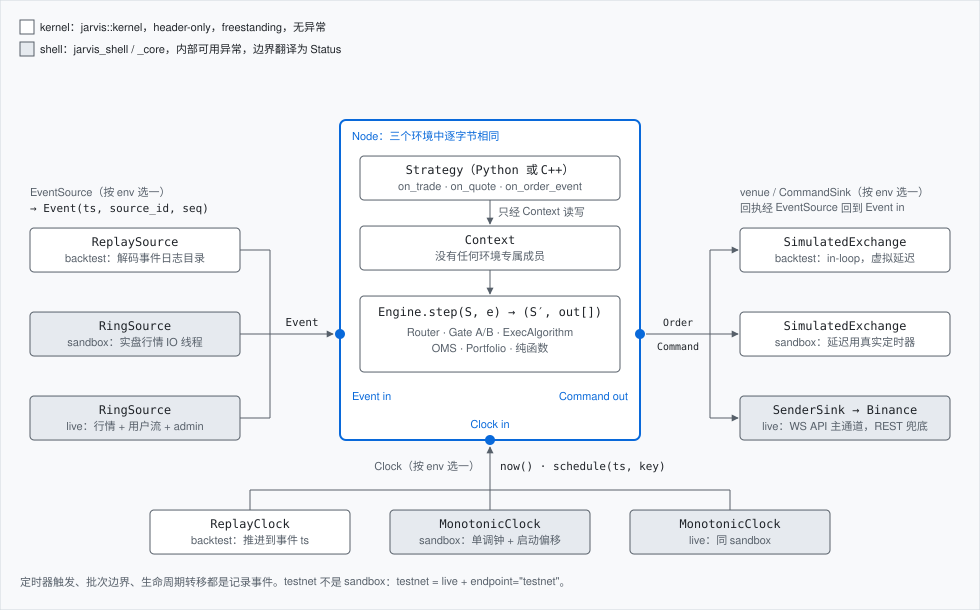
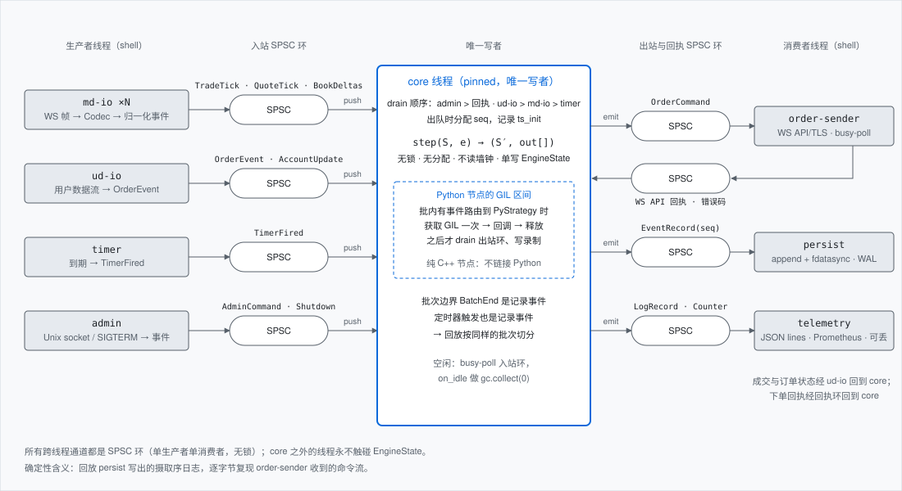
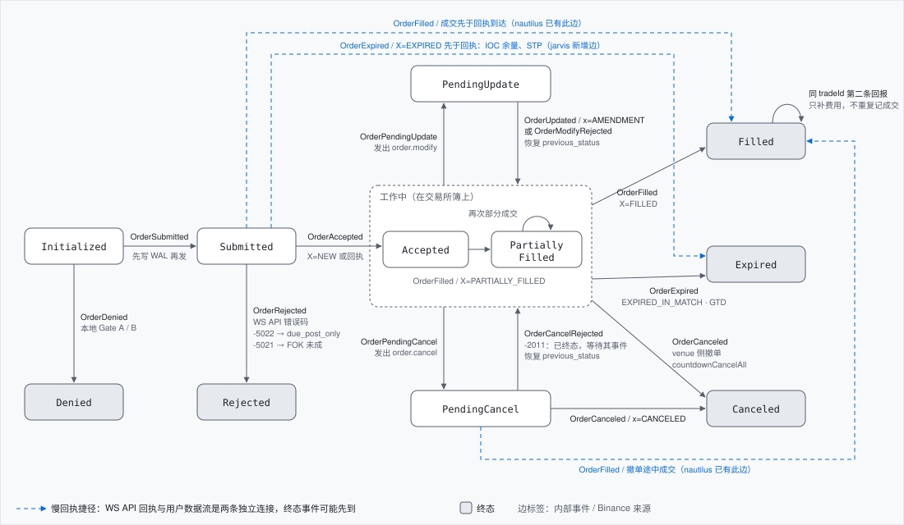
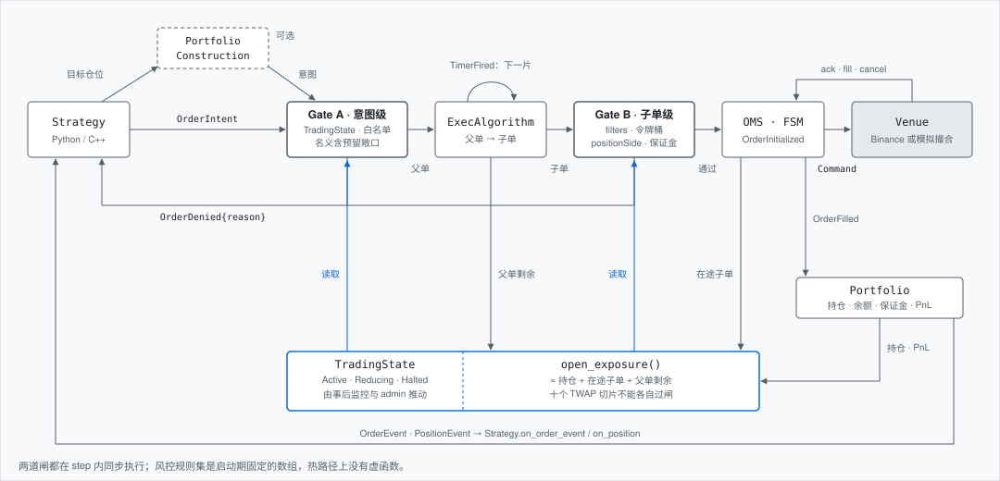
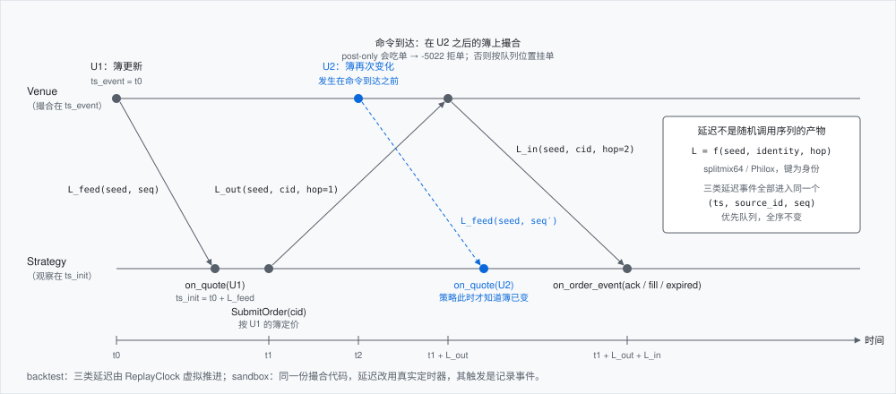
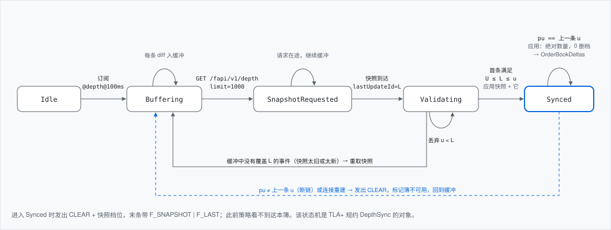
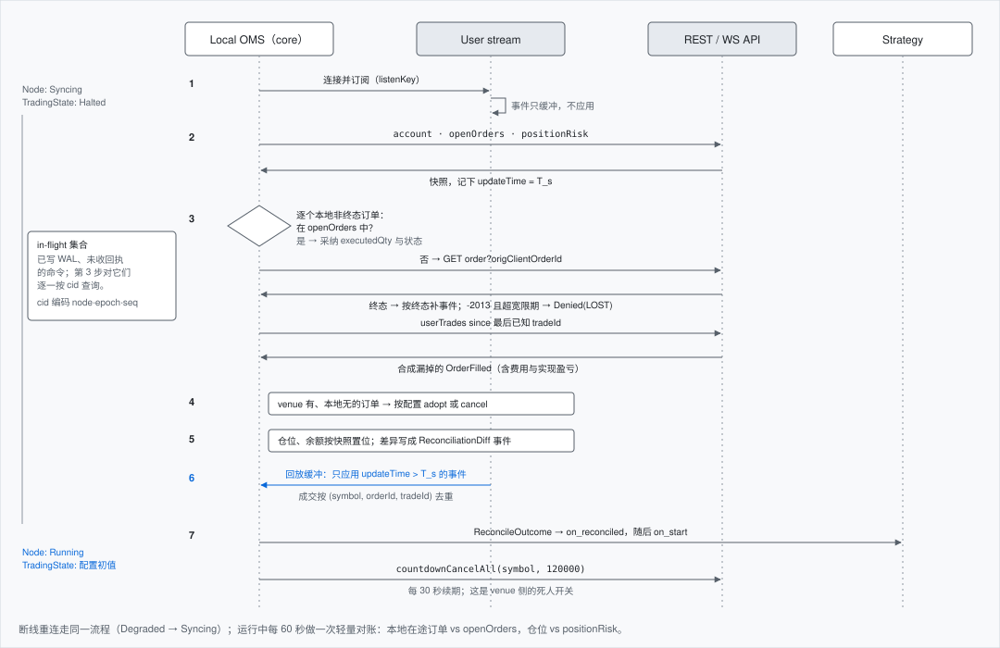
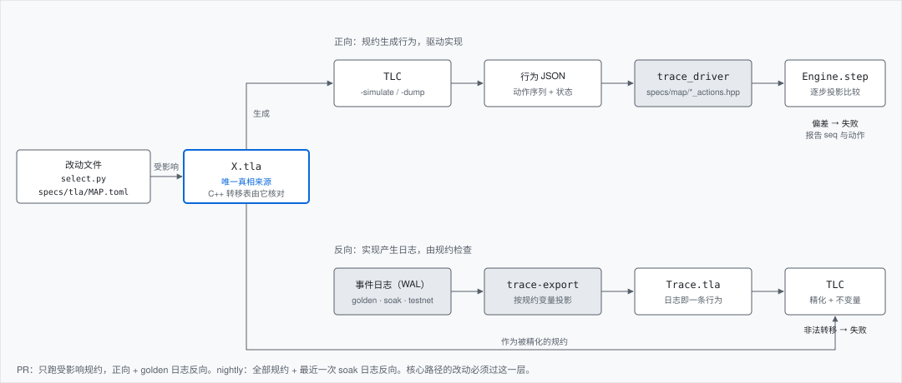

# jarvistrader 架构设计

- 状态：Accepted（第 13 节网络栈中的 io_uring 路径与第 20 节标为 Proposed 的条目除外）
- 日期：2026-09-26
- 范围：`jarvis` 的全部模块，从确定性内核到 Binance 实盘适配器、Python 宿主与测试门禁
- 领域模型对齐目标：nautilus_trader `develop` 分支，提交 `cd417b80`（v2.0.0rc6），以 Rust `crates/model` 为准
- 实现计划：[plan.md](plan.md)

本文是 jarvis 的唯一架构文档。它记录已经做出的决策、决策背后的机制，以及尚未决定的问题和推荐默认值。代码级约束仍以 [ADR 0001](adr/0001-deterministic-kernel.md) 和 [C++ 子集规范](cpp-subset.md) 为准，本文第 20 节列出对 ADR 0001 的两处修订。

## 目录

1. [目标、非目标与 v1.0](#1-目标非目标与-v10)
2. [设计原则与 nautilus 的关系](#2-设计原则与-nautilus-的关系)
3. [系统总览](#3-系统总览)
4. [Node：一个文件，三个环境](#4-node一个文件三个环境)
5. [事件模型与时间](#5-事件模型与时间)
6. [领域模型：nautilus 兼容契约](#6-领域模型nautilus-兼容契约)
7. [运行时与策略宿主](#7-运行时与策略宿主)
8. [订单生命周期与 OMS](#8-订单生命周期与-oms)
9. [命令链、两道风控闸与策略 API](#9-命令链两道风控闸与策略-api)
10. [风控引擎](#10-风控引擎)
11. [成本模型、Portfolio、组合构建与执行算法](#11-成本模型portfolio组合构建与执行算法)
12. [回测撮合器与 sandbox](#12-回测撮合器与-sandbox)
13. [网络栈与 Codec](#13-网络栈与-codec)
14. [Binance USDⓈ-M 适配器](#14-binance-usd-m-适配器)
15. [Reconciliation](#15-reconciliation)
16. [数据与持久化](#16-数据与持久化)
17. [测试 harness 与变更门禁](#17-测试-harness-与变更门禁)
18. [形式化验证](#18-形式化验证)
19. [运维与分片](#19-运维与分片)
20. [决策记录与开放问题](#20-决策记录与开放问题)
21. [附录](#21-附录)

---

## 1. 目标、非目标与 v1.0

### 目标

- 一个 C++20 + Python 的量化交易系统，先做加密资产，先接 Binance。
- 正确性优先。订单状态机、对账协议、风控状态、撮合不变量、订单簿同步这五个核心对象都有 TLA+ 规约，并用 trace validation 与 C++ 实现互相校验。
- 确定性。同一份输入日志在任何受支持的编译器、优化级别和平台上产生逐字节相同的输出。
- 生产级。实盘节点具备对账、风控、崩溃恢复、可观测性、优雅关停和 venue 侧死人开关。
- 系统在不触碰硬件（不做 kernel bypass、FPGA）的前提下，能承载 HFT 与做市类策略。系统提供能力，不内置这类策略。
- Python 是主要的策略语言，回测和实盘都是。对延迟最敏感的特定策略用 C++ 写，两者使用同一套回调 API。
- 同一个策略文件可以在回测、sandbox、实盘三个环境运行，只换配置。

### 非目标

- 不内置交易策略。系统内置的是执行算法与风控规则。示例策略放在 `examples/`，只供测试与 soak 使用，不进 wheel。
- 单次回测内部不做多线程，也不做乐观并行。
- 内核不写 SIMD intrinsics。
- 不做数据下载服务与可视化。系统只提供把已有归档（nautilus Parquet、data.binance.vision）转换成事件日志的转换器。
- v1.0 不做条件单（STOP、TAKE_PROFIT、TRAILING）、组合保证金、期权。

### v1.0 的定义

v1.0 的完成标准是"同一个策略文件在三个环境运行，且下列保证全部成立"，而不是"交付某个做市策略"。

| 维度 | v1.0 范围 |
| --- | --- |
| Venue | Binance USDⓈ-M 永续（one-way 模式）。Spot 是 v1.x 的第二个 venue |
| 环境 | `backtest`、`sandbox`（实盘行情 + 模拟撮合）、`live`（含 testnet） |
| 行情数据 | `TradeTick`（aggTrade）、`QuoteTick`（bookTicker）、`OrderBookDeltas`（depth@100ms 快照同步）、`Bar`（kline 与内核聚合）、`MarkPriceUpdate`、`IndexPriceUpdate`、`FundingRateUpdate` |
| Trade tick 全链路 | aggTrade 解码 → `TradeTick` → 策略 `on_trade` → 录制 → 回放 → 撮合器的队列位置成交模型消费成交流 |
| 订单 | `MARKET`、`LIMIT` 配 `GTC / IOC / FOK / GTX`、`reduceOnly`、自成交保护（STP） |
| 策略宿主 | Python 启动的混合节点（Python 策略与注册的 C++ 策略共存）、纯 C++ 节点 |
| 内置执行算法 | `PeggedQuote`、`PassiveThenAggressive` |
| 保证 | 确定性回放、对账、两道风控闸、KillSwitch、`countdownCancelAll`、WAL 与恢复、指标、健康检查、优雅关停 |
| 形式化验证 | 全部规约进入 CI（OrderLifecycle、TradingState、Matching、Reconciliation、DepthSync、NodeLifecycle，以及基础的 SeqOrder） |
| 验收 | `examples/` 中的 Python 与 C++ 示例在 testnet 连续运行 72 小时，穿越强制断线与 listenKey 过期；录制日志回放逐字节一致 |

---

## 2. 设计原则与 nautilus 的关系

### 原则

1. **确定性是产品属性。** 内核是纯函数 `step(S, e) → (S′, out[])`。它不读墙钟、不读全局随机状态、不依赖指针值和无序容器的迭代顺序。所有非确定性来源（网络到达顺序、定时器触发时刻、Python 回调超时）都在内核之外被转成带序号的事件记录下来。
2. **规约先于实现。** 五个核心对象先写 TLA+ 规约，C++ 转移表由规约核对。改动核心路径必须重新通过形式化验证。
3. **单写者。** 引擎状态只有 core 线程写。其他线程只通过 SPSC 环与它交换事件和命令，不存在锁。
4. **同一代码，三个环境。** 回测、sandbox、实盘运行同一个 `Engine`，只替换事件源、venue 与时钟三条边。
5. **Python 优先，热路径可下沉。** Python 是一等公民。系统提供订阅节流、内核内特征计算和批量回调，让 Python 策略远离逐 tick 的热循环；仍不够快的策略用 C++ 写，接口不变。
6. **生产级是默认值。** 对账、限速、死人开关、WAL、指标不是可选插件。

### 与 nautilus_trader 的关系

jarvis 只在领域模型类型上与 nautilus 对齐，引擎和算法是自有设计。

| 对齐（兼容契约，见第 6 节） | 自有设计（见附录 B 的逐项对照） |
| --- | --- |
| 标识符及其字符串格式 | 事件路由：`Router` 与订阅矩阵，不用字符串 topic 的消息总线 |
| `Price`、`Quantity`、`Money`、`Currency` 的定点表示 | 状态存储：`EngineState` 竞技场，不设第二份缓存 |
| 行情数据类型与字段 | 生命周期：每个 Node 一个状态机，组件没有各自的生命周期 |
| Instrument 类型与字段 | 节点装配：`Node<StrategySet>` 模板与静态接线 |
| 枚举的整数值与字符串 | 风控：两道闸与共享的预留敞口 |
| 订单事件、仓位事件、账户事件 | 执行算法：内核内的确定性算法，受令牌预算约束 |
| `OrderStatus` 的状态与转移语义 | 对账：以 WAL 事件表达，可被规约反向检查 |
| Parquet 目录布局与 Arrow schema | 配置、`ClientOrderId` 编码、撮合与成交模型、网络栈 |

jarvis 自己的组件不使用 `Actor`、`MessageBus`、`Cache`、`Trader`、`Kernel` 这些名字，避免读者误以为机制相同。

---

## 3. 系统总览



*F1：策略只通过 `Context` 与引擎交互。三个环境之间只有事件源、venue 与时钟三条边不同，中间的 Node 逐字节相同。*

### 内核与外壳

- **kernel**（`jarvis::kernel`）：header-only，经 `jarvis_kernel_freestanding` 以 `-fno-exceptions -fno-rtti` 编译守门。包含 `core`、`model`、`data`、`cost`、`portfolio`、`risk`、`execution`、`strategy`、`engine`、`backtest`。错误用 `enum class Status` 加输出参数表达。
- **shell**（`jarvis_shell` 静态库与 `_core` 绑定模块）：`sys`、`node`、`network`、`adapter/binance`、`live`、`python`。内部可以使用异常与第三方库，跨入内核前翻译成 `Status`。`node` 层（配置解析、Node 组合、命令行入口、构建信息）回测也需要，因此总是构建；`network`、`adapter`、`live` 只在 `JARVIS_BUILD_LIVE=ON` 时编入，纯回测构建不依赖网络栈。
- **sys**（`jarvis_sys` 静态库）：外壳里唯一调用操作系统 API 的层，Linux、macOS 与 Windows 的差别都在这里：崩溃安全的文件写入（`fdatasync`／`FlushFileBuffers`、原子替换、目录同步）、阻塞 socket（Unix 域 socket 与 TCP；Windows 上是 Winsock 与 AF_UNIX）、共享库加载、停止信号（`sigaction`／`SetConsoleCtrlHandler`）、进程与环境变量、错误文本。其余外壳层不 include 平台头文件，也不写平台 `#ifdef`；绑核（`live/cpu_affinity.cpp`）与 `network::Waker` 两处与线程、Asio 绑得紧，留在各自的层里。

### 分层与依赖规则

依赖只能从上往下。内核层的顺序是 `core < model < {data, cost} < portfolio < execution < risk < strategy < engine < backtest`：一个内核头文件只能 include 本层或更低的层，同级的 `data` 与 `cost` 不能互相 include。`tools/check-layering.py` 在 CI 中检查 include 关系，并禁止内核 include 线程、时钟、流、随机数、异常类与第三方库头；freestanding 目标只能拦住 `throw`，拦不住分层违规，所以两者都需要。

| 层 | 目录 | 归属 | 允许 include |
| --- | --- | --- | --- |
| core | `jarvis/core` | kernel | 标准库子集 |
| model | `jarvis/model` | kernel | core |
| data、cost | `jarvis/data`、`jarvis/cost` | kernel | core、model |
| portfolio | `jarvis/portfolio` | kernel | core、model、data、cost |
| execution | `jarvis/execution` | kernel | 以上各层（OMS 的预留敞口读取持仓） |
| risk | `jarvis/risk` | kernel | 以上各层（风控读取 Portfolio 与 OMS） |
| strategy | `jarvis/strategy` | kernel | 以上各层，不得 include backtest、live、adapter |
| engine | `jarvis/engine` | kernel | 以上各层 |
| backtest | `jarvis/backtest` | kernel | 以上各层 |
| sys | `jarvis/sys` | shell | core；操作系统 API（POSIX、Win32、Winsock） |
| node | `jarvis/node` | shell | 全部 kernel 层、sys；toml++ |
| network | `jarvis/network` | shell | core、sys；Asio、OpenSSL、picohttpparser |
| adapter | `jarvis/adapter/binance` | shell | network、sys 与全部 kernel 层；simdjson、SBE 生成代码 |
| live | `jarvis/live` | shell | node、network、adapter、sys 与全部 kernel 层 |
| python | `python/src`、`python/jarvis` | shell | 全部；nanobind |
| examples | `examples/py`、`examples/cpp` | 使用方 | 只允许公开 API：core、model、data、strategy、node |

### 目录结构

```
jarvis/
  core/         Status, FixedVector, Arena/Handle, Rng, UnixNanos, EventKey, PriorityQueue, Clock
  model/        identifiers, types (Price/Quantity/Money/Currency), data, instruments, enums, events
  data/         Router, SubscriptionMatrix, book/ (L1/L2), bars/, features/ (FeatureGraph)
  cost/         FeeModel, SlippageModel, ImpactModel, LatencyModel
  portfolio/    Portfolio, MarginModel, attribution ledger
  risk/         RiskRule catalog, Gate A/B, TradingState, TokenBucket, monitors
  execution/    OrderCore, order_fsm, OMS, ExecutionEngine, algorithms/, reconcile/
  strategy/     Strategy concept, Context, StrategySet (Static/Dynamic), registry
  engine/       Engine<StrategySet>, EventSource/CommandSink concepts, EngineState
  backtest/     ReplaySource, ReplayClock, matching/ (SimulatedExchange, fill models)
  sys/          platform calls: durable files, sockets, shared libraries, stop signals, process
  node/         build info, NodeConfig parsing, Node composition, command-line entry points
  network/      Transport, WsClient (RFC 6455), HttpClient, Signer
  adapter/binance/  codec/ (json, sbe/gen), streams, user_stream, ws_api, rest, instruments
  live/         Node wiring, rings, threads, persist, telemetry, admin, health
python/
  src/          nanobind bindings, PyStrategyHost
  jarvis/       Strategy, Node, main(), NodeConfig, determinism guard, converters
examples/       py/ 与 cpp/ 示例策略（仅测试与 soak 使用）
specs/
  tla/          OrderLifecycle, Reconciliation, TradingState, Matching, DepthSync, MAP.toml
  map/          规约动作 → 内核事件的映射头文件
  sbe/binance/  钉版本的 SBE XML schema
tests/          cpp/、golden/、fuzz/、tools/（工具脚本的 pytest）
testkit/        性质测试生成器、零分配计数器、doctest 入口
benchmarks/     hot/（门禁）、report/（只报告）、thresholds.toml
tools/          check-layering.py, golden.py, bench_compare.py, bench_ab.sh, tla/, core-paths.txt
```

---

## 4. Node：一个文件，三个环境

Node 是组合根。它拥有一个 `Engine`、一份事件日志，以及由 `env` 在运行时选定的一套接线。策略能接触到的一切在三个环境中完全相同，只有接线不同。

### 4.1 环境接线

| env | EventSource | venue / CommandSink | Clock | 对账来源 | 录制 |
| --- | --- | --- | --- | --- | --- |
| `backtest` | `ReplaySource`，读取解码后的事件日志目录 | `SimulatedExchange`，in-loop，虚拟延迟 | `ReplayClock`，推进到下一事件的 `ts` | `SimulatedExchange` 的快照，瞬时完成 | 可选 |
| `sandbox` | `RingSource`，实盘行情 IO 线程 | `SimulatedExchange`，延迟用真实定时器，触发是记录事件 | `MonotonicClock` | 同上 | 解码日志 + 原始帧 |
| `live` | `RingSource`，行情、用户流、回执、admin | `SenderSink` → `BinanceClient`，WS API 为主，REST 兜底 | `MonotonicClock` | REST 快照协议（第 15 节） | 解码日志 + 原始帧 |

testnet 不是 sandbox。testnet 是 `env = "live"` 加上 `endpoint = "testnet"`。sandbox 的意义是用真实行情和真实时钟检验策略与撮合模型，不向任何交易所发单。

sandbox 的实现（M4-E，`jarvis/live/sandbox_node.hpp`）：

- 行情 IO 线程是 `MarketFeed`（`jarvis/live/market_feed.hpp`），把归一化事件编码为线格式记录写入 `SpscByteRing`；core 线程（调用方线程）用 `LiveSource` 读出、以 `MonotonicClock` 打时间戳。
- core 线程运行与 backtest 相同的 `Driver` 与 `Engine`，只是用实时模式 `Driver::run_realtime`：输入在时钟到达其时间后才步进，最早者优先；没有到期的输入时关闭当前批次并进入空闲钩子。
- 模拟交易所复用 backtest 的 `VenueLoop`，打开 `live_feed`：真实行情到达节点时模拟交易所同时看到它，没有行情延迟，`ts_init` 保持 IO 线程记录的到达时间；订单往返的延迟仍取自 `[venues.sim]`。
- instrument 取自 `exchangeInfo`（REST），或 `venues[].exchange_info` 指定的保存文件；预备输入（instrument 定义与模拟账户）以启动时刻打时间戳。
- 结束于 SIGINT、SIGTERM 或 `--run-for`，以 `ShutdownRequested` 与 `Drained` 收尾。C++ 节点用 `jarvis::live_node_main<S...>`（`jarvis/live/live_main.hpp`），Python 节点在带 live shell 的构建中（`just install-live`）用同一个 `jarvis.main`。

live 的实现（M5-C3，`jarvis/live/live_node.hpp`）：

- 启动顺序：解析 `venues[0].credentials`；运行启动检查（时钟偏移、instrument、持仓模式、多资产模式、保证金模式与杠杆、key 权限），任一失败即不启动；取下一个 `ClientOrderId` epoch 并先写入磁盘（默认 `persistence.dir` 中本节点各次运行所在目录下的 `epoch` 文件），再允许任何订单带上它。
- 两个 IO 线程：行情的 `MarketFeed` 与账户的 `VenueIo`（第 7.1 节）。core 线程的泵先排空账户环，再排空行情环，都进入同一个 `LiveSource`，`AccountState` 与 `VenueSnapshot` 在其中保有自己的列表。
- `Driver` 以 `await_sync` 运行：前导事件（instrument 定义）之后停在 `Syncing`，直到账户对账完成才进入 `Running`（第 4.4 节的同步闸门）；用户流断开时经 `Degraded` 回到 `Syncing`。
- 引擎每产出一条 `SubmitOrder`、`ModifyOrder`、`CancelOrder`、`CountdownCancelAll` 都立即交给 venue-io 的命令环（`CommandRouter`，环满时等待，从不丢弃）；退出时最多等 2 秒让命令离开环。
- venue 侧死人开关 `countdownCancelAll`（第 10.3 节）只在 `env = "live"` 时打开。
- 与 sandbox 相同，每个输入都记录，录制的会话在 backtest 接线下回放必须逐字节一致。C++ 节点用同一个 `jarvis::live_node_main<S...>`，Python 节点用 `jarvis.main` 或 `Node.run()`（带 live shell 的构建）。
- 测试：`tests/cpp/test_live_node.cpp` 用脚本化的交易所（HTTPS 负责启动检查、listenKey 与快照，WSS 负责行情、用户流与 WS API）端到端运行：对账、策略启动、下单、确认、成交，然后回放录制的会话，输出一致。
- 停止（`SIGINT`、`SIGTERM`、`--run-for` 到期或 `HaltNode`）按 `[node] shutdown` 进行（第 19.4 节）：默认撤单、在 `Stopping` 中等待交易所确认，再解除 `countdownCancelAll`。
- 行情新鲜度（M5-L）：行情连接 up 之后，超过 `[node] market_data_stale_ms` 没有收到任何行情输入即视为陈旧，节点进入 `Degraded`，行情恢复后经 `Syncing` 回到 `Running`（第 4.4 节）。

### 4.2 NodeConfig

配置是类型化 TOML，解析为 C++ 结构体（`jarvis/node/config.hpp`）。未知键直接报错。命令行的 `--env` 与 `--set a.b=c` 覆盖之后的最终配置被规范化并计算 hash，hash 写入事件日志头，回放时据此确认配置一致。

- **报错方式。** 所有错误一次性报告，每条带路径与行号，例如 `node.toml:7: venues[0].oms: must be hedging when account_mode is hedge`。
- **不允许浮点。** 任何位置出现 TOML 浮点都报错，小数一律写成字符串（`size = "0.010"`），这样它们能精确解析为定点数。时间戳同理，写成带引号的 RFC 3339 字符串。
- **覆盖语法。** 先应用 `--env`，再按顺序应用每个 `--set`。路径段可以是表的键、数组下标，或者按 `id` 选中数组中的表（`--set strategies.mm-001.params.size=0.020`）。值能解析为 TOML 的字符串、整数、布尔、数组或内联表时按 TOML 解释；否则（裸词、小数、时间戳）按原文字符串处理。
- **hash 的范围。** 规范形式是每个字段一行 `path = value`，包含默认值，顺序固定，策略参数按键排序；因此显式写出默认值与省略它得到同一个 hash，文件中键的顺序也不影响 hash。hash 只覆盖影响内核计算结果的字段：`[node]` 的 id、seed、strict_determinism、capacity，venue 的 id、kind、account_mode、oms、sim，`[[strategies]]`，`[risk]`，`[python]`。`node.env`、`[data]`、venue 的 endpoint 与凭据引用、`[persistence]`、`[telemetry]`、`[admin]`、`[threads]` 不进 hash：它们决定输入从哪里来、输出写到哪里，而输入本身已经记录在事件日志中。这样 sandbox 录制在 backtest 中回放时 hash 仍然相同（4.6 节的环境等价测试依赖这一点）。`jarvis config <file>` 打印两部分规范形式与 hash。
- **凭据。** `credentials` 只能是引用（`env:NAME` 或 `file:PATH`），写入明文密钥会被拒绝。

```toml
[node]
id = "mm01"
env = "backtest"                  # backtest | sandbox | live
seed = 42
strict_determinism = true
capacity = { orders = 4096, instruments = 64, batch = 1024, timers = 256, strategies = 8 }
shutdown = "cancel_all_then_exit" # sandbox 与 live：cancel_all_then_exit | exit_keep_orders
shutdown_timeout_ms = 10000       # 等待撤单确认的上限
market_data_stale_ms = 10000      # 行情连接 up 但这么久没有行情即为陈旧；0 关闭检查

[data]                            # backtest 使用
catalog = "runs/2026-09/"
range = { start = "2026-09-01T00:00:00Z", end = "2026-09-02T00:00:00Z" }

[[data.streams]]
venue = "BINANCE_USDM"
instruments = ["BTCUSDT-PERP.BINANCE"]
streams = ["aggTrade", "bookTicker", "depth@100ms", "markPrice@1s"]
codec = "json"                    # json | sbe（venue 支持时）

[[venues]]
id = "BINANCE_USDM"
kind = "binance_usdm"
endpoint = "prod"                 # prod | testnet
credentials = "env:BINANCE_USDM_KEY"   # 只存引用，不存密钥
account_mode = "one_way"          # one_way | hedge，与交易所不一致则拒绝启动
oms = "netting"                   # 必须与 account_mode 匹配
leverage = 20                     # 初始保证金 = 名义 / 杠杆；省略时用 instrument 的 margin_init

[venues.sim]                      # backtest 与 sandbox 使用
fill_model = "queue_position"     # queue_position | top_of_book
latency = { feed_ns = 800000, out_ns = 1500000, in_ns = 1500000, jitter_ns = 300000 }
fee = { schedule = "binance_usdm_vip0" }
balances = ["10000 USDT"]         # 模拟账户的初始余额
stp = "none"                      # none | expire_taker | expire_maker | expire_both

[[strategies]]
id = "mm-001"
impl = "py:MyMM"                  # py:<类名> | cpp:<注册名>
instruments = ["BTCUSDT-PERP.BINANCE"]
params = { spread_bps = 2, size = "0.010" }

[risk]
initial_state = "active"
max_order_notional = "50000 USDT"
max_position_notional = "200000 USDT"  # 每个 instrument，含未完成订单
daily_loss_limit = "2000 USDT"    # → Reducing
daily_loss_halt = "4000 USDT"     # → Halted + KillSwitch
max_drawdown = "5000 USDT"        # → Reducing
price_band_bps = 200              # 限价偏离参考价的上限；0 关闭
max_open_orders = 50              # 每个 instrument；0 关闭
orders_per_10s = 250              # 0 关闭
orders_per_minute = 1000
margin_ratio_bps = 8000           # 维持保证金 / 权益达到 80% → Reducing
check_margin = true
countdown_cancel_all_ms = 120000  # 仅 env = "live"；0 关闭，否则至少 10000
on_strategy_error = "halt_strategy"    # halt_strategy | halt_node | ignore

[python]
callback_budget_us = 2000
overrun_limit = 50

[persistence]
mode = "async"                    # none | async | barrier
dir = "runs/{node_id}/{run_id}"
sync_every_ms = 100               # async：persist 线程最多隔这么久 fdatasync 一次；0 为每批一次
snapshot_every = 1000000
raw_frames = true                 # true | false | sampled
resume = false                    # live：从本节点最近一次运行的快照与日志继续（16.3 节）
truncate = false                  # sandbox 与 live：每个完整快照之后删除只在它之前的日志段与快照

[telemetry]
prometheus = "0.0.0.0:9100"       # sandbox 与 live：/metrics、/ready、/live；不设置则不开 HTTP
jsonl = true                      # telemetry.jsonl 写在运行目录中

[admin]
socket = "unix:///run/jarvis/{node_id}.sock"   # sandbox 与 live；不设置则没有 admin socket

[threads]                         # sandbox 与 live，支持 Linux 与 Windows（19.6 节）；不设置则不绑核
busy_poll = false                 # 行情线程与 venue-io 线程从不休眠
core_cpu = 2                      # core 线程的 CPU；不设置则不绑
market_cpu = 3                    # 行情线程
venue_cpu = 4                     # venue-io 线程
numa_node = 0                     # 其余线程在这个节点的 CPU 上运行；绑定的 CPU 也须在它上面
```

### 4.3 组成

```cpp
template <StrategySet SS>
class Node {
    NodeConfig  cfg_;
    EngineState state_;
    Engine<SS>  engine_;
    Recorder    recorder_;
    Telemetry   telemetry_;
    Admin       admin_;
    std::variant<BacktestWiring, SandboxWiring, LiveWiring> wiring_;
public:
    Status wire();                       // Init → Wired：分配竞技场，构造 source/sink，不做 I/O
    Status run();                        // 阻塞；开头 visit 一次 wiring_，之后执行单态循环
    Status request_stop(StopMode mode);  // 可由信号或 admin 线程调用，只入队一个事件
};
```

`run()` 只在开始时对 `wiring_` 做一次 `std::visit`，随后进入该接线类型的静态循环。`env` 是运行时选择，但热路径上没有虚调用。

### 4.4 生命周期状态机

`Init → Wired → Starting → Syncing → Running ⇄ Degraded → Stopping → Stopped`，另有终态 `Faulted`。

| 状态 | backtest | sandbox / live | 由谁推动 |
| --- | --- | --- | --- |
| `Init → Wired` | 解析配置并计算 hash，分配竞技场，打开数据目录 | 同左，并构造 IO 线程（尚未启动） | 主线程，在 `run()` 之前 |
| `Starting` | 打开日志，写日志头 | 连接行情、用户流、WS API，启动 IO 线程；TradingState 置为 `Halted` | core 线程 |
| `Syncing` | 对 `SimulatedExchange` 跑同一套对账代码，瞬时完成 | 完整对账协议（第 15 节）；完成后 TradingState 置为配置初值 | core 线程 |
| `Running` | 消费到 `ReplaySource` 结束 | 消费入站环；readiness = 已同步 ∧ 行情新鲜 ∧ 用户流心跳正常 | core 线程 |
| `Degraded` | 不适用 | readiness 为假（行情陈旧、断线重连中）；按策略把 TradingState 降为 `Reducing`；重连成功后回到 `Syncing` | core 线程，依据 `Health*` 事件 |
| `Stopping` | 写最终快照与报告 | 默认 `cancel_all_then_exit`：撤单、确认、排空出站环、关闭连接 | core 线程，依据 EOF 或 `Shutdown` 事件 |
| `Faulted` | 保留日志，非零退出 | KillSwitch（尽力撤全单），非零退出 | core 线程，依据 `step` 返回错误、容量耗尽、日志写失败、Python 致命错误 |

- 同步闸门（`jarvis/engine/sync_gate.hpp`，M5-B3、M5-D3）：driver 在每个输入之后按账户的对账阶段与其他连接的状态推动生命周期，直到不再需要转移为止，每次转移都记录下来。回放不需要闸门，因为转移已经记录在日志中。
  - 连接状态来自记录的 `ConnectionStatus` 输入：用户流由对账器跟踪；行情（md-io 线程在全部行情连接打开时记录 up，任一关闭时记录 down）与下单通道（venue-io 线程在 WS API 就绪与断开时记录）由内核的 `ConnectionHealth` 跟踪，状态为未知、up 或 down。
  - `Syncing → Running`：账户已同步，且没有连接处于 down；`DriverOptions::await_sync`（实盘）还要求收到过用户流并完成对账、下单通道已经 up。
  - `Syncing → Degraded`：对账期间用户流断开。
  - `Running → Degraded`：用户流断开或重连后重新缓冲，或行情、下单通道 down。TradingState 随之降为 `Reducing`；`countdownCancelAll` 不再续期，所以降级持续整个倒计时后由交易所撤单。
  - `Degraded → Syncing`：用户流恢复（缓冲中或已同步）且行情与下单通道都不处于 down；随后按上面的规则回到 `Running`。
  - backtest 没有这些输入，闸门不会移动它；sandbox 没有用户流，按账户已同步处理，只有行情连接会让它降级。
- 行情新鲜度（M5-L）：`ConnectionHealth` 另有 `market_data_stale` 位，为真时 `healthy()` 为假，闸门据此把 `Running` 移到 `Degraded`。
  - 判断在内核中，按记录的输入的时间，所以回放复现它。行情连接 up 的那一步安排一个内核周期定时器（`kStaleTimerId`，周期为限值的一半）；成交、报价、订单簿增量、K 线、标记价、指数价、资金费率、强平单任一输入到达都更新最后时间并清除陈旧位。
  - 定时器触发时，若行情连接 up、尚未陈旧、且距最后一次行情输入（或连接 up 的时刻）超过 `[node] market_data_stale_ms`（默认 10000，0 关闭），置陈旧位并写一条内核记录 `market_data_stale`（已过时长与限值，第 19.2 节）。之后第一条行情输入清除它，闸门经 `Syncing` 回到 `Running`。
  - 行情连接的 up 与 down 也清除陈旧位：down 本身已让节点降级，up 从零开始计时。
  - backtest 数据中没有 `ConnectionStatus`，定时器不会安排；`RunStart`（恢复的运行）取消遗留的定时器，连接重新 up 时再安排。
- `Faulted`（M5-L，`Driver::fault`）：step、日志写入、交易所适配或泵返回错误时，driver 不再推进输入，按顺序尽力做三件事，每件都作为输入记录：
  - 实时运行且有未完成订单时，先步进 `Shutdown{cancel_all_then_exit}`，与 KillSwitch 相同：TradingState 置为 `Halted`，撤销全部订单，撤单命令照常交给 venue-io；不等待确认。
  - 转移 `Fault`，节点进入 `Faulted`。策略不再收到回调，`on_stop` 也不调用。
  - 关闭当前批次。
  - 最后 `run()` 与 `run_realtime()` 返回原来的错误；`RunSummary` 带 `faulted`、`fault`、`state = FAULTED` 与仍未完成的订单数。节点打印 `the node faulted at seq …` 并以非零码退出。
  - 日志本身写不进去时，后续输入也无法记录，因此不再步进任何输入（WAL 先于步进的规则不变）。这时撤单靠交易所的 `countdownCancelAll`：`Faulted` 不解除它，节点停止续期，倒计时结束后交易所撤销全部订单（第 10.3 节）。
  - 回放一个 `Faulted` 的运行会在同一个输入上得到同样的错误；恢复它同样会失败，需要人工处理。
- 转移表位于 `jarvis/engine/lifecycle.hpp`，是纯函数 `next_state(from, reason)`。原因码：`Configured`（Init → Wired）、`RunRequested`（Wired → Starting）、`Started`（Starting → Syncing）、`Synced`（Syncing → Running）、`HealthLost`（Syncing 或 Running → Degraded）、`HealthRestored`（Degraded → Syncing）、`EndOfData`（Running → Stopping）、`ShutdownRequested`（Wired 到 Degraded 之间任一状态 → Stopping；Stopping 中重复请求保持原状态）、`Drained`（Stopping → Stopped）、`Fault`（任一非终态 → Faulted）。表外的组合返回 `InvalidTransition`。
- 每次状态转移都写成 WAL 事件 `NodeLifecycle{from, to, reason}`，回放会复现它；回放时每条记录都必须与转移表给出的结果一致，否则报 `InvalidTransition`。
- 只有 core 线程推动状态。IO、admin、信号处理只入队事件。
- 组件没有自己的生命周期，它们是 `EngineState` 中的数据。策略收到 `on_start` / `on_stop`，这两个回调本身也是记录事件。
- `TradingState`（`Active / Reducing / Halted`）与 Node 生命周期正交，由第 10 节描述。

### 4.5 单文件入口

Python：

```python
# my_mm.py：完整的可部署单元
import jarvis
from jarvis import Strategy, Cadence

class MyMM(Strategy):
    params = {"spread_bps": 2, "size": "0.010"}     # [[strategies]] 的 params 覆盖这些默认值

    def on_start(self, ctx):
        iid = "BTCUSDT-PERP.BINANCE"
        ctx.subscribe_trades(iid)
        ctx.subscribe_quotes(iid, cadence=Cadence.CONFLATED)
        self.mp = ctx.feature(jarvis.features.microprice(iid), cadence=Cadence.sampled_ms(100))

    def on_trade(self, ctx, t): ...
    def on_quote(self, ctx, q): ...
    def on_feature(self, ctx, feature_id, value, ts): ...
    def on_order_event(self, ctx, ev): ...               # M3
    def on_timer(self, ctx, timer_id, deadline): ...
    def on_stop(self, ctx): ...

if __name__ == "__main__":
    jarvis.main(MyMM)
```

```sh
python my_mm.py --config node.toml --env backtest [--out runs/x]
python my_mm.py --config node.toml --env sandbox
python my_mm.py --config node.toml --env live --set venues.0.endpoint=testnet
python my_mm.py --replay runs/x [--until SEQ] [--dump-state]
```

`--replay` 读取运行目录（第 16.1 节）中保存的配置与覆盖项，核对配置 hash 后以同一策略文件重算全部输出，报告第一处偏差（退出码 3）。C++ 的 `node_main<S...>` 与 Python 的 `jarvis.main` 共用这套参数（`jarvis/node/node_cli.hpp`）。

`jarvis.main(*classes)` 等价于 `Node(config, env=..., sets=..., out=...)` 加上按 `[[strategies]]` 条目构造的策略再 `run()`：`impl = "py:MyMM"` 用传入的同名类，以条目的 `id`、`instruments`、`params` 构造；`impl = "cpp:Name"` 用注册过的 C++ 策略。配置不列策略时，每个类以默认参数各构造一个。显式写法 `Node(...).add_strategy(obj).add_native_strategy("PeggedMM", params).run()` 与之等价，`Node.from_run(dir).add_strategy(obj).replay()` 回放。

C++：

```cpp
struct MyMM {                                     // 满足 jarvis::Strategy concept，无基类
    std::int64_t spread_bps = 2;
    Decimal size;
    // 可选：从 [[strategies]] 条目的 params 构造；也可以写构造函数 MyMM(const StrategyParams&)
    static Status create(const StrategyParams& p, MyMM& out);
    Status on_start(Context& ctx);
    Status on_trade(Context& ctx, const TradeTick& t);
    Status on_quote(Context& ctx, const QuoteTick& q);
    Status on_order_event(Context& ctx, const OrderEvent& ev);
    Status on_timer(Context& ctx, TimerKey key, UnixNanos ts);
    Status on_stop(Context& ctx);
};
static_assert(jarvis::Strategy<MyMM>);

int main(int argc, char** argv) { return jarvis::node_main<MyMM>(argc, argv); }   // 同一套命令行参数
```

`node_main<S...>` 的第 i 个策略类型由第 i 个 `[[strategies]]` 条目构造；配置文件不列策略时以空参数构造。

### 4.6 "三环境一套代码"如何保证

1. `Context` 没有任何环境专属的成员或方法。策略无法得知自己处于哪个环境。
2. 分层检查禁止 `strategy`、`examples`、`python/jarvis` include `live`、`backtest`、`adapter` 的内部头。
3. **环境等价测试**进入 CI：录制一段 sandbox 会话的解码日志，用同一个策略文件以 backtest 接线回放（回放模式见第 5.2 节），两次的命令流必须逐字节相同。它验证的是接线差异不会泄漏到策略与引擎。每个示例策略都跑这项测试。实现（M4-E）：`tests/cpp/test_sandbox.cpp` 用脚本化的回环交易所（行情路由、WS API 快照）跑一段 sandbox 会话，策略在模拟交易所成交、撤单，然后 `replay_run` 复算全部输出逐字节相同，原始帧重解码得到的行情与运行日志中的行情输入逐条相同。内核层另有测试：虚拟时钟下的实时运行与同一到达序列的 backtest 记录相同的输入、输出与交易所回报。2026-09-27 对生产行情实测：C++ 示例 `pegged_mm` 60 秒（16,942 条消息、0 解码错误、21 个订单、32 条交易所回报）与带 depth 的 40 秒（1 次快照、订单簿同步）、Python 示例 `mm_quote.py` 60 秒，回放全部无偏差。
4. 三个环境之间唯一不同的配置段是 `[data]`、`[venues]`、`[persistence]`，策略读不到它们。

---

## 5. 事件模型与时间

### 5.1 事件分类

内核的输入是一个封闭的 `Event` variant。封闭意味着新增事件类型必须修改 variant 定义，所有 `std::visit` 在编译期检查穷尽。

| 类别 | 事件 | 来源 |
| --- | --- | --- |
| 行情 | `TradeTick`、`QuoteTick`、`OrderBookDeltas`、`Bar`、`MarkPriceUpdate`、`IndexPriceUpdate`、`FundingRateUpdate`、`InstrumentStatus`、`LiquidationOrder`（扩展类型） | md-io 线程或 `ReplaySource` |
| venue | 订单事件（Accepted、Rejected、Canceled、Expired、Updated、Filled 等）、`AccountState`、`VenueSnapshot`、`RateLimitFeedback` | ud-io、order-sender 的回执、`SimulatedExchange` |
| 参考数据 | instrument 定义（`CurrencyPair`、`CryptoPerpetual`、`CryptoFuture`） | exchangeInfo、目录中的 instrument 文件 |
| 时间 | `TimerFired`、`BatchEnd` | timer 线程、core 线程 |
| 控制 | `AdminCommand`、`Shutdown`、`ParamUpdate`、`TargetPosition`（控制面）、`Health*` | admin 线程、控制面通道 |
| 内核自产 | `NodeLifecycle`、`StrategyError`、`OrderDenied`、`FeatureUpdate`、venue 命令（`SubmitOrder`、`ModifyOrder`、`CancelOrder`、`CancelAllOrders`、`CountdownCancelAll`）、仓位事件、`ReconciliationDiff`、`ReconcileOutcome` | `step` 的输出；其中影响后续状态且无法由输入重算的（`NodeLifecycle`、`StrategyError`）同样写入日志；仓位事件只交给策略，不写入日志 |

### 5.2 全序键

每个输入事件携带键 `(ts, source_id, seq)`，内核按此严格全序处理，不存在并列。

- **backtest，历史数据**：`MergeSource`（`jarvis/backtest/merge_source.hpp`）按数据源各自的键合并多个数据源，`ts` 为事件的 `ts_init`（M3 起由延迟模型合成，第 12 节），`source_id` 为数据源编号，`seq` 为源内行号。延迟模型产生的事件插入同一个优先队列。Node 把合并后的每条输入连同自己合成的输入（生命周期、定时器、批次边界、策略错误）写入运行日志时，用自己的摄取计数重新编号 `seq`（从 1 开始），保留数据源的 `source_id`，合成输入的 `source_id` 为 0。这与 sandbox、live 的记录方式相同，所以任何环境的运行日志都按同一方式回放。
- **backtest 的批次**：批次是 `ts` 相同的一段连续输入，由 `BatchEnd` 结束。每条数据输入之前，截止时间不晚于其 `ts` 的定时器先以 `TimerFired` 触发；设置了 `data.range` 时，范围结束前到期的定时器在数据耗尽后继续触发（`jarvis/backtest/driver.hpp`）。
- **backtest，回放已录制的日志**（环境等价测试、实盘问题复现）：`ReplaySource` 按日志中的 `seq` 顺序投递，`ts_init`、定时器触发与批次边界全部取自日志，不再由延迟模型合成。
- **sandbox 与 live**：全序就是 core 线程的**摄取顺序**。core 在从入站环取出事件时分配单调递增的 `seq`，并把事件连同 `seq` 写入日志。IO 线程打上的 `ts_init` 是元数据，不是排序键，因为多个 IO 线程之间不存在全局单调的时间戳。

因此实盘确定性的精确含义是：**回放摄取日志，逐字节复现输出**。它不承诺"同样的网络包以任意线程交错到达也得到同样结果"，那是不可能的。

ADR 0001 原文的键是 `(ts, source_id, row)`，本文把 `row` 推广为 `seq`，见第 20 节。

### 5.3 两个时间戳

- `ts_event`：事件在 venue 发生的时间，来自交易所字段（Binance JSON 为毫秒，SBE 为微秒，统一换算为纳秒）。
- `ts_init`：事件在本地被创建的时间。实盘由 IO 线程用单调时钟加启动时的一次墙钟偏移打点；回测由延迟模型合成（第 12 节）。

回测中 `Bar` 的 `ts_init` 等于收盘时间，这与 nautilus 的约定一致，避免未来函数。

### 5.4 记录事件

下列事件发生在内核之外或源自非确定性测量，它们被当作输入写入日志，回放时直接读取而不是重算：

- 定时器触发 `TimerFired`（实盘的触发时刻不可复现）
- 批次边界 `BatchEnd`（决定 `Conflated` 订阅的合并窗口）
- Node 生命周期转移、策略错误（包括 Python 回调超时）
- admin 命令、控制面事件
- 限速反馈（`X-MBX-USED-WEIGHT-1M`、`X-MBX-ORDER-COUNT-*`）
- instrument 定义：tick、步长、过滤器与保证金参数决定风控与撮合的结果，回放必须看到运行时的同一份定义，而不是回放时刻交易所的定义

### 5.5 排空优先级

core 线程每轮按固定顺序排空入站环：`admin` > `回执 · ud-io` > `md-io` > `timer`。

- admin 最先：halt 与 KillSwitch 不能排在行情后面。
- 回执与用户流先于行情：基于过时仓位行动比基于过时价格行动更危险。
- 顺序是语义决策，但它是确定性的，因为结果序列被写入日志。

### 5.6 事件日志头

日志头为定宽二进制，至少包含：格式版本、schema 版本、`NodeConfig` hash、`seed`、`PYTHONHASHSEED`、平台三元组、编译器与版本、jarvis 版本与提交号、Python 与 numpy 版本（Python 节点）、SBE schema `id:version`（使用时）。

---

## 6. 领域模型：nautilus 兼容契约

本节是与 nautilus_trader 的兼容契约。对齐目标为 `develop` 分支提交 `cd417b80`（v2.0.0rc6）的 `crates/model`。实施 M1 时逐项与该提交的源码核对，偏差视为缺陷。v2 相对 v1 的变化（`NO_*` 枚举值移除、`OrderBookDepth10` 改为可变档数、费率移出 instrument、新增 `Voided` 状态与 `OrderFillVoided` 事件、`AggressorSide` 字符串改为 `BUY/SELL`）全部按 v2 处理。

### 6.1 值类型与数值规则

jarvis 采用 nautilus 的 standard precision 模式。

| 常量或类型 | 值 |
| --- | --- |
| `FIXED_PRECISION` | 9 |
| `FIXED_SCALAR` | 1e9 |
| `Price` | `{ raw: int64, precision: uint8 }` |
| `Quantity` | `{ raw: uint64, precision: uint8 }` |
| `Money` | `{ raw: int64, currency: Currency }` |
| `PRICE_MAX` / `PRICE_MIN` | ±9_223_372_036.0 |
| `QUANTITY_MAX` / `QUANTITY_MIN` | 18_446_744_073.0 / 0 |
| `PRICE_UNDEF` / `PRICE_ERROR` | `INT64_MAX` / `INT64_MIN` |
| `QUANTITY_UNDEF` | `UINT64_MAX` |

规则：

- `raw` 始终按全局刻度 1e9 存储，与 `precision` 无关。例如 `Price(1.23, 2).raw = 1_230_000_000`。
- `precision` 只影响显示与字符串格式。相等与比较只看 `raw`，所以 `Price(1.23, 2) == Price(1.230, 3)`。
- 字符串：`Price`、`Quantity` 按 `precision` 位小数输出；解析时由小数位数推断精度。`Money` 的字符串是 `"{amount} {CODE}"`。
- 内核中禁止浮点。乘法（价格 × 数量 × 乘数）用 `__int128` 中间量计算，结果**向零截断**到 `Money` 的刻度。向零截断保证系统永远不会凭舍入给账户记入不存在的金额。
- 仓位的有符号数量用 `int64` raw 表示（nautilus 的 `Position.signed_qty` 是 `f64`，这是有意差异）。
- 撮合器和订单簿内部把价格按 instrument 的 `price_increment` 归一为 tick 索引，便于用稠密数组表示价位。归一是内部表示，不进入跨模块接口。
- standard 模式最多 9 位小数，覆盖 Binance USDⓈ-M 的全部合约。加载 instrument 时若 `tickSize` 或 `stepSize` 的精度超过 9，拒绝该 instrument 并告警。
- 与 nautilus Parquet 互转时，Arrow 列是 `Decimal128(38, 16)`，与精度模式无关，因此 standard 与 high precision 数据可以无损互转（第 16 节）。

`Currency` 为 `{ code, precision, iso4217, name, currency_type }`。`AccountBalance` 要求 `total == locked + free`。

### 6.2 标识符

| 标识符 | 格式与约束 | 示例 |
| --- | --- | --- |
| `Symbol` | 非空、非全空白、UTF-8；允许包含 `.` | `BTCUSDT-PERP` |
| `Venue` | 非空、非全空白、ASCII | `BINANCE` |
| `InstrumentId` | `"{symbol}.{venue}"`，按**最后一个** `.` 拆分 | `BTCUSDT-PERP.BINANCE` |
| `TraderId` | ASCII，必须含 `-`，按**最后一个** `-` 拆出 tag；`EXTERNAL-0` 保留 | `TESTER-001` |
| `StrategyId` | 同 `TraderId`，另允许字面量 `EXTERNAL` | `MyMM-001` |
| `AccountId` | ASCII，必须含 `-`，按**第一个** `-` 拆为 issuer 与账号 | `BINANCE-001` |
| `ClientOrderId` | ASCII；`EXTERNAL` 保留；jarvis 的生成格式见第 8.4 节 | `mm01-0001Q2-00000G4K` |
| `VenueOrderId`、`ClientId`、`ComponentId`、`ExecAlgorithmId`、`OrderListId` | ASCII | |
| `PositionId` | UTF-8；NETTING 下固定为 `{instrument_id}-{strategy_id}` | `BTCUSDT-PERP.BINANCE-MyMM-001` |
| `TradeId` | 非空 ASCII，最长 36 字符 | `4812765123` |
| `UUID4` | RFC 4122 v4，36 字符 | |

内核内部把 `InstrumentId` 在配置阶段 intern 为 `uint32` 槽位（`InstrumentTable`，`jarvis/model/instrument_table.hpp`），字符串只存于侧表。槽位按首次出现的顺序分配，由于事件顺序确定，槽位也确定；表的容量来自 `node.capacity.instruments`，构造后 intern 不再分配内存。`ClientOrderId`、`TradeId` 以定长内联数组存储。

### 6.3 时间

`UnixNanos` 为 `uint64` 纳秒，UTC。所有数据与事件携带 `ts_event` 与 `ts_init`。

### 6.4 行情数据类型

| 类型 | 字段 |
| --- | --- |
| `TradeTick` | `instrument_id, price, size, aggressor_side, trade_id, ts_event, ts_init` |
| `QuoteTick` | `instrument_id, bid_price, ask_price, bid_size, ask_size, ts_event, ts_init` |
| `BarSpecification` | `step, aggregation, price_type`；字符串 `"{step}-{AGG}-{PRICE_TYPE}"` |
| `BarType` | 标准形式 `"{instrument_id}-{step}-{AGG}-{PRICE_TYPE}-{SOURCE}"`，例如 `BTCUSDT-PERP.BINANCE-1-MINUTE-LAST-EXTERNAL`；复合形式在其后追加 `@{step}-{AGG}-{SOURCE}` |
| `Bar` | `bar_type, open, high, low, close, volume, ts_event, ts_init` |
| `BookOrder` | `side（可空）, price, size, order_id: uint64` |
| `OrderBookDelta` | `instrument_id, action, order, flags: uint8, sequence: uint64, ts_event, ts_init` |
| `OrderBookDeltas` | `instrument_id, deltas[], flags, sequence（取最后一条）, ts_event, ts_init` |
| `OrderBookDepth` | `instrument_id, bids[], asks[], bid_counts[], ask_counts[], flags, sequence, ts_event, ts_init`；前 10 档内联存储 |
| `InstrumentStatus` | `instrument_id, action, ts_event, ts_init, reason?, trading_event?, is_trading?, is_quoting?, is_short_sell_restricted?` |
| `MarkPriceUpdate`、`IndexPriceUpdate` | `instrument_id, value, ts_event, ts_init` |
| `FundingRateUpdate` | `instrument_id, rate, interval?（分钟）, next_funding_ns?, ts_event, ts_init` |
| `InstrumentClose` | `instrument_id, close_price, close_type, ts_event, ts_init` |

- `RecordFlag`：`F_LAST = 128`、`F_TOB = 64`、`F_SNAPSHOT = 32`、`F_MBP = 16`。快照批次以 `CLEAR` 开头，末条带 `F_SNAPSHOT | F_LAST`。
- `BookType`：`L1_MBP`、`L2_MBP`、`L3_MBO`。
- nautilus 中 `FundingRateUpdate.rate` 是十进制数。jarvis 以定点整数存储费率（刻度 1e9），字符串形式与 nautilus 一致。
- `LiquidationOrder`（来自 Binance `forceOrder` 流）是 jarvis 的扩展数据类型，按 nautilus 自定义数据的方式存储，不改动兼容类型。

### 6.5 Instrument

公共字段：`id, raw_symbol, asset_class, instrument_class, base_currency?, quote_currency, settlement_currency, is_inverse, price_precision, size_precision, price_increment, size_increment, multiplier, lot_size, max_quantity, min_quantity, max_notional, min_notional, max_price, min_price, margin_init, margin_maint, ts_event, ts_init`。

校验：increment 与 multiplier 为正；`price_increment.precision == price_precision`，数量同理；`min_price ≤ max_price`。

加密相关类型：

| 类型 | 额外字段 | Binance 映射 |
| --- | --- | --- |
| `CurrencyPair` | 无 | Spot，`BTCUSDT.BINANCE` |
| `CryptoPerpetual` | `settlement_currency, is_inverse` | USDⓈ-M 永续，`BTCUSDT-PERP.BINANCE` |
| `CryptoFuture` | `underlying, activation_ns, expiration_ns` | USDⓈ-M 交割，保留 `_YYMMDD` 后缀 |
| `CryptoOption` | 同上加 `option_kind, strike_price` | v1.0 不使用 |

`exchangeInfo` 的 filters 映射：`PRICE_FILTER.tickSize → price_increment`，`LOT_SIZE.stepSize → size_increment / lot_size`，`minQty/maxQty`、`minPrice/maxPrice`、`MIN_NOTIONAL` 映射为对应限额。nautilus v2 已把 maker/taker 费率移出 instrument，jarvis 同样放在账户级 `FeeModel`（第 11 节）。

### 6.6 枚举

枚举保留 nautilus 的整数值与 `SCREAMING_SNAKE_CASE` 字符串，没有 `NO_*` 零值，"无值"用 `std::optional` 表达。

| 枚举 | 值 |
| --- | --- |
| `OrderSide` | Buy=1, Sell=2 |
| `OrderType` | Market=1, Limit=2, StopMarket=3, StopLimit=4, MarketToLimit=5, MarketIfTouched=6, LimitIfTouched=7, TrailingStopMarket=8, TrailingStopLimit=9 |
| `TimeInForce` | Gtc=1, Ioc=2, Fok=3, Gtd=4, Day=5, AtTheOpen=6, AtTheClose=7 |
| `OrderStatus` | Initialized=1, Denied=2, Emulated=3, Released=4, Submitted=5, Accepted=6, Rejected=7, Canceled=8, Expired=9, Triggered=10, PendingUpdate=11, PendingCancel=12, PartiallyFilled=13, Filled=14, Voided=15 |
| `PositionSide` | Flat=1, Long=2, Short=3 |
| `LiquiditySide` | NoLiquiditySide=0, Maker=1, Taker=2 |
| `AggressorSide` | NoAggressor=0, Buy=1, Sell=2（字符串 `BUY` / `SELL`） |
| `AssetClass` | FX=1, Equity=2, Commodity=3, Debt=4, Index=5, Cryptocurrency=6, Alternative=7 |
| `InstrumentClass` | Spot=1, Swap=2, Future=3, FuturesSpread=4, Forward=5, Cfd=6, Bond=7, Option=8, OptionSpread=9, Warrant=10, SportsBetting=11, BinaryOption=12 |
| `ContingencyType` | Oco=1, Oto=2, Ouo=3 |
| `TriggerType` | Default=1, LastPrice=2, MarkPrice=3, IndexPrice=4, BidAsk=5, DoubleLast=6, DoubleBidAsk=7, LastOrBidAsk=8, MidPoint=9 |
| `TrailingOffsetType` | Price=1, BasisPoints=2, Ticks=3, PriceTier=4 |
| `OmsType` | Unspecified=0, Netting=1, Hedging=2 |
| `AccountType` | Cash=1, Margin=2, Betting=3, Wallet=4 |
| `BookType` | L1_MBP=1, L2_MBP=2, L3_MBO=3 |
| `BookAction` | Add=1, Update=2, Delete=3, Clear=4 |
| `AggregationSource` | External=1, Internal=2 |
| `PriceType` | Bid=1, Ask=2, Mid=3, Last=4, Mark=5 |
| `BarAggregation` | Tick=1 … Year=17, Renko=18（完整列表见 nautilus `enums.rs`） |
| `MarketStatusAction` | None=0 … NotAvailableForTrading=15 |
| `TradingState` | Active=1, Reducing=2, Halted=3 |
| `CurrencyType` | Crypto=1, Fiat=2, CommodityBacked=3 |
| `PositionAdjustmentType` | Commission=1, Funding=2 |

### 6.7 订单、仓位、账户事件

订单事件共 17 种：`OrderInitialized`、`OrderDenied`、`OrderEmulated`、`OrderReleased`、`OrderSubmitted`、`OrderAccepted`、`OrderRejected`、`OrderCanceled`、`OrderExpired`、`OrderTriggered`、`OrderPendingUpdate`、`OrderPendingCancel`、`OrderModifyRejected`、`OrderCancelRejected`、`OrderUpdated`、`OrderFilled`、`OrderFillVoided`。

- 公共字段：`trader_id, strategy_id, instrument_id, client_order_id, event_id, ts_event, ts_init, causation_id?`，多数事件带 `reconciliation: bool`。
- `OrderDenied.reason` 是 `CATEGORY_CONDITION` 形式的代码，例如 `NOTIONAL_EXCEEDS_MAX_PER_ORDER`、`RATE_LIMIT_EXCEEDED`、`TRADING_HALTED`。
- `OrderRejected` 带 `due_post_only`，用于表达 post-only 单因会吃单而被拒。
- `OrderFilled` 带 `venue_order_id, account_id, trade_id, order_side, order_type, last_qty, last_px, currency, liquidity_side, position_id?, commission?`。

仓位事件：`PositionOpened`、`PositionChanged`、`PositionClosed`、`PositionAdjusted`（资金费、以基础币种支付的佣金）。

账户：`AccountState{ account_id, account_type, base_currency?, balances[], margins[], is_reported, event_id, ts_event, ts_init }`；`MarginBalance{ initial, maintenance, currency, instrument_id? }`。

### 6.8 有意差异

| 项目 | nautilus | jarvis | 原因 |
| --- | --- | --- | --- |
| 仓位数量与均价 | `f64` | 定点 raw 整数 | ADR 0001 禁止内核浮点 |
| 费率位置 | 账户级 `MakerTakerFeeSchedule` | 账户级 `FeeModel`（含档位、BNB 折扣、资金费） | 同一模型供撮合器、执行算法、组合构建使用 |
| 订单句柄 | 无 | `OrderHandle`：32 位竞技场索引加代际 | nautilus 的 `OrderId` 是 venue 的 64 位 ID，避免同名 |
| `ClientOrderId` 生成 | 含墙钟时间 | `{node_tag}-{epoch}-{seq}`，可解码 | 无墙钟；对账时可识别上一 epoch 的遗留订单 |
| `BarType` 内部表示 | 运行期解析的字符串 | 保留字符串用于互操作，内部为 `BarKey(uint32)` | 热路径不做字符串解析 |
| 虚拟仓位 | NETTING venue 上可按策略拆分 | v1 不做，改为按 `strategy_id` 的归因账本 | 保持"Portfolio 仓位 == venue 仓位"这一对账不变量 |
| `OrderStatus` 转移 | 见第 8 节 | 在 nautilus 转移表上增加一条边 | Binance 的两条独立连接使该边成为常态 |
| 自由字典与变长列表 | instrument 的 `info`、`tick_scheme`；`AccountState.info`；`OrderInitialized` 的 `linked_order_ids`、`exec_algorithm_params`；成交事件的 `info` | 不进内核模型；成交事件以 `info_flags` 位域承载强平、ADL、TRADE_LITE 标记 | 内核记录是定长的，自由字典无法做确定性编码；`python/tests/test_nautilus_conformance.py` 逐项列出这些省略 |
| 浮点转定点 | `(value * 10^p).round()`，对二进制乘积四舍五入 | 先取浮点数的最短十进制表示（`repr`），再按 round half to even 量化 | 结果只取决于十进制文本，与平台无关；代价是像 `2.675` 这种二进制上不精确的平局会与 nautilus 相差一个最小单位 |

---

## 7. 运行时与策略宿主

### 7.1 实盘线程拓扑



*F2：引擎状态只有 core 线程一个写者。其他线程只通过 SPSC 环与它交换数据。Python 节点只在一批事件的处理期间持有 GIL。*

- 每个 md-io 线程拥有一个或多个行情连接，在本线程完成 TLS、WebSocket 解帧、`Codec` 解码，推入环的是归一化后的定点事件。全部行情连接打开时它记录 `ConnectionStatus(MarketData, up)`，任一连接关闭时记录 down（同步闸门据此降级，第 4.4 节）。
- order-sender 线程拥有 WS API 连接。它从出站环取命令发出，并把回执与错误码推入自己的回执环。
- persist 线程把 `EventRecord` 追加写入 WAL；telemetry 线程格式化日志与指标，telemetry 环满时丢弃并计数，persist 环满时反压 core（写入失败即 `Faulted`）。
- core 线程绑核，空闲时 busy-poll 入站环（M5-Q：`[threads] core_cpu`，第 19.6 节）。core 内不加锁、不分配内存。
- 实现（M4-E）：环是 `jarvis/live/spsc_ring.hpp` 的 `SpscRing<T>`（定长值）与 `SpscByteRing`（变长记录，原地读取，一条记录最多占环的一半）；两端各自缓存对方的下标，稳态下一次读写只触碰一条共享缓存行。基准 `ring/spsc_roundtrip`（两个线程之间一去一回）在本机 4 vCPU 虚拟机上中位数约 690 ns，`ring/byte_record` 约 9 ns。
- venue-io 线程（M5-C2，`jarvis/live/venue_io.hpp`）：与上面的线程划分不同，WS API（下单）与用户数据流放在同一个 IO 线程上。两者的回报都要经过同一个 `OrderTracker`，一个线程就是它唯一的写者；账户相关的输入（`ConnectionStatus`、订单事件、`AccountState`、`RateLimitFeedback`、`VenueSnapshot`）按发生顺序进入同一个环，内核因此总是先看到用户流 up，再看到快照。命令经 SPSC 环 `SpscRing<QueuedCommand>` 从 core 送来，IO 线程在两轮网络处理之间取命令；`busy_poll` 时从不休眠，否则无事可做的一轮最多等 1 ms，等到一个 handler（网络事件或唤醒）为止；core 推入命令后调用 `VenueIo::wake()` 结束这次等待（M5-Q，见下一条）。会阻塞的部分（listenKey 的创建、续期与过期重建，REST 快照，`countdownCancelAll`，每 60 秒的轻量对账）在第二个线程上，结果经 `IoContext::post` 交回 IO 线程。停止时先停 IO 线程（它先处理完命令环里剩下的命令），再停 REST 线程；REST 线程丢弃尚未执行的快照与 listenKey 任务，但仍发出已排队的 `countdownCancelAll` 与 REST 下单请求。快照只在发起它的那次用户流连接仍然在线时记录（中途断线即作废），失败则稍后重取。WS API 未就绪时命令经 REST 线程走 REST 下单（M5-F，`VenueIoConfig::rest_fallback`，默认打开），结果与 WS API 的一样交回 `OrderTracker`：已确认、被拒（带交易所错误码）或未知（5xx、超时）；REST 线程正忙于快照时，命令排在它后面。关闭兜底时命令在本地拒绝（`OrderRejected` 等，原因 `BINANCE_0 order entry is down`）：命令没有到达交易所。结果未知（超时、在途断线）的订单留给对账。
- venue-io 线程的唤醒（M5-Q）：
  - `network::Waker` 是 IO 线程的 `IoContext` 监听的一个描述符（Linux 上是 eventfd，macOS 上是 pipe），Windows 上是 IO 线程等待的自动复位事件。core 只做一次系统调用（`write(2)` 或 `SetEvent`），不加锁、不分配内存；IO 线程上的 handler 把描述符读空（事件在等待结束时自动复位）后重新监听。
  - IO 线程在等待之前、core 在推入命令之后，各自交换同一个原子标志 `sleeping`。两次交换总有一次读到另一次的结果：要么 core 看到 IO 线程在等待并写描述符，要么 IO 线程看到命令而不等待，唤醒不会丢。
  - 一次等待只唤醒一次，同一批的后续命令不再付系统调用；`busy_poll` 时不唤醒。
- 没有单独的 timer 线程：内核定时器由 core 循环在时钟越过截止时间时触发（作为记录输入 `TimerFired`），网络层的定时器（重连退避、快照节拍）在各自 IO 线程的 `IoContext` 上运行。
- persist 线程（M5-I1，`jarvis/live/persist.hpp` 的 `Persister`）：sandbox 与 live 中 core 不再自己写日志，而是把编码好的记录写入一个 SPSC 字节环（默认 64 MiB），persist 线程取出后按段追加并 `fdatasync`，写出的字节与 core 线程上的 `EventLogWriter` 完全相同（测试逐字节比对）。环满时 core 等待并计数（`stalls`），从不丢记录；写入或同步失败后 persist 线程不再取记录，core 的下一次追加返回 `IoError`，运行随之停止。backtest 仍由 core 线程同步写日志（1 MiB 缓冲），从不 `fdatasync`。

### 7.2 路由

路由由封闭的 `Event` variant（`jarvis/data/router.hpp` 的 `route_of`）与 `SubscriptionMatrix`（`jarvis/data/subscription.hpp`）组成。矩阵的行是 instrument slot、bar 类型 slot 或 feature slot，列是 `DataKind`（12 种），每个单元是按订阅顺序排列的 `Subscriber{ strategy, cadence }`，单元容量为策略数。投递是一次数组访问加一次按固定顺序的遍历，没有字符串、哈希或内存分配，投递顺序在回放中不变。

订阅在 `on_start` 中声明，也可以在运行中增删；增删本身发生在 `step` 内，因此可回放。同一策略对同一单元再次订阅只改变节奏，不产生第二个条目。

一个 `step` 内的投递顺序固定：成交先投递给它的订阅者，再更新它驱动的特征并投递 `FeatureUpdate`，最后是它完成的 bar。同一单元的订阅者先全部收集再依次调用，所以回调里的订阅增删影响下一次投递，不影响当前这次。

### 7.3 StrategySet：静态与动态分发

`Engine<SS>`（`jarvis/engine/engine.hpp`）以 `StrategySet` concept 为参数。该 concept 按 `StrategyIndex` 调用六个入口：`on_start`、`on_stop`、`on_data(DataView)`、`on_batch(BatchView)`、`on_timer`、`on_error`，都返回 `Status`。`DataView` 是指向已投递数据的 const 指针 variant，引擎不为投递拷贝数据。策略类型只需是可移动的类，每个回调都可选；缺失的回调在编译期解析为空操作。

| 实现 | 用于 | 分发方式 |
| --- | --- | --- |
| `StaticStrategySet<S...>` | 纯 C++ 节点，`node_main<S>` | 编译期展开，完全内联 |
| `DynamicStrategySet` | Python 启动的混合节点 | `FixedVector<Entry{ void* self; const StrategyVTable* vtable; }>`；Python 策略由 `PyStrategyHost` 提供自己的函数表 |

- `StrategyVTable` 是由 `make_vtable<S>()` 生成的纯函数指针结构体，每个类型一份（`kVTable<S>`）。
- C++ 策略在自己的翻译单元里用 `JARVIS_REGISTER_STRATEGY(Type, "Name")` 按名注册（`jarvis/node/strategy_registry.hpp`），配置写 `impl = "cpp:Name"`，Python 侧用 `node.add_native_strategy("Name", params)`。创建时依次尝试 `static Status Type::create(const StrategyParams&, Type&)`、构造函数 `Type(const StrategyParams&)`、默认构造。`StrategyParams` 是该 `[[strategies]]` 条目的只读视图，按键取类型化参数。重名注册不会覆盖，节点启动时报错。注册发生在静态初始化期，所以该翻译单元必须直接链接进可执行文件或共享库。
- 策略插件（M5-N，`jarvis/node/strategy_plugin.hpp`）：Python 节点承载 wheel 之外编译的 C++ 策略。
  - 插件是一个共享库：源文件照常用 `JARVIS_REGISTER_STRATEGY` 注册，其中一个源文件加 `JARVIS_STRATEGY_PLUGIN()`，由 CMake 的 `jarvis_add_strategy_plugin(<target> <sources>...)` 构建。库只导出入口 `jarvis_strategy_plugin_v1`，库内的 jarvis 代码副本（注册表等）对外不可见。
  - Python：`jarvis.load_native(path)` 加载插件并返回其中的策略名，之后 `node.add_native_strategy(name, params)` 与 `impl = "cpp:<name>"` 都能使用它们；`jarvis.registered_strategies()` 列出内置与已加载的策略。C++ 节点用同一个 `node::load_strategy_plugin`。
  - 插件与节点互相传递 C++ 对象（`Context`、策略函数表、`StrategyParams`、`NativeStrategy`），所以必须由同一份 jarvis 源码、同一编译器与同样的标志构建。入口报告编译器（`__VERSION__` 以及 ASan、调试容器等改变布局或运行时的标志）与这些类型大小和对齐的指纹，加载器与自己的比对，不一致时拒绝加载并提示重新构建；指纹只能发现改变了大小或对齐的差异，其余靠同源构建保证。
  - 同一个插件再次加载时不重复注册；插件中的名字已被别的实现注册时整个插件被拒绝，什么也不加入。加载成功的库在进程结束前不卸载，因为策略的代码在其中。
  - 测试：`tests/cpp/test_node.cpp` 加载测试插件并经函数表运行其策略，覆盖重复加载、名字冲突、文件不存在、缺少入口与指纹不一致；`python/tests/test_node.py` 用 wheel 自己的编译命令构建同一个插件，在 Python backtest 节点中运行。
- Python 节点的策略集合在编译期不可知，每次回调一次间接调用不可避免。它的代价约 1–2 ns，相对于至少 1 µs 的 Python 回调可以忽略。这是 C++ 子集规范中唯一被批准的间接分发，`docs/cpp-subset.md` 需要补一条例外说明（plan.md M0）。
- 纯 C++ 节点不链接 Python，也不承担间接调用。
- 两种策略集实例化同一个 `Engine<>` 模板，所以内核测试、基准与规约映射同时覆盖两者。

### 7.4 GIL 策略

- Python 启动的节点里，主线程就是 core 线程。`Node.run()` 进入时释放 GIL，所有 IO 线程都是 C++ 线程，从不触碰 Python。
- 一批输入中第一次需要调用 Python 回调时，`PyStrategyHost` 获取 GIL（`python/src/bind_node.cpp` 的 `GilBatch`）；策略没有定义的回调直接跳过，不触碰 Python，所以只路由到 C++ 策略的批次不获取 GIL。批次结束后，节点在写下一批的第一条输入之前释放 GIL（backtest 的输入钩子 `InputHook`）。回放在调用方持有 GIL 的情况下进行。
- 空闲时不持有 GIL。空闲钩子按 `python.idle_hook_ms`（默认 100，运维参数，不进入配置 hash）的节奏在持有 GIL 的情况下运行：先 `gc.collect(0)`，再调用各 Python 策略的 `on_idle()`；backtest 没有空闲期，不运行它。`on_idle` 不接收 `ctx`：它在任何 `step` 之外运行，它对内核做的任何事都无法在回放中重现；它抛出的异常只打印，不产生 `StrategyError`，原因相同。
- 进程信号由 C++ 的 `sigaction` 处理，写入 admin 环，变成 `Shutdown` 事件。不使用 Python 信号处理器。实现（M4-E）：运行期间 `live::ShutdownSignals`（即 `sys::ShutdownSignals`）把 SIGINT、SIGTERM 换成只写一个原子标志的处理器，运行结束时恢复原来的处理器（Python 的）；实时循环见到标志后以 `ShutdownRequested` 收尾。Windows 没有这两个信号，同一个类用 `SetConsoleCtrlHandler`：Ctrl+C、Ctrl+Break 置标志；关闭控制台、注销、关机也置标志，并让系统等待最多约 5 秒（系统给的上限），供节点撤单后退出。
- `on_start` 结束后调用 `gc.freeze()`，第二代回收只在 `on_idle` 中进行。运行结束时调用 `gc.unfreeze()`：冻结的对象连解释器退出时也不回收，不解冻会在退出时留下未释放的对象。

### 7.5 让 Python 远离逐 tick 热循环

| 机制 | 作用 |
| --- | --- |
| 订阅节奏 `Cadence` | `Every`：逐条投递。`Conflated`：在 `BatchEnd` 只投递该单元本批最新的值（盘口投递最新的簿视图）。`Sampled(p)`：投递每个周期内的第一条更新，周期按 `ts_init / p` 对齐到 Unix 纪元，与启动时间无关。`OnBatch`：缓冲到 `BatchEnd`，经 `on_trade_batch`/`on_quote_batch` 一次交付；缓冲满时先交付已缓冲部分再继续，这一行为同样确定。批次边界是记录事件，回放按同样的边界合并 |
| 内核特征图 `FeatureGraph` | EMA、VWAP（窗口）、盘口失衡、microprice、实现波动率，在 `jarvis/data/features.hpp` 中以定点实现；bar 聚合（tick、volume、时间 bar）在 `jarvis/data/bars.hpp`，时间 bar 由内核定时器收盘。策略在 `on_start` 中声明，相同声明共享一个特征。声明发生在 `step` 内并随输入回放，所以不进入配置 hash。特征在 `step` 内计算，以 `FeatureUpdate` 按所选节奏投递，投递的值同时写入日志作为输出记录 |
| 批量回调 `on_trade_batch`/`on_quote_batch` | 以列式只读 numpy 视图交付一个 instrument 在一批中的全部成交（`ts_init`、`price_raw`、`size_raw`、`aggressor_side`）或报价（`ts_init`、`bid_raw`、`ask_raw`、`bid_size_raw`、`ask_size_raw`），raw 值为 10^9 刻度。视图指向宿主复用的缓冲，只在回调期间有效。回调返回后宿主检查批对象与各列的引用计数，仍被引用即视为逃逸，按策略错误处理（`jarvis.BatchEscaped`）；引用计数是确定的，所以这项检查在所有构建中开启 |
| 单事件拷贝 | 单个事件以 48–64 字节的 POD 按值拷贝给 Python，比创建视图加引用计数更便宜 |

跨越 Python 边界的永远是值，不是竞技场句柄或指针。`ctx.position(iid)` 之类的查询返回拷贝。

### 7.6 异常与超时

- `PyStrategyHost` 捕获 Python 异常，把回溯截断到 4 KiB 写到 stderr，产生记录事件 `StrategyError{ strategy_index, kind = Exception, message_hash }`。`message_hash` 是 `"python:" + 异常类型的限定名` 的 FNV-1a：回溯文本含对象地址，跨进程不稳定，异常类型稳定。`risk.on_strategy_error` 决定后果：撤掉该策略的订单并停用该策略（默认）、停止整个节点，或忽略。
- C++ 回调返回非 `Ok` 的 `Status` 走同一路径：引擎在 `step` 内记下 `StrategyFailure`（每个策略只记第一次，`hash` 为 Status 名的 FNV-1a），节点把它转成下一条输入 `StrategyError` 并写入日志，处置在该输入的 `step` 中执行。
- 回放时 `StrategyError` 从日志读取，不重新抛出。回放中如果 Python 在该 `seq` 没有抛异常，视为偏差。
- 超时不抢占。Node 在 `step` 之外测量回调耗时，超过 `callback_budget_us` 记为遥测；连续 `overrun_limit` 次超限产生 `StrategyError{ kind = Overrun }`，按同一策略处置。测量本身不确定，但它的后果是事件，`step` 仍然是纯函数。超限检测只在 sandbox 与 live 开启：backtest 的运行日志必须只由输入决定，回放则读取日志里记录的 `Overrun`，不重新测量。回调计时在所有环境都作为统计返回（`RunResult.strategies`）。

### 7.7 Python 策略的确定性守卫

Python 代码运行在 `step` 之内，所以 ADR 0001 的纯函数约束同样适用于它。

1. **哈希种子。** `jarvis.main` 在 `PYTHONHASHSEED` 未设置时以 `seed` 派生值重新执行自身，并把该值写入日志头，使 `set` 与字符串哈希的迭代顺序可复现。
2. **禁止的调用。** 回调执行期间，`time.time`、`time.monotonic`、`datetime.now`、`random.*`、`uuid.uuid4`、`os.urandom` 抛出 `NondeterminismError`。由 `jarvis.determinism.guard()` 实现，宿主在回调前后开关；backtest 与 `strict_determinism = true` 的实盘默认开启。合法来源是 `ctx.now()` 与 `ctx.rng(key)`（counter-based splitmix64）。`import jarvis` 时替换这些模块属性以及 `datetime.datetime`、`datetime.date` 类；在 jarvis 之前已经绑定原函数的名字（`from time import time`）由 `scrub_module()` 重新绑定，宿主对策略模块调用它。守卫之外这些函数行为不变，每次调用只多一次标志检查。
3. **浮点。** Python 中允许浮点，但进入命令的数值必须经 `Price.from_float(x, precision)` 等方法量化：先取 `repr(x)` 的最短十进制文本，再 round half to even（与 nautilus 的差异见 6.8 节）。不带精度的 `Price(0.1)` 直接报 `TypeError`。同一平台上比特级可复现；跨平台比特级可复现只对 C++ 策略承诺，因为 numpy 的 SIMD 归约在不同平台上可能不同。日志头记录平台与 numpy 版本。
4. **并发。** 策略状态只能在 core 线程的回调中修改，不允许线程或 asyncio 修改策略状态。
5. **偏差检测。** 回放时逐步比较重新产生的命令流与日志中记录的命令流，第一处不一致产生 `ReplayDivergence{ seq }`。
6. **快照。** 策略可实现 `__getstate__`；快照时保存其哈希用于偏差检测，不可 pickle 的策略从日志开头回放。

### 7.8 性能预算与何时改用 C++

M2 的实测值（本仓库的云端开发容器，单核，Release 构建；`benchmarks/hot/bench_engine.cpp` 与 `benchmarks/report/bench_py_callback.py`）：

| 项目 | 实测值 |
| --- | --- |
| `step/trade_to_strategy`：一条成交经路由投递给一个 C++ 策略 | 30 ns |
| `step/trade_with_feature`：同上，并更新一个 EMA 特征、投递并输出 `FeatureUpdate` | 53 ns |
| `book/apply_l2_delta`：每侧 200 档的簿上一次 L2 更新 | 50 ns |
| `py/node_event_no_callback`：Python 启动的节点每条报价的开销（读日志、合并、两次 `step`，不调用 Python） | 0.25 µs |
| `py/callback_on_quote`：C++ 到 Python 的一次 `on_quote`（按值拷贝事件，立即返回） | 0.21 µs |
| `py/callback_on_quote_record`：`on_quote` 内调用一次 `ctx.record`（含 `Decimal` 转换） | 0.63 µs |
| M2 验收：一天 BTCUSDT-PERP（57 万成交、740 万报价、共 1257 万条输入），Python 示例策略 | 12 s（含写运行日志），回放 3 s |

按这些数字，一个 Python 回调本身约 0.2 µs，每次 `ctx.*` 调用在 0.1–0.4 µs 之间；策略逻辑通常比调用本身贵。单核 50% 占用下，简单的 Python 回调可持续数十万次每秒，Binance USDⓈ-M 单个活跃合约的 `bookTicker + aggTrade` 峰值约为每秒 1000–5000 条，所以逐条节奏的 Python 策略可以覆盖多个合约。订单相关调用的成本在 M3 测量。出现下列任一情况时，策略应改用 C++：要求 tick 到命令的延迟低于 20 µs；需要响应每一条 L2 增量并做非平凡计算；Python 路由的事件持续超过每秒数万条。

`py/*` 三项是只报告的基准：它们需要已安装的 wheel 和 Python 解释器，而 A/B 门禁作业只构建 C++（`JARVIS_BUILD_PYTHON=OFF`）。`step/*` 与 `book/*` 进入 `bench_hot` 门禁。

---

## 8. 订单生命周期与 OMS



*F4：每条边标注"内部事件 / Binance 来源"。蓝色虚线是回执与用户数据流走两条独立连接时的常态捷径，其中一条是 jarvis 在 nautilus 转移表上新增的边。*

### 8.1 状态与转移

- 状态枚举保留 nautilus v2 的全部 15 个值。v1.0 不做本地订单模拟与条件单，所以 `Emulated`、`Released`、`Triggered` 不会进入，`Voided` 仅在交易所撤销成交时出现。
- 转移表以 nautilus 的 `OrderStatus::transition`（`crates/model/src/orders/mod.rs`）为基线，并保留其 `apply` 阶段的二次修正：
  - `OrderFilled` 之后按数量决定 `PartiallyFilled`、`Filled` 或 `Voided`；若订单处于 `Pending*`，状态保持不变，并把 `PartiallyFilled` 记为 `previous_status`。
  - `OrderModifyRejected`、`OrderCancelRejected`、从 `Pending*` 出发的 `OrderUpdated` 都恢复 `previous_status`。
  - 同一个 `trade_id` 的第二次成交被拒绝（`DuplicateFill`）。
  - 过期的状态事件被拒绝（`Stale`）：OMS 记录每个订单最近一次应用的 venue 事件的交易所时间（`ts_venue`），`ts_event` 早于它的非成交事件不再应用，否则乱序到达的旧改单会覆盖新改单。成交不受此限，按 `trade_id` 只记一次。对账把比对过的订单一律视为 `T_s` 时的状态（第 15 节）。
- nautilus 的表已经包含 `Submitted → Filled`、`PendingCancel → Filled`、`Canceled → Filled` 这些"真实世界可能发生"的边。F4 把前两条画成蓝色虚线，因为在 Binance 上它们是常态：WS API 回执与用户数据流是两条独立连接，成交或终态事件可能先于下单回执到达。
- jarvis 新增一条边：`Submitted → Expired`。Binance 对 IOC 余量和自成交保护都回报 `EXPIRED`，它同样可能先于回执到达。nautilus 的表只有 `Submitted → Canceled`（用于 IOC/FOK）。新增边只扩大允许集合，不改变任何已有状态或事件的语义。
- C++ 转移表由 TLA+ 规约 `OrderLifecycle` 核对（第 18 节）。修改转移表必须同时修改规约并通过形式化验证。

### 8.2 Binance 事件映射

| Binance 来源 | 内部事件 | 说明 |
| --- | --- | --- |
| WS API `order.place` 成功回执，或用户流 `x=NEW` | `OrderAccepted` | 两者谁先到用谁，后到的一条幂等忽略 |
| WS API 错误码 | `OrderRejected` | `-5022`（post-only 会吃单）设置 `due_post_only = true`；`-5021` 为 FOK 无法全部成交 |
| 用户流 `x=TRADE` | `OrderFilled` | `X` 为 `PARTIALLY_FILLED` 或 `FILLED` |
| 用户流 `x=CALCULATED` | `OrderFilled`，`info` 标记强平或自动减仓 | 与普通成交走同一路径 |
| 用户流 `x=CANCELED` | `OrderCanceled` | 包括 `countdownCancelAll` 触发的撤单 |
| 用户流 `x=EXPIRED`，`X=EXPIRED` 或 `EXPIRED_IN_MATCH` | `OrderExpired` | IOC 余量、STP、GTD 到期 |
| 用户流 `x=AMENDMENT` | `OrderUpdated` | `order.modify` 生效 |
| WS API `order.modify` 错误 | `OrderModifyRejected` | |
| WS API `order.cancel` 错误 `-2011` | `OrderCancelRejected` | 订单已不在簿上，等待或查询其终态事件 |
| `TRADE_LITE` | `OrderFilled` 的快速版本 | 见 8.3 |

### 8.3 幂等与去重

- 成交按 `(symbol, orderId, tradeId)` 去重。
- `TRADE_LITE` 比 `ORDER_TRADE_UPDATE` 更早到达，但不含手续费与已实现盈亏。第一条到达的回报产生 `OrderFilled` 并更新仓位与敞口；同一 `tradeId` 的第二条回报只补充手续费、`rp` 与累计数量，不重复记成交。
- 订单状态回报按 `(orderId, updateTime)` 单调推进，旧于当前状态的回报丢弃并计数。
- 实现（M4-D）：适配器的 `OrderTracker`（`jarvis/adapter/binance/order_tracker.hpp`）按 `(orderId, tradeId)` 记住每笔成交是 Lite 还是完整回报。比订单上次更新更早的回报丢弃，但成交回报例外（M5-P）：交易所可能乱序送达同一订单的回报，成交无论何时到达都按成交号计一次，与内核 OMS 的规则相同。`TRADE_LITE` 先到时发出带 `FillInfo::Lite`、没有手续费的 `OrderFilled`；同一笔成交的 `ORDER_TRADE_UPDATE` 再作为带手续费的 `OrderFilled` 转发一次；之后的回报丢弃。内核的 OMS 在成交记录上标记"手续费待到"，重复成交（`DuplicateFill`）若是这笔 Lite 成交的完整回报，由 `Portfolio::on_commission` 只记一次手续费，不重复记成交。

### 8.4 ClientOrderId

格式：`{node_tag}-{epoch}-{seq}`。

- `node_tag`：即 `node.id`，1 到 8 个 ASCII 字母或数字，配置解析时校验。
- `epoch`：持久化计数器，每次节点启动加一，Base32 编码 6 字符。计数器文件（`jarvis/node/epoch_store.hpp`）以原子方式替换：写临时文件、fsync、rename、fsync 目录。文件损坏时启动失败而不是从 1 重来，因为从 1 重来可能复用仍挂在交易所的订单的 id。live 运行的第一条输入是记录下来的 `RunStart{epoch, prior_seq}`，内核据此设定 epoch，所以回放生成的 id 与运行时相同，与回放时的配置无关（M5-I2 之前 epoch 只在内核配置中，回放 epoch 不为 1 的 live 运行会出现偏差）。
- `seq`：本 epoch 内单调递增，Base32 编码 8 字符。
- 总长不超过 24 字符，满足 Binance `newClientOrderId` 的正则 `^[\.A-Z\:/a-z0-9_-]{1,36}$`。
- 不含墙钟时间，在回放中确定。Binance 只保证未完成订单之间的 `clientOrderId` 唯一，jarvis 通过 epoch 保证永不复用。
- 可解码：对账时遇到本节点上一 epoch 留下的订单，可以识别为自己的遗留订单，而不是外部订单。
- 分片部署时 `node_tag` 包含分片编号（第 19 节）。

### 8.5 OMS 与账户模式

Binance USDⓈ-M 的持仓模式（`dualSidePosition`）是账户级设置，并改变下单参数：hedge 模式必须传 `positionSide = LONG | SHORT`，且不能使用 `reduceOnly`。

- OMS 类型由账户模式决定，不由策略选择：one-way ⇔ `Netting`，hedge ⇔ `Hedging`。
- 启动时读取 `GET /fapi/v1/positionSide/dual`，与配置不一致则拒绝启动。jarvis 从不自动切换账户模式（有持仓时交易所也会拒绝）。
- v1.0 默认 one-way。hedge 模式在 v1.x 实现。
- 仓位标识：netting 为 `{instrument_id}-{strategy_id}`，hedging 为 `(instrument_id, LONG | SHORT)`。
- 多个策略共用一个 NETTING 账户时，Portfolio 仍只有一个 venue 仓位；按 `strategy_id` 的归因账本从成交事件中计算每个策略的贡献，供报告与风控使用。

### 8.6 改单

`order.modify` 在 Binance USDⓈ-M 上只适用于 LIMIT 单。改单保留 `orderId`，但按交易所规则可能失去队列优先级。`PeggedQuote` 在"改单"与"撤单重下"之间按令牌预算与队列位置估计选择（第 11 节）。Binance USDⓈ-M 的改单也会重新排队，所以实现中队列位置估计决定是否跟随，改单是默认的跟随方式，交易所拒绝改单时才撤单重下（第 11.4 节）。

---

## 9. 命令链、两道风控闸与策略 API



*F5：Gate A 在执行算法之前按意图检查，代价低、拒绝早；Gate B 在子单进入 OMS 之前检查，有约束力。两道闸读取同一份风控状态，其中预留敞口包含父单剩余量。*

### 9.1 命令链

`Strategy →（可选 PortfolioConstruction）→ Gate A → ExecAlgorithm → Gate B → OMS → Adapter → Venue`

回程：`Venue → Adapter → ExecutionEngine（推进 FSM）→ Portfolio → Strategy`。

- 策略可以直接提交订单意图，也可以提交父单交给执行算法。直接下单的意图同样经过两道闸，此时执行算法为直通。
- 两道闸都在 `step` 内同步执行，没有风控线程。
- 被拒绝的意图或子单产生 `OrderDenied{ reason }`，回到策略的 `on_order_event`。

### 9.2 两道闸各查什么

| 检查项 | Gate A（意图级） | Gate B（子单级） |
| --- | --- | --- |
| `TradingState` 是否允许该命令 | 是 | 是 |
| 策略的 instrument 白名单、instrument 状态为可交易 | 是 | |
| 意图名义（父单数量 × 参考价）对比限额，含预留敞口 | 是 | |
| 价格与数量的精度、步长（`PRICE_FILTER`、`LOT_SIZE`） | | 是 |
| 最小名义（`MIN_NOTIONAL`）、单笔最大名义 | | 是 |
| 价格带（相对 mark 或 last 的偏离） | | 是 |
| 未完成订单数上限 | | 是 |
| 提交与改单速率（固定窗口） | | 是 |
| `reduceOnly` / `positionSide` 与 OMS 模式一致 | | 是 |
| 保证金占用、可用余额 | | 是 |
| GTD 到期时间未过 | | 是 |

nautilus RiskEngine 的检查集合（精度、正负、GTD、reduce-only、单笔最大名义、余额与保证金影响、提交与改单限速、TradingState）是 jarvis 内置规则的下界。

### 9.3 预留敞口

一个剩余 90% 的 TWAP 父单必须计入仓位限额，否则十个切片可以各自通过检查。`open_exposure()` 定义为：

```
open_exposure(instrument) = 当前持仓 + 在途子单（未成交部分） + 执行算法中父单的剩余量
```

两道闸都读取它。它在 `step` 内由 OMS、执行算法与 Portfolio 的输出维护，与任何时刻的状态一致。

### 9.4 策略 API

C++ 的 `Strategy` concept 要求以下成员函数中的任意子集，未实现的回调在编译期被省略：

| 回调 | 触发 |
| --- | --- |
| `on_start(ctx)` / `on_stop(ctx)` | Node 进入 `Running` / `Stopping`；`on_stop` 之后策略不再收到任何回调，关停期间的交易所回报只更新内核状态 |
| `on_reconciled(ctx, outcome)` | 对账完成（第 15 节） |
| `on_trade(ctx, TradeTick)` | 成交流 |
| `on_quote(ctx, QuoteTick)` | 最优报价 |
| `on_book(ctx, BookView)` / `on_book_deltas(ctx, OrderBookDeltas)` | 订单簿变化 |
| `on_bar(ctx, Bar)` | K 线 |
| `on_mark_price` / `on_index_price` / `on_funding_rate` | 永续合约相关 |
| `on_feature(ctx, FeatureId, value, ts)` | 内核特征更新 |
| `on_batch(ctx, Batch)` | `OnBatch` 节奏 |
| `on_order_event(ctx, OrderEvent)` | 全部订单事件，含 `OrderDenied` |
| `on_position_event(ctx, PositionEvent)` | 仓位开、变、平、调整 |
| `on_timer(ctx, TimerKey, ts)` | 定时器 |
| `on_error(ctx, StrategyError)` | 本策略的错误 |
| `on_params_changed(ctx, ParamUpdate)` | 运维用 admin `set_param` 设置了本策略的参数 |

Python 的 `jarvis.Strategy` 基类提供同名方法，默认实现为空。

订单事件的投递顺序：venue 事件先推进 OMS，被接受后立即投递给订单所属策略；OMS 拒绝的转移、重复成交、过期状态和未知订单的事件只计数、不投递。对账期间暂存的 venue 事件与对账合成的事件同样走这条路径（第 15 节），`on_reconciled` 在它们之后调用，首次启动时早于 `on_start`。内核为命令产生的事件（`OrderSubmitted`、`OrderDenied`、`OrderPendingUpdate`、`OrderPendingCancel`）在引起它的回调返回后、同一步内按命令发出的顺序投递，这些投递中再发出的命令也在同一步内处理，总数受 `order_events` 容量约束。被停用的策略不再收到任何事件，内核撤销它的全部未完成订单。

`Context` 的主要方法：

| 类别 | 方法 |
| --- | --- |
| 时间与随机数 | `now()`、`rng(key)`、`set_timer(key, ts)`、`cancel_timer(key)` |
| 订阅 | `subscribe_trades / quotes / book / bars / mark_price / funding(iid, cadence)`、`unsubscribe(...)`、`feature(spec, cadence)` |
| 下单 | `submit(intent)`、`submit_parent(algo, intent, params?)`、`parent(id)`、`modify(cid, qty?, price?)`、`cancel(cid)`、`cancel_all(iid?)` |
| 查询（返回拷贝） | `instrument(iid)`、`book(iid)`、`position(iid)`、`orders(filter)`、`account()`、`exposure(iid)`、`trading_state()` |
| 参数 | 构造时的 `[[strategies]]` 参数；admin `set_param` 产生记录的 `ParamUpdate` 输入，触发 `on_params_changed(ctx, ParamUpdate)` |

订单意图 `OrderIntent` 由 `ctx.limit(iid, side, qty, price, tif, post_only=False, reduce_only=False)`、`ctx.market(...)` 等工厂方法构造，`ClientOrderId` 由内核分配。

---

## 10. 风控引擎

### 10.1 规则目录

规则是 `RiskRule` concept 的实现，在启动期组成固定的 `std::array`，每道闸一个。venue 相关规则在加载 instrument 时由 `exchangeInfo.filters` 生成，因此 instrument 加载器与风控共用一份 schema。

| 规则 | 闸 | 参数来源 | `OrderDenied.reason` |
| --- | --- | --- | --- |
| `TradingStateRule` | A、B | TradingState | `TRADING_HALTED`、`TRADING_REDUCING_ONLY` |
| `InstrumentWhitelistRule` | A | 策略配置 | `INSTRUMENT_NOT_ALLOWED` |
| `InstrumentStatusRule` | A | `InstrumentStatus` | `INSTRUMENT_NOT_TRADING` |
| `IntentNotionalRule` | A | `[risk]`，读 `open_exposure()` | `EXPOSURE_EXCEEDS_LIMIT` |
| `PriceFilterRule` | B | `PRICE_FILTER` | `PRICE_INVALID_TICK`、`PRICE_OUT_OF_RANGE` |
| `LotSizeRule` | B | `LOT_SIZE` | `QUANTITY_INVALID_STEP`、`QUANTITY_OUT_OF_RANGE` |
| `MinNotionalRule` | B | `MIN_NOTIONAL` | `NOTIONAL_BELOW_MIN` |
| `MaxOrderNotionalRule` | B | `[risk]` | `NOTIONAL_EXCEEDS_MAX_PER_ORDER` |
| `PriceBandRule` | B | `[risk]`，参考 mark 或 last | `PRICE_OUTSIDE_BAND` |
| `MaxOpenOrdersRule` | B | `MAX_NUM_ORDERS` 与 `[risk]` 取小 | `OPEN_ORDERS_EXCEEDED` |
| `RateLimitRule` | B | 固定窗口（10.4） | `RATE_LIMIT_EXCEEDED` |
| `PositionModeRule` | B | 账户模式 | `POSITION_SIDE_INVALID`、`REDUCE_ONLY_INVALID` |
| `MarginRule` | B | Portfolio、`MarginModel` | `MARGIN_INSUFFICIENT` |
| `GtdExpiryRule` | B | 时钟 | `GTD_ALREADY_EXPIRED` |

撤单与查询不经过风控。

规则的实现（`jarvis/risk/gates.hpp`）：每条规则满足 `RiskRule` concept，读取一份 `OrderCheck`（订单本身，以及它会改变的状态的快照：venue 持仓、该 instrument 的未完成订单、参考价、可用保证金）与闸的共享状态，返回拒单原因码或空。一道闸是规则的定长 tuple，按顺序检查，第一个拒绝生效。补充说明：

- 名义金额只在限额的币种下比较，币种不同的限额不适用于该 instrument。
- 参考价取 mark price，没有时取最近成交价。
- `MarginRule` 的可用保证金 = 钱包余额 + 未实现盈亏 − 持仓初始保证金 − 未完成订单初始保证金。未完成订单按名义金额计保证金、不与持仓对冲，比交易所的计算保守。只减仓的订单总是通过。
- `MinNotionalRule` 对 reduce-only 订单豁免，与 Binance 一致；市价单按参考价计算名义。
- `InstrumentStatusRule` 在停牌时仍放行只减仓的订单。
- 改单经过一道较小的闸（TradingState、价格过滤、步长、单笔最大名义、价格带、限速）；被拒的改单以 `OrderModifyRejected` 事件回到策略，订单保持原状。

规则目录之前先做结构检查（`jarvis/risk/order_checks.hpp`），确认意图对其 instrument 是一张合法的单。原因码：`INSTRUMENT_UNKNOWN`（还没有 instrument 定义）、`ORDER_TYPE_UNSUPPORTED`、`TIME_IN_FORCE_UNSUPPORTED`、`POST_ONLY_INVALID`、`QUANTITY_NOT_POSITIVE`、`QUANTITY_INVALID_PRECISION`、`PRICE_MISSING`、`PRICE_UNEXPECTED`、`PRICE_NOT_POSITIVE`、`PRICE_INVALID_PRECISION`、`GTD_EXPIRE_TIME_MISSING`、`GTD_ALREADY_EXPIRED`，以及 OMS 已满且没有可淘汰的已关闭订单时的 `OMS_CAPACITY_EXCEEDED`。

### 10.2 TradingState

| 状态 | 新开仓 | 减仓 | 改单 | 撤单 |
| --- | --- | --- | --- | --- |
| `Active` | 允许 | 允许 | 允许 | 允许 |
| `Reducing` | 拒绝 | 允许（必须是减仓意图） | 只允许不增加敞口的改单 | 允许 |
| `Halted` | 拒绝 | 拒绝 | 拒绝 | 允许 |

能推动 TradingState 的角色是固定的：

| 角色 | 推动 |
| --- | --- |
| 对账 | 启动与重连期间为 `Halted`，完成后恢复为配置初值 |
| 日内亏损监控 | 超限 → `Reducing`；再超一个阈值 → `Halted` 并触发 KillSwitch |
| 回撤监控 | 同上 |
| `MARGIN_CALL` 用户流事件 | → `Reducing` |
| Node `Degraded` | → `Reducing` |
| admin 命令 | `halt`、`reduce`、`resume`，唯一能从 `Halted` 回到 `Active` 的途径 |

实现（`jarvis/risk/trading_state.hpp`）把有效状态拆成三部分，取最严格者：

- `base`：事后监控只能收紧（`Active → Reducing → Halted`），admin 命令是唯一能放宽它的途径；
- 同步保持：对账期间（启动与每次重连）为 `Halted`，同步完成后自动解除；
- 降级保持：Node 处于 `Degraded` 时为 `Reducing`，恢复后自动解除。

因此对账完成不会撤销监控造成的 `Reducing` 或 `Halted`，配置的初值 `initial_state` 就是 `base` 的初值。改单若增加数量，按新开仓处理（`Reducing` 下拒绝）。TradingState 的转移是 TLA+ 规约 `TradingState` 的对象。

### 10.3 KillSwitch 与 venue 侧死人开关

- KillSwitch = 把 TradingState 置为 `Halted` + 撤销全部未完成订单 + 等待终态确认。触发者是监控、admin 命令或 `Faulted`。
- Binance USDⓈ-M 没有"断线即撤单"。jarvis 对有挂单的 symbol 调用 `POST /fapi/v1/countdownCancelAll`，`countdownTime = 120000` 毫秒（`[risk] countdown_cancel_all_ms`），每 30 秒续期一次（这是交易所文档给出的推荐节奏，权重 10，交易所约每 10 毫秒检查一次）。节点失联超过两分钟，交易所会自行撤单。
- 续期由内核决定，所以是记录的输出（`CountdownCancelAll`），回放可以复算（M5-D1）：
  - 节点进入 `Running` 时立即续期一次，并以内核定时器（`TimerKey{kKernelTimerOwner, kCountdownTimerId}`）每隔倒计时的四分之一再续期；每次续期覆盖当时有未完成订单的 instrument。
  - 两次续期之间，某个 instrument 若还未被覆盖就有新单，同一步里紧跟在 `SubmitOrder` 之后产出它的 `CountdownCancelAll`。
  - 离开 `Running`（`Degraded`、`Syncing`、`Stopping`）后定时器到期不再续期，也不再重排：节点失步超过整个倒计时，由交易所撤单；回到 `Running` 时立即续期。
  - 只在 `env = "live"` 时打开（`kernel_config`）；设置值为 0 表示关闭，非 0 时至少 10000 毫秒，因为续期间隔是它的四分之一。
- 命令经 venue-io 的 REST 线程发出（WS API 没有这个方法）。失败计入 `VenueIoStats::countdown_failures` 并写入 `last_error`，不作为健康事件：交易所上已有的倒计时继续走，一直失败时由交易所撤单，节点从用户流看到撤单。venue-io 停止时，已交给 REST 线程的倒计时请求仍会发出。
- 优雅关停时，先撤单并确认，再以 `countdownTime = 0` 解除倒计时（第 19.4 节）。

### 10.4 限速窗口与权重反馈

- 限速状态在内核内（`jarvis/risk/rate_limit.hpp`），所以回测与实盘按同样的规则限速。Binance 按与时钟对齐的固定窗口计数，内核同样用固定窗口：一个窗口在两个间隔整数倍之间最多放行 `limit` 笔。窗口由输入的 ts 推进，状态是输入的函数，不需要定时器。
- USDⓈ-M 的窗口：账户下单数每 10 秒与每分钟（`[risk] orders_per_10s = 250`、`orders_per_minute = 1000`，交易所上限为 300 与 1200），新单与改单各计一笔，撤单不计。IP 请求权重由适配器按连接统计（M4）。默认值低于交易所上限，给重连与对账请求留出余量。
- 限速是 Gate B 的最后一条规则，只有其他规则都通过时才消耗额度。
- 适配器把响应头 `X-MBX-USED-WEIGHT-1M`、`X-MBX-ORDER-COUNT-*` 与 WS API 响应中的 `rateLimits` 回灌为 `RateLimitFeedback` 事件，内核据此校正估计值。事件带 `kind`（`ORDERS` 或 `REQUEST_WEIGHT`）、窗口长度、已用数与上限；内核只用 `ORDERS`，把间隔相同的窗口计数抬到至少 `used`，从不下调；请求权重按 IP 计，由适配器自己约束。
- 收到 HTTP 429 立即把相关窗口的余量清零并退避；收到 418（IP 封禁）进入 `Degraded` 并告警。
- `PeggedQuote` 等执行算法在生成子单前查询剩余额度，额度不足时只更新移动了的一侧。

### 10.5 事后监控

事后监控（`jarvis/risk/monitors.hpp`）在每次成交、mark price 更新和资金费结算后运行，读取一个币种下的权益（钱包余额加未实现盈亏）：

- 日内亏损：UTC 当日第一次观测时的权益减当前权益，超过 `daily_loss_limit` → `Reducing`，超过 `daily_loss_halt` → `Halted` 并触发 KillSwitch；
- 回撤：观测到的最高权益减当前权益，超过 `max_drawdown` → `Reducing`；
- 保证金率：维持保证金 / 权益达到 `margin_ratio_bps`（默认 80%）→ `Reducing`。

币种取第一个配置的亏损限额的币种，否则取第一个 instrument 的结算币种。监控只能产生 TradingState 转移，不直接发单；KillSwitch 由内核执行：撤销全部策略的全部未完成订单。

---

## 11. 成本模型、Portfolio、组合构建与执行算法

### 11.1 成本模型

`jarvis/cost` 定义三个 concept，撮合器、执行算法与组合构建共用同一份实现：

| concept | 内容 | 使用者 |
| --- | --- | --- |
| `FeeModel` | maker/taker 费率档位、BNB 抵扣、资金费计算（按 `FundingRateUpdate` 与持仓在结算时刻产生 `PositionAdjusted`） | 撮合器、Portfolio、执行算法的成本估计 |
| `SlippageModel` / `ImpactModel` | 吃单的预期滑点与冲击；v1.0 提供基于订单簿深度的静态模型 | 执行算法、组合构建、回测报告 |
| `LatencyModel` | 行情延迟、命令延迟、回程延迟的分布，counter-based RNG 取样 | 仅撮合器 |

实盘中手续费以交易所回报（`ORDER_TRADE_UPDATE` 的 `n`、`N`）为准；`FeeModel` 的估计值与实际值之差进入报告与指标。

实现（`jarvis/cost/`）：

- `MakerTakerFees`：内置档位 `binance_usdm_vip0`（maker 0.02%、taker 0.05%）、`binance_usdm_vip0_bnb`（BNB 抵扣 10%）、`binance_spot_vip0`（0.1%）、`binance_spot_vip0_bnb`（抵扣 25%）与 `zero`；负 maker 费率表示返佣。
- 费用与资金费用整数精确计算，并按对账户不利的方向取整到币种精度：支付的费用与资金费向上取整，返佣与收到的资金费向下取整，回测不会少记成本。
- 资金费：持仓在 mark price 下的名义乘以费率，多头支付正费率。
- `BookDepthSlippage`：按簿深度逐档吃单，平均价按对吃单方不利的方向取整；档位类型只要有 `price` 与 `size` 成员，成本层不依赖订单簿实现。
- `JitteredLatency`：每一跳固定延迟加 `[0, jitter]` 的均匀抖动，取自独立 Philox 密钥的 counter-based RNG，是 `(seed, identity, hop)` 的纯函数。

### 11.2 Portfolio

`Portfolio` 是必需组件，在 `step` 内由 OMS 的输出更新。它维护：每个 instrument 的仓位（定点数量、开仓均价）、余额、保证金（初始与维持，经 `MarginModel` concept 计算）、已实现与未实现盈亏（未实现盈亏按 mark price 计）、敞口、按策略归因的账本。

实现（`jarvis/portfolio/`）：

- venue 仓位：每个 instrument 一个 netting 仓位，是余额、保证金与敞口的依据。
- 账本：每个（策略，instrument）一个 netting 仓位，只由该策略自己的成交推动；策略的仓位事件、PnL 与 `ctx.position()` 都来自账本。venue 仓位恒等于各策略账本之和。
- 仓位用整数表示：带符号数量与开仓名义（价格 raw × 数量 raw 之和）。开仓均价精确，全部平仓时实现的盈亏正好是出场名义减入场名义；减仓按比例移除成本，不改变均价。一笔翻转仓位的成交拆成平仓与开仓两部分，各自产生仓位事件。
- 余额：`AccountState` 置位全部余额，之后由 venue 仓位的已实现盈亏、手续费与资金费推动。
- `MarginModel`：`StandardMargin`（instrument 的 `margin_init` 与 `margin_maint`）与 `LeveragedMargin`（初始保证金 = 名义 / 杠杆，`[[venues]] leverage`），都向上取整。
- 资金费：`FundingRateUpdate` 带 `next_funding_ns` 时，下一个资金费时刻越过已存的时刻即按已存的费率结算；不带时，该更新本身就是一次已结算的费率（历史资金费文件）。结算产生每个持仓策略的 `PositionAdjusted`。
- 估值价取 mark price，没有时取最近成交价。
- 仓位事件（`PositionOpened/Changed/Closed/Adjusted`）经 `on_position_event` 交给策略，排在引起它的成交事件之后；它们由输入确定性地重算，不写入日志。
- v1 只记账线性合约（USDⓈ-M 永续与交割）。反向合约与现货的成交只计数不记账，随相应 venue 在 M6 加入。

`ACCOUNT_UPDATE` 用户流事件与对账快照直接置位余额与仓位；置位与本地计算值的差异产生 `ReconciliationDiff` 事件。

### 11.3 PortfolioConstruction（可选）

```cpp
template <typename P>
concept PortfolioConstruction = requires(P p, const PortfolioView& view, const Signals& s,
                                         FixedVector<OrderIntent>& out) {
    { p.rebalance(view, s, out) } -> std::same_as<Status>;
};
```

输入是目标仓位或权重，输出是订单意图，意图随后进入 Gate A。它运行在定时器或 bar 节奏上，不在热路径，因此允许 Python 实现。参考实现 `TargetPositionRebalancer` 在 v1.x 提供。HFT 与做市类策略直接下单，不经过它。

### 11.4 执行算法

```cpp
template <typename A, typename Ctx>
concept ExecAlgorithm = requires(const A a, AlgoState& st, Ctx& ctx, const AlgoEvent& e) {
    { a.on_parent(st, ctx) }      -> std::same_as<Status>;   // 收到父单
    { a.on_event(st, ctx, e) }    -> std::same_as<Status>;   // 子单的订单事件（M5 起加行情与定时器）
    { a.on_cancel(st, ctx) }      -> std::same_as<Status>;   // 父单撤销
};
```

- 策略用 `ctx.submit_parent(algo, intent)` 提交父单。父单作为意图过 Gate A（含预留敞口），失败时 `OrderDenied` 以父单的 id 回到策略。父单不发往交易所，没有自己的订单事件；`ctx.parent(id)` 读取它，`ctx.cancel(id)` 撤销它。
- 执行算法运行在 `step` 内，每个父单的状态保存在 `AlgoState` 中（`AlgoBook` 固定容量竞技场，`[capacity]` 之外由 `TradingConfig.parents` 决定，默认 256），是确定性的。算法是内核内置的封闭集合，按 `AlgoKind` 静态分发，不经函数指针。
- `Ctx` 是内核的 `Trading::AlgoContext`：提交、改、撤子单，查询限速窗口的剩余额度，声明算法已结束。子单只能在父单的 instrument 与方向上，数量不超过父单尚未由子单承担的部分；子单经 Gate B 与限速，不再过 Gate A。
- 子单是策略自己的订单，`ClientOrderId` 由内核按同一规则分配，`OrderView.parent_id` 记录所属父单；子单的事件照常投递给策略，同时交给算法的 `on_event`。
- 父单在以下情况关闭：全部成交；或已撤销、算法已结束，且没有仍在工作的子单。`cancel_all` 与 KillSwitch 先撤父单，再撤剩余订单，使算法不会补发刚被撤掉的子单。
- 预留敞口：父单剩余量中尚无子单承担的部分按 instrument 与方向计入 `open_exposure()` 与 Gate A 的名义检查（第 9.3 节）。
- M3 只提供直通算法 `passthrough`：父单以相同条件作为一个子单发出，子单被拒或未全部成交即结束。下表的算法在 M5、M6 加入。

内置算法：

| 算法 | 版本 | 行为 |
| --- | --- | --- |
| `PeggedQuote` | v1.0 | 维持一张或一对相对参考价（最优价、microprice 或策略给定价）固定偏移的限价单；参考价移动超过阈值时按令牌预算与队列位置估计选择改单或撤单重下；默认 `GTX` |
| `PassiveThenAggressive` | v1.0 | 先以被动限价挂单，超时或价格偏离后改为吃单；参数为超时、最大偏离、最大吃单比例 |
| `TWAP` | v1.x | 生成确定性的时间切片计划 `Slice{ ts, qty }`，每个切片用 `PassiveThenAggressive` 执行，而不是直接市价 |
| `POV` | v1.x | 以内核中的 `TradeFlowMeter`（基于 `TradeTick` 的成交量计量）驱动，维持目标参与率 |
| `Iceberg` | v1.x | 只显示部分数量，成交后补单 |

Binance 的 `priceMatch` 参数（交易所侧按对手价或队列价定价）可以减少追价延迟，作为 `PeggedQuote` 的可选模式在 v1.x 评估。

实现（M5-H，`jarvis/strategy/exec_algo.hpp`）：

- `AlgoEvent` 是子单订单事件、`AlgoQuote`（所在 instrument 的最优买卖价变化）与 `AlgoTimer`（算法用 `ctx.wake_at` 要求的时间到了）三者之一。最优价来自 `QuoteTick`，或 L2 簿更新后的最优档；内核在策略收到这次更新之前记下它（所以策略此时提交的父单从它开始），在策略之后把 `AlgoQuote` 交给算法。只有需要行情的算法（`PassiveThenAggressive`、`PeggedQuote`）才收到 `AlgoQuote`，内核按 instrument 计数，没有这类父单时不遍历。
- 定时器：每个父单最多一个唤醒时间，内核只保持一个内核定时器（`TimerKey{kKernelTimerOwner, kAlgoTimerId}`）在最早的唤醒时间，每一步之后按需重排。它与其他定时器一样成为记录的 `TimerFired` 输入。
- `AlgoContext` 增加 `top()`、`tick()`、`lot()`、`pending(child)`、`wake_at(t)`、`sleep()`。
- 参数是父单的四个整数（`AlgoParams`；Python 的 `ctx.submit_parent(intent, algo=..., params=[...])`）：
  - `passive_then_aggressive`：`[0]` 挂单时长（纳秒，0 为 5 秒），`[1]` 市场偏离挂单价多少个最小价位后立即吃单（0 为不限），`[2]` 允许吃单的份额（千分比，0 为全部）。挂单是 post-only，价格为父单的限价，没有限价时为同方向最优价；吃单先撤挂单，撤单确认后以对手最优价发 IOC 限价单（没有行情时为市价 IOC），数量不超过份额中尚未吃掉的部分，之后算法结束。挂单被拒（post-only 会成交）或未成交就关闭时立即吃单。
  - `pegged_quote`：`[0]` 远离市场方向的偏移（最小价位数），`[1]` 参考价（0 同方向最优价，1 中间价），`[2]` 目标价移动多少个最小价位才跟随（0 为 1），`[3]` 保留的限速余额（余额不多于它时不跟随，0 为 2）。订单是 post-only，价格不会越过对手方最优价；被拒或被撤后在下一次行情重新挂出。父单撤销或全部成交前一直工作。
  - 改单还是撤单重下（M5-M）：在 Binance USDⓈ-M 上，改价的改单与撤单重下都把订单排到新价位队尾，在限速窗口中都计一笔（撤单不计），改单少一个往返且中间没有空档，所以跟随一律用改单。以下情况等下一次行情：订单尚未被交易所确认（没有交易所订单号；此时改单可能因交易所还没有这张单而被拒）、改单或撤单未答复、限速余额不足。交易所拒绝改单时改为撤单重下：撤销订单，撤单确认后在下一次行情以目标价重新挂出。风控闸在本地拒绝的改单不改变算法记下的价格。
  - 队列位置估计：`AlgoTop` 带最优买卖价的显示数量（来自 `QuoteTick` 或 L2 簿的最优档）。订单到达一个价位时，前方量为该价位的显示数量（该价位是同侧最优价时）、0（订单改善了最优价时）或未知（订单在最优价之后时）。订单价位是同侧最优价期间，显示数量减少时前方量按比例减少（成交与撤单分布在整个队列上，与回测 `QueuePosition` 成交模型的假设相同），增加时不变（新单排在后面）；在最优价之后时估计保持不变，重新成为最优价时以该价位显示数量为上限。
  - 队列位置决定是否跟随：前方量小于订单自身剩余量时订单处于队首，向市场方向的移动要比阈值多一个最小价位才跟随（队首位置值一个价位）；远离市场方向的移动按阈值跟随，因为偏移是订单避开逆向成交的手段。
  - 测试：`tests/cpp/test_engine.cpp` 覆盖队尾时一个价位即跟随、队首时等第二个价位、远离市场按阈值跟随、未确认时不改单、交易所拒绝改单后撤单并在撤单确认后重新挂出。

---

## 12. 回测撮合器与 sandbox



*F3：venue 在 `ts_event` 动作，策略在 `ts_init` 才观察到；命令带着出站延迟到达时，簿可能已经再次变化。所有延迟都来自以身份为键的 counter-based RNG。*

### 12.1 SimulatedExchange

- `SimulatedExchange` 实现与实盘适配器相同的 `VenueClient` concept，包括快照查询，所以对账代码与规约 `Reconciliation` 的行为可以在回测中演练。
- 它是 in-loop 组件：backtest 中由 `ReplayClock` 驱动，sandbox 中它的延迟事件通过真实定时器触发，触发时刻作为记录事件写入日志。两种环境运行同一份撮合代码。

### 12.2 双时间线

- 每条历史行情有 `ts_event`（venue 发生）与合成的 `ts_init = ts_event + L_feed(seed, seq)`（策略观察）。
- 撮合器在 `ts_event` 上撮合挂单；策略在 `ts_init` 才看到这次更新。
- 策略在 `t` 发出的命令在 `t + L_out(seed, cid, hop)` 到达撮合器，回执与成交在 `+ L_in(seed, cid, hop)` 后回到策略。
- 所有延迟都由 counter-based RNG（splitmix64 或 Philox）按身份键取样，不依赖调用顺序，符合 ADR 0001 第 4 条。所有延迟事件插入同一个 `(ts, source_id, seq)` 优先队列，全序不变。事件数量约为原始行情的两倍，可以接受。

### 12.3 成交模型

成交模型是封闭的 variant：

| 模型 | 所需数据 | 规则 |
| --- | --- | --- |
| `TopOfBookCross` | quote 或 bar | 限价单在对手最优价越过其价格时成交；bar 数据下按 OHLC 路径保守处理 |
| `QueuePosition` | L2 增量 + `TradeTick` 成交流 | 挂单时记录同价位前方排队量；该价位的每笔成交（来自 `TradeTick`）从前方量中扣减；该价位数量减少时按比例扣减前方量；数量增加只加在队尾；前方量归零后，后续成交才吃到本单；对手价越过本单价格时立即成交 |
| `Probabilistic` | 同上 | 对 `QueuePosition` 加入可配置的撤单位置分布；v1.x |

`TradeTick` 是 `QueuePosition` 的必需输入，这也是 v1.0 要求 trade tick 全链路的原因之一。

撮合器还实现：`GTX` 会吃单时拒单（对应实盘的 `-5022`）、`IOC` / `FOK` 余量过期、STP 的 `EXPIRE_TAKER / EXPIRE_MAKER / EXPIRE_BOTH`、按 `FeeModel` 计算手续费、按资金费率在结算时刻产生资金费。强平模拟在 v1.x 提供。

### 12.5 实现

撮合器位于 `jarvis/backtest/matching/sim_exchange.hpp`，时间线位于 `jarvis/backtest/venue_loop.hpp`，由驱动器的 venue 模式运行（配置了 `[venues.sim]` 时启用）。

- 市场状态：每个 instrument 一份来自 quote 的最优价，以及收到增量后的 L2 簿（此后以 L2 为准）。我们的订单不进入这本簿，只与它撮合。
- 吃单：到达时即可成交的订单按最优档依次吃对手方：L2 下吃到限价为止，只有 quote 时吃最优档且以其数量为上限。`IOC` 与市价单的余量过期，`FOK` 不能全部成交则直接过期（不先回 `ACCEPTED`），`GTC`、`GTD` 的余量挂单。
- 挂单成交，一律按自己的价格：`TopOfBookCross` 在对手最优价到达其价格（以该档数量为上限）或成交价穿过其价格（以成交量为上限）时成交；`QueuePosition` 另外在同价位前方排队量耗尽后以剩余成交量成交。只有 quote 时，同价位数量减少按比例扣减前方量（向下取整到订单的数量步长，使成交量始终落在步长网格上），最优价离开该价位则前方量归零。
- 回报按 Binance 的顺序：新单先 `ACCEPTED` 再 `FILLED`；`IOC` 余量 `EXPIRED`；改单回 `UPDATED`，价格改变或数量增加失去队列位置；撤不存在的单回 `CANCEL_REJECTED`（`-2011`），改不存在的单回 `MODIFY_REJECTED`（`-2013`）；reduce-only 不能减仓则 `REJECTED`（`-2022`）；没有行情的市价单 `REJECTED`。
- venue 有自己的账户（一个 `Portfolio`）：reduce-only 检查与快照查询（未完成订单、仓位、余额）读它。
- 三条通道（行情、WS API、用户数据流）各自是 FIFO：延迟取自 `JitteredLatency`，同一通道上后发的消息不会超车。行情在 venue 时间撮合，内核在 `+ L_feed` 后看到它，事件的 `ts_init` 改写为该时刻；延迟的 `OrderBookDeltas` 把增量拷贝进环形池。venue 回报在日志中的 `source_id` 为 `0xFFFE`。
- 驱动器每次处理最早的一件事：venue 侧（行情、命令到达）、定时器、内核输入（延迟的行情、venue 回报），同时刻按这个顺序；每一步产生的命令交给时间线排入出站通道。
- 回放只读运行日志：venue 回报与延迟后的行情都是记录的输入，回放时不运行撮合器。
- 启动时（`Syncing` 期间）驱动器先注入前导输入：目录中 `{catalog}/{instrument}/instrument/{day}/` 的 instrument 定义（`data.range` 起点之前最近的一天），以及 `[venues.sim] balances` 生成的 `AccountState`。
- `SimulatedExchange` 满足 `VenueClient` concept（接收命令、给出订单事件），实盘适配器（M4）满足同一契约。

### 12.4 数据来源与局限

- 历史数据由 Python 转换器从 data.binance.vision（aggTrades、bookTicker、klines、markPrice 等）与 nautilus Parquet 目录转换为解码事件日志（第 16 节）。
- Binance 不提供 USDⓈ-M 的历史 L2 增量。jarvis 在 M4 提供录制器，自行录制 depth 流。在积累足够的录制数据之前，做市类回测只能基于 `bookTicker + aggTrade` 与 `TopOfBookCross` 或保守参数的 `QueuePosition`，回测报告必须标注所用的数据与模型。
- sandbox 的意义就在这里：它用真实行情检验成交模型的假设，并同时积累录制数据。
- 回测报告 `RunReport`（`jarvis/node/run_report.hpp`；Python 的 `result.report()`、`jarvis.RunReport.from_run(dir)`；命令行 `jarvis report <run-dir>`）只从运行目录（`config.toml` 与运行日志）计算：订单经一个新的 OMS 重放、被接受的成交经一个 `Portfolio` 记账，用的都是内核自己的代码，所以数字与策略在运行中看到的一致。它按策略与 instrument 给出成交笔数（maker、taker）、买卖数量、成交名义、手续费、资金费、已实现与未实现盈亏（未实现按 mark、否则最后成交、否则最后报价中间价估值，并注明来源）、期末仓位，按策略给出订单的去向（提交、拒绝、接受、成交、撤销、过期、改单与撤单被拒、被 OMS 拒绝的迟到事件），以及账户的期初与期末余额。报告首先列出所依据的数据（流、instrument、区间、成交模拟所用的行情是 L1 还是 L2）与模拟 venue 的模型（成交模型、延迟、费率档、STP）。

---

## 13. 网络栈与 Codec

### 13.1 选型

网络栈属于 shell，不进入内核，位于 `Transport` concept 之后，可以替换。候选方案的定性评分（1 最差，5 最好）：

| 方案 | 成熟度 | 延迟与拷贝 | 依赖重量（对照 CPM 小依赖策略） | macOS | io_uring | 工作量 | 合计 |
| --- | --- | --- | --- | --- | --- | --- | --- |
| Boost.Asio + Beast + OpenSSL | 5 | 3 | 1 | 5 | 3 | 5 | 22 |
| **standalone Asio + OpenSSL + 自写 RFC 6455 帧层 + picohttpparser** | 4 | 4 | 4 | 5 | 4 | 3 | **24** |
| libuv + 自写帧层 | 5 | 3 | 3 | 5 | 1 | 2 | 19 |
| libwebsockets | 4 | 2 | 2 | 4 | 1 | 3 | 16 |
| uWebSockets / uSockets | 3 | 4 | 3 | 4 | 2 | 2 | 18 |
| 自研 epoll / io_uring reactor | 1 | 5 | 5 | 2 | 5 | 1 | 19 |

**决策：standalone Asio + OpenSSL 3 + 自写 WebSocket 客户端帧层 + picohttpparser，不引入 Boost。**

Boost 不合适的原因要说准确：

- Asio 本身没有问题。standalone Asio 与 Boost.Asio 是同一作者、同一份源码，header-only，可以按 tag 钉版本。
- 问题在 Beast。它的 WebSocket 实现围绕动态缓冲与可组合异步操作设计，要做到接收路径零分配、零拷贝，需要自定义分配器与缓冲；它还带有 jarvis 用不到的 permessage-deflate 协商层。这些正好落在行情解码的延迟路径上，而 jarvis 需要的客户端帧层只有约 450 行。
- 通过 CPM 引入 Boost 源码包会破坏 `cmake/Dependencies.cmake` 当前"少量小依赖、逐个钉提交"的策略，也接近 `init-project.md` 中切换到 vcpkg 的触发条件。

Asio 的 io_uring 路径：Linux 默认使用 epoll；定义 `ASIO_HAS_IO_URING` 后文件类操作走 io_uring；再定义 `ASIO_DISABLE_EPOLL` 则全部异步操作走 io_uring。macOS 使用 kqueue。v1.0 使用 epoll 路径，io_uring 在 M7 作为实验项评估（Proposed）。

也要说清楚的一点：Binance 只提供 TLS 连接，端到端延迟由网络往返主导，reactor 本身不是瓶颈。从第一天自研 reactor 得不偿失。

### 13.2 Transport 与帧层

```cpp
template <typename T>
concept Transport = requires(T t, std::span<const std::byte> bytes) {
    { t.connect(Endpoint{}) } -> std::same_as<Status>;
    { t.send(bytes) }         -> std::same_as<Status>;
    { t.close() }             -> std::same_as<Status>;
    // 收到的完整消息通过构造时注入的 on_frame(std::span<const std::byte>) 回调交付
};
```

- 每个 IO 线程一个 `asio::io_context`，每个连接一块预分配的 64 KiB 接收缓冲。服务端发来的帧不加掩码，可以原地解帧，零拷贝交给 `Codec`。
- 自写部分约 450 行，全部有 libFuzzer 目标：
  - RFC 6455 客户端：握手、仅对出站帧加掩码、分片重组、ping/pong/close，不实现 permessage-deflate。
  - HTTP/1.1 客户端：keep-alive 请求构造，响应与 chunked 编码由 picohttpparser 解析。
- TLS 使用 `asio::ssl::stream` 与系统 OpenSSL 3。Ed25519 签名经 `EVP_DigestSign` 实现，封装在 `Signer` 接口后（第 19 节）。
- 连接管理：24 小时强制断线按计划重连处理；服务端 ping 自动回 pong；断线指数退避，退避期间 Node 进入 `Degraded`。
- 实现要点（`jarvis/network/`，M4-A）：
  - `jarvis_network` 是静态库。Asio、OpenSSL 与 picohttpparser 都是私有依赖，其他层 include 的头文件只含标准库与 jarvis 类型。
  - `WsClient` 每次连接新建一个 TLS stream，并分配一个代际号。每个完成回调都持有自己的 stream 与代际号：stream 不会先于它的异步操作释放；旧连接被中止的操作即使在 `on_close` 里重连之后才送达，也会被丢弃。
  - `HttpsClient` 是阻塞式的，只用于启动阶段与 order-sender 线程的 REST 调用。每个请求在超时内完成或失败；复用的 keep-alive 连接若已被服务端关闭，换新连接重试一次。
  - HTTP 响应解析按 RFC 9112 拒绝互相矛盾的多个 `Content-Length`；`Connection` 与 `Transfer-Encoding` 按逗号分隔的 token 匹配，不做子串匹配。
  - fuzz 目标 `fuzz_ws` 与 `fuzz_http` 检查同一个性质：输入一次投递与按任意大小分片投递，得到的消息、错误与未消费尾部都相同。

### 13.3 Codec

```cpp
template <typename C>
concept Codec = requires(C c, std::span<const std::byte> frame, ConnCtx& conn, EventEmitter& out) {
    { c.decode(frame, conn, out) } -> std::same_as<Status>;
};
```

- `JsonCodec`：simdjson on-demand 解析，数值字符串直接解析为定点 raw，不经过浮点。实现要点（`jarvis/adapter/binance/json_codec.hpp`）：
  - 成交、报价、K 线与 depth 档位按 instrument 精度精确解析，值不在网格上即 `PrecisionLoss`；mark、index 价格与强平单价格保留自身精度，因为它们本来就可以不在 tick 上。
  - 字段按 Binance 发送的顺序、只用有序查找读取。simdjson 的无序查找在回绕时假定对象已经校验过，畸形输入会破坏这个假定；这是 fuzz 发现的。新增字段会被跳过；字段顺序改变或缺失时返回指明字段的 `ParseError`。
  - 不在符号表里的符号计数后跳过：全市场强平流会推送所有符号。
  - depth 帧解码为 `DepthDiff`（`U`、`u`、`pu` 与档位），交给同步状态机，同步后才产出 `OrderBookDeltas`。
- `SbeCodec`：由 Real Logic `sbe-tool` 从 `specs/sbe/binance/*.xml` 生成 C++ 解码器，生成物入库；`just sbe-check` 在 CI 中重新生成并比对。每条消息校验头部的 schema `id:version`；未知模板返回 `Status::UnsupportedMessage` 并计数，原始帧保留在原始帧文件中。SBE 的十进制以 mantissa 与 exponent 分开编码，由 `Price::from_mantissa_exp` 转换。交易所的弃用信号（REST 的 `X-MBX-SBE-DEPRECATED` 响应头、WS API 的 `sbeSchemaIdVersionDeprecated` 字段）转为遥测告警与 readiness 警告，可配置为立即失败。
- 两种 Codec 都在 IO 线程运行，产出同样的归一化定点事件。环中传递的是归一化事件，内核不知道线上格式。

Binance 的 SBE 可用范围（2026-09-26 按官方文档核对）：

| 产品与通道 | JSON | SBE |
| --- | --- | --- |
| USDⓈ-M 行情流 | 有 | 文档未提供 |
| USDⓈ-M 用户数据流、WS API、REST | 有 | 文档未提供 |
| Spot 行情流 | 有 | 有：`wss://stream-sbe.binance.com:9443`，需 Ed25519 API key；`<symbol>@trade`、`<symbol>@bestBidAsk`、`<symbol>@depth`（20ms）、`<symbol>@depth20`（50ms）；时间戳为微秒 |
| Spot REST | 有 | 有：`Accept: application/sbe` 与 `X-MBX-SBE: <id>:<version>` |
| Spot WS API | 有 | 有：连接参数 `responseFormat=sbe&sbeSchemaId=&sbeSchemaVersion=` |

因此 USDⓈ-M 在 v1.0 使用 `JsonCodec`，`SbeCodec` 随 Spot venue 在 v1.x 交付。若 USDⓈ-M 开放 SBE，只需新增 schema 与生成代码，内核与策略不受影响。

### 13.4 录制：原始帧与解码事件都保留

- **解码事件日志**：归一化事件，即 WAL，回放只读这一份（第 16 节）。
- **原始帧文件**：每个连接一份，记录 `(recv_ts, conn_id, len, bytes)`，由 IO 线程写入。`persistence.raw_frames` 可设为 `true`、`false` 或 `sampled`。

只存解码日志，修复 Codec 缺陷后无法重新推导，也没有 fuzz 语料；只存原始帧，回放就依赖 Codec 版本，且回放时必须解码。两者都存，`jarvis-capture redecode raw-frames.jraw --exchange-info JSON [--out DIR] [--check RUN_DIR]` 可以从原始帧重建解码日志用于研究（放在 `jarvis-capture` 而不是 `jarvis`，因为 `jarvis` CLI 在不带 live shell 的构建中也要能编译）。重解码用与 md-io 线程相同的 Codec 与订单簿同步，按文件中的顺序处理同样的帧；IO 线程按处理顺序写帧，WS API 的快照请求与应答也写入，所以结果与当时交给 core 的事件流逐条相同。`--check` 要求运行日志中的行情输入（md-io 的 `ConnectionStatus` 记录除外，它们来自连接而不是帧）恰好是重解码事件的前缀，逐字节相同；之后的几条是运行停止时仍在环里、没有被步进的事件。2026-09-27 对一段 40 秒的生产 sandbox 会话（含 depth 与一次快照）验证：运行的 2704 条行情输入与重解码结果逐字节相同。

原始帧文件的格式（`jarvis/live/raw_frames.hpp`，小端）：文件头为 `"JVRAWFR1"`、`u32 version`、`u32 reserved`；每条记录为 `u64 recv_ns`、`u32 conn_id`、`u8 kind`、`u8 opcode`、`u16 reserved`、`u32 length` 加字节。`kind` 区分 Open（字节为 URL）、Message、Close（字节为原因）与 Sent（节点在该连接上发出的请求，例如 WS API 的 depth 请求，用来把快照应答与其 symbol 配对；带凭证的请求从不写入），因此重解码知道每个连接订阅了什么，也能看到断线。`recv_ns` 是 UTC 纳秒，取自启动时锚定一次的单调时钟。`jarvis-capture record|dump|decode` 采集、打印并离线解码这种文件，codec 的测试夹具与 fuzz 语料都由它采集。

---

## 14. Binance USDⓈ-M 适配器

### 14.1 连接拓扑

| 连接 | 地址 | 内容 | 线程 |
| --- | --- | --- | --- |
| 行情（高频） | `wss://fstream.binance.com/public/stream?streams=...` | `@depth@100ms`、`@bookTicker` | md-io |
| 行情（常规） | `wss://fstream.binance.com/market/stream?streams=...` | `@aggTrade`、`@markPrice@1s`、`@kline_*`、`@forceOrder` | md-io |
| 用户数据流 | `wss://fstream.binance.com/private/stream`，连接后 `SUBSCRIBE` listenKey | `ORDER_TRADE_UPDATE`、`TRADE_LITE`、`ACCOUNT_UPDATE`、`MARGIN_CALL`、`ACCOUNT_CONFIG_UPDATE`、`listenKeyExpired` | ud-io |
| WS API | `wss://ws-fapi.binance.com/ws-fapi/v1` | `session.logon`、`order.place`、`order.modify`、`order.cancel`、`order.status` | order-sender |
| REST | `https://fapi.binance.com` | `exchangeInfo`、`listenKey`、`positionSide/dual`、快照、`countdownCancelAll`、下单兜底 | order-sender 与启动阶段 |

- 流在 `/public` 与 `/market` 之间的归属已于 2026-09-27 对 `fstream.binance.com` 实测核对：`/public` 只推 `bookTicker` 与 depth 流，`/market` 推 `aggTrade`、`markPrice`、`kline` 与 `forceOrder`；旧路径 `/stream` 现在只推 `/public` 的流。订阅在错误路由上的流不会报错，只是没有数据，因此适配器总是按路由拆分订阅（`jarvis/adapter/binance/streams.hpp`）。
- 单个行情连接最多 1024 个流、24 小时有效；客户端发往服务端的消息每秒不超过 10 条，ping、pong 帧与订阅类控制消息都计入；服务端每 3 分钟发 ping，10 分钟无 pong 即断开。
- WS API 连接同样 24 小时有效；`session.logon` 只接受 Ed25519 key，登录后请求无需逐条签名。`ORDERS` 限额与 REST 共享，`REQUEST_WEIGHT` 按 IP 单独计算。
- 用户数据流不能通过 WS API 连接接收，需要单独连接。地址与订阅方式取自 Binance 官方 SDK（`binance-sdk-derivatives-trading-usds-futures` 17.5.0，2026-09 版）：用户流走 `/private` 路由，listenKey 作为流名订阅，事件以组合流信封 `{"stream":"<listenKey>","data":{...}}` 到达。交易所对任意 listenKey 都接受连接且不报错（2026-09-27 实测 `/private/ws/<key>`、`/ws/<key>` 均如此），所以没有账户无法在线验证事件确实从这里推送；testnet 契约测试（M4 harness）会补上这一步。

### 14.2 流与事件的映射

| 流 | 字段 | 事件 |
| --- | --- | --- |
| `<s>@aggTrade` | `a` → `trade_id`；`p`、`q` → 定点价格与数量；`T` → `ts_event`；`m`（买方是 maker）为真 → `aggressor_side = SELL`，否则 `BUY` | `TradeTick` |
| `<s>@bookTicker` | `b`、`B`、`a`、`A`；`T` → `ts_event`；`u` 用于去重 | `QuoteTick` |
| `<s>@depth@100ms` | `U`、`u`、`pu`、`b`、`a`；同步后才产出 | `OrderBookDeltas` |
| `<s>@markPrice@1s` | `p`、`i`、`r`、`T`（下次资金费时间） | `MarkPriceUpdate`、`IndexPriceUpdate`、`FundingRateUpdate` |
| `<s>@kline_<interval>` | 只取已收盘（`x = true`）的 K 线；`ts_event` 为收盘时间 | `Bar`（`...-EXTERNAL`） |
| `<s>@forceOrder` | 强平订单 | `LiquidationOrder`（扩展类型） |

USDⓈ-M 的 `aggTrade` 把同一 taker 订单在同一价位的多笔成交聚合为一条，`TradeTick.size` 是聚合量，`trade_id` 是聚合 ID。

### 14.3 订单簿同步



*F6：先缓冲增量，再取快照，丢弃过旧事件，要求首条事件覆盖快照 ID 且后续事件首尾相接，否则回到缓冲重新同步。*

规则（按交易所文档）：

1. 订阅 `<s>@depth@100ms`，缓存收到的每条事件。
2. `GET /fapi/v1/depth?symbol=<S>&limit=1000` 取快照，记 `lastUpdateId = L`。请求在途时继续缓存。
3. 丢弃 `u < L` 的事件。
4. 第一条被应用的事件必须满足 `U ≤ L ≤ u`。
5. 之后每条事件的 `pu` 必须等于上一条的 `u`，否则回到第 2 步。
6. 事件中的数量是该价位的绝对数量，数量为 0 表示删除该价位；删除本地不存在的价位是正常情况。

jarvis 的补充：进入 `Synced` 时发出 `CLEAR` 与快照档位组成的 `OrderBookDeltas`，末条带 `F_SNAPSHOT | F_LAST`；断链或重连时发出 `CLEAR` 并把该簿标记为不可用，策略在此期间看不到这本簿。该状态机是规约 `DepthSync` 的对象。快照请求消耗 REST 权重，重同步受专门的令牌桶约束，避免断链风暴耗尽权重。

实现（`jarvis/adapter/binance/depth_sync.hpp`，无 I/O，header-only）：

- 状态为 `Idle → Buffering → Requested → Validating → Synced`（F6 中的 SnapshotRequested 即 `Requested`）。快照到达时一次处理完缓冲：丢弃 `u < L`；剩余为空则进入 `Validating` 等待覆盖 `L` 的事件；首条剩余事件 `U > L` 说明快照过旧，保留缓冲回到 `Buffering`；链条中途断开则保留断点之后的缓冲回到 `Buffering`；全部接上才进入 `Synced`。
- 进入 `Synced` 时发出的快照批次是快照加上已接上的缓冲事件之后的本地簿，因此内核从不看到中间状态；同步期间每条差量一批（数量为 0 用 `Delete`，否则用 `Update`），批次的 `sequence` 是最后应用的 `u`。
- 每次快照请求带请求号，断线后迟到的应答被忽略；请求失败回到 `Buffering`。缓冲超过 `max_buffer`（默认 4096 条）时整体丢弃，之后的快照会被判定为过旧并重新请求。
- `DepthBooks` 持有一个适配器的全部簿与一个共享的快照预算：沿用内核的固定窗口限速器 `risk::RateLimiter`，默认任意 10 秒窗口最多 5 次、1 分钟最多 20 次（1000 档快照权重 20，占每分钟 2400 权重的六分之一）；各符号轮流取用，避免一个符号的反复断链饿死其他符号。
- REST 快照由 `decode_depth_snapshot` 按 instrument 精度精确解析。WS API 的 `depth` 方法返回同样的快照（`lastUpdateId` 与 fstream 差量的更新号同属一个序列），由 `decode_ws_depth_response` 解析；适配器可以经已建立的 WS API 连接取快照，REST 作为兜底。2026-09-27 在本环境实测：`fapi.binance.com` 的 REST 返回 451，而 `ws-fapi.binance.com` 可用。
- 实盘一致性检查 `jarvis-capture depth-check`：主簿用 WS API 快照同步生产环境的 depth 流；每 15 秒用新快照在同一条流上独立同步第二本簿，两者到达同一更新号时前 100 档必须完全相同。

### 14.4 下单通道

- 主通道是 WS API：连接后 `session.logon`（Ed25519），之后 `order.place / order.modify / order.cancel` 无需逐条签名。
- WS API 不可用时退回 REST 下单，同样签名，同样受令牌桶约束（令牌桶在内核里，与通道无关）。实现见第 7.1 节的 venue-io（M5-F）；同步闸门此时让节点处于 `Degraded`（`Reducing`），兜底通道主要承载撤单与减仓单。
- 每个命令先写入 WAL（`barrier` 模式下等待落盘）再发送；发出而未收到回执的命令组成 in-flight 集合，是对账的输入。
- `timestamp` 与 `recvWindow`（默认 5000 毫秒）按服务器时间偏移校正；偏移与 `-5028`（超出撮合引擎 recvWindow）作为指标监控。
- 实现（M4-D）：`jarvis/adapter/binance/requests.hpp` 不做 I/O，把内核命令变成请求参数，再变成签名的 REST 查询串或 WS API 请求；应答变成 `PlaceAck`、`RequestError` 与 `RateLimitFeedback`。
  - 订单参数：post-only 限价单用 `GTX`；`newOrderRespType=ACK`，成交只从用户数据流得到；`order.modify` 需要 side，命令里没有，由调用方传入（`OrderTracker` 记录了每个订单的方向）；撤单按 client order id。
  - 签名：REST 对实际发送的查询串签名（HMAC-SHA256 为十六进制，Ed25519 为 base64 再做百分号编码）；WS API 的 `session.logon` 对按名排序的 `k=v&...` 签名，logon 之后的请求不再签名。
  - `RestClient`（`rest_client.hpp`）是阻塞式的，每个线程一个（启动线程、下单线程）。`sync_time` 取偏移的下界（`serverTime` 减去应答到达时的本地时钟；M5-P 之前取往返中点），之后签名请求的 `timestamp` 用交易所时钟。本地对交易所时钟的估计因此从不超前：快照的 `T_s` 若超前，交易所在 `T_s` 之后不久打上时间的事件（例如对账刚结束后的撤单确认）会被当作已经反映在快照中而作为过期事件丢弃，订单停在 `PENDING_CANCEL`；估计落后只会让这类事件再施加一次，而再施加是幂等的。混沌测试在 TSan 构建下（往返更慢）发现了这个问题。
  - REST 下单结果分三种：带回执的 `Ok`；带拒绝码的 `Ok`（HTTP 4xx 且有 `code`，交给 `OrderTracker::on_request_error` 产生 `OrderRejected` 等事件）；结果未知的 `IoError`（5xx、超时、无法解析），订单留在 in-flight 集合，由对账确定结局。5xx 不能当作拒绝：交易所可能已经接受了订单。
  - `WsApiSession`（`ws_api.hpp`）运行在 order-sender 的 IoContext 上。Ed25519 key 用 `session.logon` 登录，之后请求不再签名；其他 key 逐条签名。请求按 id 与应答配对，订单请求只有三种结局：已确认、被拒（带交易所错误码）、未知（超时未答，或连接断开时仍在途）。未知的订单留给对账；超时后才到的应答照常报告，由 `OrderTracker` 幂等处理。
  - 24 小时轮换是先建后拆：到期前开第二个连接并登录，新请求改走新连接，旧连接上的请求答完后才关闭，计划内的轮换不会让下单中断。意外断线按退避重连；登录被拒（key 错误或被吊销）不重连，报告后停止。
  - 2026-09-27 用 `jarvis-capture ws-api-probe` 对生产 `ws-fapi.binance.com` 发 `time` 与 `depth`：应答的 id、状态码与 `rateLimits` 都按预期解码，0 解码错误。

### 14.5 用户数据流

- `POST /fapi/v1/listenKey` 获取，每 30 分钟 `PUT` 续期（listenKey 有效期 60 分钟），收到 `listenKeyExpired` 或续期失败时重新获取并重连，然后走对账流程。
- 事件处理：`ORDER_TRADE_UPDATE` 与 `TRADE_LITE` 见第 8 节；`ACCOUNT_UPDATE` 置位余额与仓位，原因为 `FUNDING_FEE` 时产生 `PositionAdjusted(Funding)`；`MARGIN_CALL` 推动 TradingState；`ACCOUNT_CONFIG_UPDATE` 更新杠杆与多资产模式，与配置不符时告警。
- 连接（`user_stream_session.hpp`）：`UserStreamSession` 在 ud-io 线程上连接 `/private/stream` 并订阅 listenKey，收到订阅确认后才算 live；从此到 `on_down` 之间不会漏事件，`on_down` 之后重连并重新对账。事件帧原样交给调用方录制与解码。24 小时轮换同样先建后拆：新连接订阅成功后两条连接并存一段重叠期（默认 2 秒），同一事件在两条连接上的字节完全相同，重叠期内按全文比对只转发一次，然后关闭旧连接；计划内的轮换因此不需要对账。
- listenKey（`ListenKeyKeeper`）：创建后每 30 分钟续期；续期失败或流里出现 `listenKeyExpired` 时重新申请。交易所对仍有效的 key 会返回同一个并延长有效期，只有换了新 key 才需要让会话订阅新 key（`set_listen_key` 在每条连接上先订阅新 key、再退订旧 key）。续期是阻塞的 REST 调用，所以 keeper 在允许阻塞的 admin 线程上按 tick 驱动，不在 ud-io 线程上。
- 实现（M4-D）：`decode_user_report` 把各类事件解析为未解释的报告结构（数值保持字符串，由 `OrderTracker` 按 instrument 精度精确解析）。`ACCOUNT_UPDATE` 只列出变化的资产，`OrderTracker` 把它合并进完整的余额表，再以 `AccountState`（total 为钱包余额）交给内核，因为内核的 `set_account` 整体替换余额。不是本节点发出的订单的回报计数后丢弃，由对账（第 15 节）处理。

### 14.6 启动检查与 instrument 加载

启动时依次完成，任一失败则拒绝启动：

1. `exchangeInfo`：构造 `CryptoPerpetual`，由 filters 生成 Gate B 规则；`status ≠ TRADING` 的 instrument 标记为不可交易。
2. `positionSide/dual`：与 `account_mode` 一致。
3. 每个 instrument 的杠杆与保证金模式：与配置一致（默认 USDT 单资产、全仓）。
4. API key 权限与 IP 白名单：key 必须具备交易权限、不具备提现权限。
5. 服务器时间偏移在阈值内。

运行中 `exchangeInfo` 的变化（tick size、状态）以 `InstrumentStatus` 或 instrument 更新事件进入内核。

实现（`jarvis/adapter/binance/startup.hpp`）：检查只读，jarvis 从不修改账户设置，不一致由运维处理。先同步时钟，之后的签名请求用交易所时钟；每项都跑完再汇总，报告一次列出所有问题。`status ≠ TRADING` 的 instrument 是警告，杠杆只在配置了时检查。key 权限在现货 API 主机（`GET /sapi/v1/account/apiRestrictions`）上查询：必须能交易合约、不能提现，没有 IP 白名单默认失败（可配置为警告）；testnet 没有这个主机，此时跳过并给出警告。

`exchangeInfo` 到 `CryptoPerpetual` 的映射（`jarvis/adapter/binance/exchange_info.hpp`）与回测目录用的 Python 映射（`python/jarvis/data/binance_instrument.py`）相同：精度取 `tickSize` 与 `stepSize` 去掉末尾零后的小数位，价格与数量上下限按该精度取值，`MIN_NOTIONAL` 以保证金资产计价，保证金率为百分比除以 100。C++ 测试与 pytest 对同一份 testnet 夹具核对同一份期望文件，保证实盘节点与回测看到的 instrument 一致。Gate B 的 PRICE_FILTER、LOT_SIZE、MIN_NOTIONAL 规则直接读取这些字段。

### 14.7 限速

默认的自限速低于交易所上限：请求权重每分钟 2400、订单每 10 秒 300、每分钟 1200。具体数值取自配置，并由 `RateLimitFeedback` 事件校正（第 10.4 节）。HTTP 429 立即退避，418 进入 `Degraded`。

实现（M4-D）：

- REST 响应头 `X-MBX-USED-WEIGHT-<n><unit>` 与 `X-MBX-ORDER-COUNT-<n><unit>`、WS API 应答的 `rateLimits` 数组，都解析为 `RateLimitFeedback{kind, interval_ns, used, limit}`。
- `ORDERS` 类交给内核：`RateLimiter::feedback` 把对应窗口的已用量抬高到交易所报告的值，只升不降，所以本地计数偏少时会被纠正，不会因为反馈把预算放宽。`REQUEST_WEIGHT` 由适配器自己的桶使用。
- 418 表示 IP 被封：`RestClient` 在 `Retry-After`（缺省 120 秒）之前让所有调用立即以 `InvalidState` 失败，不再发出请求，避免封禁时间延长。
- 429（M5-R）：`RestClient` 同样在 `Retry-After`（缺省 10 秒）之前不再发出请求。封禁或退避期间没有发出的下单、改单、撤单作为被拒处理（代码 0，原因 `BINANCE_0` 加说明），因为请求确实没有到达交易所；此前这类请求被当作结果未知，要等对账。快照与 listenKey 请求失败后按各自的节拍重试。
- 与第 10.4 节设计的差别：内核的下单窗口不因 429 清零（429 只涉及 REST 的请求权重，WS API 的 `rateLimits` 照常回灌）；418 也不直接让节点进入 `Degraded`，而是由 `jarvis_http_418_total` 告警通知运维（`docs/runbook.md` 第 8.5 节）。

---

## 15. Reconciliation



*F7：先订阅用户流并只缓冲，再取快照，逐单比对并合成漏掉的成交，只应用比快照更新的缓冲事件，最后才进入 Synced 并武装 `countdownCancelAll`。*

### 15.1 会话状态

协议的会话状态为 `Disconnected → Buffering → Snapshotting → Reconciling → Synced`。进入 `Synced` 之前 TradingState 固定为 `Halted`。

朴素做法"先取快照、再订阅"会丢失两者之间的事件，所以顺序必须是先订阅、后快照。

实现（M5-B2，`jarvis/execution/reconciliation.hpp`）：内核只看记录下来的输入，会话阶段为 `SyncPhase`：

- `Local`：从未收到用户流的 `ConnectionStatus`（backtest、sandbox），venue 事件直接应用。
- `Disconnected`：用户流断开。当步立即施加 TradingState 的同步保持（`SyncStarted`，`Halted`），丢弃已暂存的事件，与网络丢失在途消息一致。
- `Buffering`：用户流连上。venue 订单事件与 `AccountState` 暂存、不应用。规约的 `Snapshotting` 与 `Reconciling` 属于适配器（发请求、组装快照），内核在 `VenueSnapshot` 到达前一直是 `Buffering`，处理它的那一步完成对账。
- `Synced`：对账完成。同步保持在 Node 进入 `Running` 时解除，由 driver 的同步闸门在对账完成后推动（第 4.4 节），因此 `HaltedUntilSynced` 在内核层面成立；断线时闸门把节点送入 `Degraded`，用户流恢复后回到 `Syncing`。

暂存容量 `ReconcileConfig::held`（默认 4096），超出时 `step` 返回 `CapacityExceeded`。适配器应在快照迟迟不到时主动重连，而不是让暂存溢出。`Synced` 时到达的快照计数后忽略，第 15.3 节的轻量对账另行实现。

### 15.2 步骤

1. 连接用户数据流并缓冲，不应用。
2. 取快照：账户（余额、仓位）、`openOrders`、`positionRisk`，记录快照的 `updateTime = T_s`。
3. 对每个本地非终态订单（含 in-flight 集合中的命令）：
   - 在 `openOrders` 中：采纳交易所的 `executedQty` 与状态。
   - 不在：`GET /fapi/v1/order?origClientOrderId=...` 查询终态并补发对应事件；返回 `-2013` 且超过宽限期，判为 LOST。
   - 对有成交的 symbol 调用 `userTrades`，从最后已知的 `tradeId` 开始，合成漏掉的 `OrderFilled`（含手续费与已实现盈亏）。
4. 交易所有、本地没有的订单：若 `ClientOrderId` 可解码为本节点上一 epoch，按遗留订单处理；否则视为外部订单。按配置撤单或只报告。
5. 仓位与余额以快照**置位**，不做增量推导；与本地计算值的差异写成 `ReconciliationDiff` 事件并进入指标。
6. 回放缓冲：只应用 `updateTime > T_s` 的事件，成交按 `(symbol, orderId, tradeId)` 去重。
7. 产出 `ReconcileOutcome`，策略收到 `on_reconciled`，随后 `on_start`（首次启动）；TradingState 恢复为配置初值；节点进入 `Running`，为有挂单的 symbol 武装 `countdownCancelAll`（第 10.3 节）。

内核一侧（M5-B2）的做法。步骤 2 到 4 的 REST 调用由适配器完成，结果以一条 `VenueSnapshot` 记录；内核按以下顺序处理：

- 本地只到 `SUBMITTED`、交易所有记录的订单，先合成 `OrderAccepted`。
- 成交报告逐条合成 `OrderFilled`，与 venue 成交一样应用。已记过的 `trade_id` 是重复成交，丢弃，所以同一笔成交既在报告中、又在暂存中时只记一次。
- 每个本地非终态订单与它的报告比对：
  - 数量或价格变了，合成 `OrderUpdated`；终态合成对应终态事件（该状态没有此转移时退为 `OrderCanceled`）。
  - 交易所为 `FILLED`、但成交报告不全的订单，以 `OrderCanceled(UNREPORTED_FILLS)` 关闭，并产生 `FILLED_QUANTITY` 差异。缺失的成交没有 `trade_id` 可去重，内核不推断成交。
  - 交易所不认识的订单判为 LOST：从未确认的合成 `OrderRejected(LOST)`，已确认的合成 `OrderCanceled(LOST)`。从未确认、且提交时间距 `T_s` 不足 `lost_grace`（默认 5 秒）的订单可能仍在途，留待下一次对账。
  - 比对过的订单记为 `T_s` 时的状态，之后到达的更旧状态事件为过期事件（第 8.1 节）。
- 本节点未管理的交易所挂单产生 `EXTERNAL_ORDER` 差异。带本节点标签的（早先 epoch，或本地已关闭、已淘汰的）按 `own` 策略处理，其余按 `foreign` 策略。策略为撤单时，内核输出 `strategy_index = kNoStrategy` 的 `CancelOrder`；默认对 `own` 撤单、对 `foreign` 只报告。
- 仓位与余额置位：
  - 仓位按 `PositionStatusReport` 置位 venue 仓位，含 `avg_px_open`。没有报告的 instrument 视为在交易所空仓，因为 Binance `positionRisk` 只列有仓位的 symbol。各策略的份额仍由各自的成交决定。
  - 快照没有余额时保留本地余额。
- 暂存事件中 `ts_event > T_s` 的按交易所时间排序后应用；暂存的最新 `AccountState` 若晚于 `T_s`，覆盖快照余额。
- 输出每个差异一条 `ReconciliationDiff`，最后一条 `ReconcileOutcome`；随后调用每个策略的 `on_reconciled`。合成事件使用交易所时间作 `ts_event`，并走 venue 事件的正常路径，策略看到的与实时事件相同。

适配器组装快照的约束（不满足时不再精确）：

- `T_s` 不晚于它组合的第一次 REST 调用。
- 订阅早于 `T_s`。
- 成交最后获取，保证仓位或余额反映的每一笔成交都在成交报告中。

适配器一侧（M5-C1，`jarvis/adapter/binance/snapshot.hpp`）按上述约束用 REST 组装快照：

1. `T_s` 取第一次调用前交易所的时钟（本地时钟加上测得偏移的下界，所以不晚于交易所的真实时钟，见第 13 节 `RestClient`）。
2. `GET /fapi/v1/openOrders`；对 `OrderTracker` 尚未见到关闭、又不在列表中的订单逐个 `GET /fapi/v1/order`（`-2013` 表示交易所不认识，留给内核判 LOST）。
2b. 按订单补读成交（M5-P）：交易所报告的已成交量（`openOrders` 或逐单查询的 `executedQty`）大于适配器已知成交之和的订单，用 `userTrades?orderId=` 读出它的全部成交。这种订单的某条成交回报丢了或被后到的回报超过，而第 3 步按品种的读取从见到的最大成交号之后开始，可能已经越过它。`OrderTracker` 为每个订单记下回报中最大的累计成交量 `z` 与已知成交的数量之和，前者更大的订单即使已经关闭也列入快照要查询的订单。
3. 一致读：先 `userTrades`（按品种，从上次见到的成交号之后开始，没有时从节点启动时间开始），再 `/fapi/v3/balance` 与 `/fapi/v3/positionRisk`，再读一次 `userTrades`。第二次读到新成交时重读余额与仓位，最多三轮；读不稳定时放弃，稍后重试。这样仓位与余额反映的每一笔成交都在成交报告中，且报告之后没有它们不反映的成交。

同一笔成交在第 2b 步与第 3 步都读到时只报告一次。成交报告按已知的交易所订单号补上 `ClientOrderId`；未知品种与非内置币种的条目计数后跳过。内核对账之后，`OrderTracker::absorb` 吸收快照所示的交易所订单号、确认、关闭与成交，之后同一订单或成交的回报按正常规则去重。

测试：`tests/cpp/test_reconciliation.cpp` 为每一步写了单元用例，并有一个性质测试：随机生成交易所历史（开单、逐笔成交、撤单、断线、重连、重排与重复投递、快照与对账交错），每一步检查规约的 `HaltedUntilSynced`、`CountedOnce`、`NoPhantom`，最终检查 `Converged`（成交量、开闭状态与确切状态）。变异检验：去掉成交报告、不回放暂存、断线不停止交易都会被抓到。

### 15.3 重连与持续对账

- 断线重连走同一流程（Node 从 `Degraded` 回到 `Syncing`）。
- 24 小时强制断线与 listenKey 过期是计划内事件，同样走该流程，不作为故障告警。
- 运行中每 60 秒做一次轻量对账：本地在途订单集合对比 `openOrders`，仓位对比 `positionRisk`。发现差异时产生 `ReconciliationDiff`，差异超过阈值则把 TradingState 降为 `Reducing` 并告警。
- 实现（M5-E）：
  - venue-io 在当前用户流连接已完成对账后，每 `check_every`（60 秒）由 REST 线程读取 `openOrders` 与 `positionRisk`，T_c 取第一次调用前的交易所时钟，记录为 `check = true` 的 `VenueSnapshot`（没有余额与成交）。读取失败或期间用户流断开就丢弃，下一次照常进行。
  - 内核只在 `Synced` 时比较，其他阶段忽略（`ignored_checks`）；轻量对账从不改变内核状态，因为它缺少结算差异所需的信息，结算留给下一次完整对账。
  - 比较内容：交易所的未完成订单本地不认识（`EXTERNAL_ORDER`）、本地已关闭（`UNTRACKED_ORDER`）或成交数量不同（`FILLED_QUANTITY`）；本地已确认的未完成订单交易所没有列出（`LOST_ORDER`）；仓位不同（`POSITION`）。任一方在 T_c 之前 `check_quiet`（5 秒）以内有变化的订单或仓位不比较，因为相关回报可能还在路上。
  - 同一差异（种类、instrument、订单）在连续 `check_confirmations`（2）次轻量对账中都出现才算确认：输出一次 `ReconciliationDiff`，并以 `SoftLimit` 把 TradingState 的基础状态降为 `Reducing`（需要人工恢复或重启）。断线与完整对账会清空待确认的差异。
  - 这个阈值用连续次数而不是差异数量：单次出现的差异多半是回报在途，连续两次（间隔 60 秒）仍在就不是时序造成的。

### 15.4 记录形式

`VenueSnapshot`、`ReconciliationDiff`、`ReconcileOutcome` 都是 WAL 事件。规约 `Reconciliation` 的反向验证直接读取它们（第 18 节）。协议的正确性性质是：进入 `Synced` 时，本地订单集合与仓位等于交易所在 `T_s` 的状态加上之后被应用的事件；没有成交被记两次；没有未完成订单被遗漏。

---

## 16. 数据与持久化

### 16.1 事件日志

事件日志同时是 WAL、回放输入和 ADR 0001 第 6 条要求的确定性 trace。

- 文件按段滚动：`runs/{node_id}/{run_id}/events-{segment}.jlog`，每段开头是日志头（第 5.6 节）。
- 记录采用显式编码的定宽字段、小端序，从不序列化结构体填充、指针或容器容量：

```
seq: u64 | ts: u64 | source_id: u16 | kind: u16 | payload_len: u32 | payload | crc32c: u32
```

- `payload` 按 `kind` 有固定布局；变长类型（如 `OrderBookDeltas`）为定长头加定长元素数组。
- 每个模型结构体的字段顺序与名称只在一处定义：`jarvis/model/schema.hpp` 中的 `fields(value, f)`。日志编码与解码（`jarvis/model/wire.hpp`）、`jarvis dump` 的文本、Python 绑定的属性名都由它生成，所以三者不会分叉。记录 `kind` 码一经发布不再改变；输入使用 1 到 0x7FFF，内核输出（命令）使用 0x8000 以上。
- `jarvis fingerprint <dir>` 对选中记录的完整字节（含头与 CRC，不含日志头）求 SHA-256；`--compare A B` 逐条比较并打印第一处差异。CI 的 determinism job 与 `just fp` 用它比较 Release 与 `-O0` 构建写出的语料日志（`tools/fingerprint_gate.sh`）。
- 输入事件与内核输出都写入日志。M2 的输出是 `FeatureUpdate`（0x8001，投递给至少一个订阅者的特征值）与 `StrategyRecord`（0x8002，策略用 `ctx.record(tag, value)` 记下的值，是不交易策略的可回放输出）；命令从 M3 起加入。输出记录的键取自引起它的输入：`seq` 与 `ts` 等于该输入，`source_id` 是这次 `step` 内的输出序号，所以输出紧跟在它的输入之后。回放以输入重算，以输出比对。
- 定时器触发与批次边界也是输入。节点在喂下一条输入前查看引擎最早的定时器（`next_timer`），到期则先合成 `TimerFired` 并记录；`step` 弹出定时器时核对键与期限，不一致即为偏差（`InvalidState`）。回放直接读取这些记录，不再合成。
- 原始帧文件另存（第 13.4 节）。
- 运行目录包含 `config.toml`（节点加载的配置原文）、`run.toml`（`--env`、`--set` 覆盖项与得到的配置 hash）与运行日志；回放据此重建配置并与日志头的 hash 核对。目录名默认由 `persistence.dir` 的 `{node_id}`、`{run_id}` 展开，`{run_id}` 是启动时的 UTC 时间，这是墙钟唯一影响的地方。
- 回测数据目录（`data.catalog`）按 instrument、流与 UTC 日期存放解码日志：`{catalog}/{instrument_id}/{stream}/{YYYY-MM-DD}/events-*.jlog`，由 `jarvis.data` 的转换器写出。回测按 `[data]` 选出与 `data.range` 重叠的日期，每个流按日期顺序串接，各流再按键合并。

提议（Proposed）：用 SBE XML 定义日志记录 schema，其他语言的读取器由代码生成而不是手写。

### 16.2 持久化模式

| 模式 | 行为 | 适用 |
| --- | --- | --- |
| `none` | 不写日志 | 研究型回测 |
| `async` | persist 线程批量追加并 `fdatasync`，core 不等待 | 默认；本地状态丢失由对账协议恢复 |
| `barrier` | order-sender 发送命令前等待 `persisted_seq ≥ cmd.seq` | 需要"发出的命令一定在本地有记录"的场景 |

默认选 `async` 的理由是：对账协议本来就要处理本地状态丢失（崩溃、磁盘故障），把它当作恢复机制比让每个命令等待落盘更合理。

实现（M5-I1）：

- 日志位置是已追加记录的字节数（不计段头）。persist 线程每次 `fdatasync` 后公布 durable 位置：崩溃后日志至少保留到这里。段写满时旧段先 `fdatasync` 再关闭，新段创建后同步目录，所以 durable 位置之前的记录在崩溃后都能读到。macOS 上用 `fsync`；Windows 上用 `FlushFileBuffers`，目录不需要同步（NTFS 的元数据有日志），快照的原子替换用 `MoveFileExW(MOVEFILE_REPLACE_EXISTING | MOVEFILE_WRITE_THROUGH)`。`FlushFileBuffers` 比 `fdatasync` 慢，Windows 上 `barrier` 模式的命令延迟相应更高。
- `async`：persist 线程最多每 `persistence.sync_every_ms`（默认 100）同步一次，为 0 时每取一批同步一次；core 从不等待。崩溃最多丢失最近一个同步间隔内的记录。
- `barrier`：persist 线程每取一批就同步。`CommandRouter` 在命令的输出记录追加之后把当前日志位置随命令放入 venue-io 的命令环（`QueuedCommand::durable_at`）；venue-io 只在 durable 位置达到它之后才发出这条命令，排在它后面的命令也一起等待，顺序不变。等待期间 IO 线程不休眠（让出 CPU），延迟约为一次 `fdatasync`。sandbox 的命令只发给进程内的模拟交易所，`barrier` 与 `async` 相同；backtest 不 `fdatasync`。
- 读取崩溃留下的日志：最后一段末尾可能是半条记录，或刚创建、段头不完整的段。`EventLogReadOptions::tolerate_torn_tail` 把最后一段中第一条解不开的记录（长度不足或 CRC 不符）当作日志结尾，并报告丢弃的字节数；更早的段出现同样问题仍是错误。
- 关停顺序：主循环结束后不再有记录追加，节点先关闭 persist 线程（全部记录落盘），再等 venue-io 取完命令环、停止 IO 线程。所以 `barrier` 下关停时的撤单与解除 `countdownCancelAll` 不会因为等待落盘而被丢下；停止时仍留在环中的命令（记录从未落盘，例如 persist 线程写入失败）不发出，计入 `unsent_at_stop`。
- 统计：记录数、字节、durable 位置、同步次数、单次同步覆盖的最大字节数、环满次数、段数（`PersistStats`，打印在运行结束时，Python 结果的 `log` 字典）；venue-io 统计等待过日志的命令数（`barrier_waits`）与停止时未发出的命令数（`unsent_at_stop`）。

### 16.3 快照与恢复

- 每 `snapshot_every` 条事件写一次 `EngineState` 快照（同样是定宽显式编码），包含策略状态；之后可截断更早的日志段。
- 恢复 = 最近快照 + 日志尾部回放 + 对账。

快照的实现（M5-I2）：

- 内容是内核的全部状态，而不是摘要：instrument 表、订阅矩阵、订单簿、K 线聚合器、特征、定时器队列（连同其中已取消的旧条目与编号计数）、批次缓冲、OMS（订单、成交记录、id 哈希表、已关闭订单环）、组合、风控（TradingState、限速窗口、亏损监控）、执行算法的父单、对账器（会话阶段、暂存的事件与账户状态、轻量对账的待确认差异）、连接状态、`countdownCancelAll` 定时器与各项统计。配置决定的部分（容量、费率、保证金模型、风控限额）不写入，快照只能恢复到用同一配置构建的内核中。
- 编码：每个有状态的类用一个成员模板 `template <typename Ar> void state(Ar& ar) { ar(a_, b_, c_); }` 同时描述保存与恢复（`jarvis/core/state.hpp`）。整数、枚举、bool 按定宽小端序；有字段描述符的模型结构体（`jarvis/model/schema.hpp`）逐字段编码；Price、Quantity 等数值类型复用事件日志的编码器，恢复时经过各自的校验构造函数；标识符、币种、UUID 的默认值（未使用槽位中的空 id）按原样恢复。容器按实际布局写出，恢复后分配顺序与原内核相同：定时器 arena 的空闲表、OMS 被淘汰槽位的复用顺序、成交记录的空闲链都保持不变。从未使用过的 OMS 订单槽与成交记录只写数量，订单簿价位窗口按零段压缩。
- 策略自己的状态：C++ 策略同样写一个 `state(ar)` 成员模板；Python 策略定义 `on_save(self) -> bytes` 与 `on_load(self, state)`。每个策略的状态写在自己的长度前缀段中，恢复时必须恰好读完。没有提供的策略仍会被快照，但快照标记为不完整：恢复后该策略保持构造时的状态，所以不能用来精确续跑，恢复这类节点只能从日志开头回放。
- 快照点：一次 `BatchEnd` 输入处理完、输出全部写出之后，且距上一个快照点至少 `snapshot_every` 条输入（`engine/snapshot_schedule.hpp`）。这里处于两个批次之间，没有未交付的输出；回放对记录下来的输入使用同一规则，所以节点与回放在同一条输入之后取快照。
- 另外两个快照点也在 `BatchEnd` 之后：admin 的 `snapshot` 命令之后的第一个（M5-K），以及记录过 `Shutdown` 输入的运行转入 `Stopped` 之后的那一个，即 sandbox 与 live 正常停机时的最终快照（M5-R）。判断写在 `engine::asks_for_snapshot` 中，节点与回放共用；它依据内核记录的 `shutdown`（属于快照状态，`RunStart` 清除），所以从停机过程中的快照开始回放也会取到最终快照。backtest 没有 `Shutdown` 输入，不取最终快照。
- 文件：运行目录下的 `snapshot-<seq>.jsnap`，内容为魔数、格式版本、本次运行的日志头（配置 hash、seed、提交号）、取快照的输入 `seq` 与 `ts`、完整标志、策略数、状态字节与 CRC-32C（`jarvis/node/snapshot_file.hpp`）。先写临时文件再改名，所以文件要么完整、要么不存在。backtest 在 core 线程上直接写；sandbox 与 live 由 persist 线程在日志落盘到该快照的位置之后再写（并同步文件与目录），磁盘上的快照从不超前于日志。等待写出的快照最多两个，更多时替换较旧的一个并计数。
- 取快照失败（策略的 `on_save` 抛出异常、文件写不进去）只计数（`RunSummary::snapshot_failures`），运行继续：日志才是记录，快照只是加速。
- 耗时：状态在 core 线程上编码，文件由 persist 线程写出。默认容量的内核（一个永续合约、每侧 200 档订单簿、200 张订单）状态约 229 KB，编码约 1.1 ms，恢复约 0.9 ms（`bench_report` 的 `snapshot/save_state` 与 `snapshot/load_state`，只报告不设门禁）。这是每 `snapshot_every` 条输入一次的停顿，默认一百万条输入一次。
- 回放校验：`--replay` 在每个快照点重算内核状态，与目录中同一 `seq` 的快照文件逐字节比较，不同即为 `ReplayDivergence`；`--from-snapshot FILE` 从该快照恢复内核（只接受完整的快照），然后从下一条输入开始回放，输出仍须与日志逐字节一致。
- 测试：引擎层性质测试在随机输入序列的任意一步保存、恢复到新引擎，逐步比较两者的输出、策略回调与最终状态字节；对账性质测试在随机交易所历史的任意一步让一个从快照恢复的孪生引擎加入，此后每一步都比较；golden 场景（订单、K 线、批次、订单簿、特征、报价、成交）每隔几十条输入取一次快照，逐个从快照回放到结尾均无偏差。
- 节点在两步之间向引擎查询的东西（最早的定时器 `next_timer`、挂单数、停止请求）不改变任何状态，否则节点的驱动器在两步之间的查询会让它的状态字节与不做这些查询的回放不同。定时器队列的堆里留有已取消的旧条目：每个 `step` 结束时弹出堆顶的旧条目（`TimerQueue::prune`），回放同样如此；两步之间的查询只读，堆顶就是下一个定时器。

恢复与截断的实现（M5-I3）：

- `persistence.resume = true`（只对 live 有效；backtest 与 sandbox 忽略它，sandbox 的模拟交易所状态不在快照中）：节点启动时找到本节点最近一次运行的目录（`persistence.dir` 中 `{run_id}` 位置的目录，按 UTC 时间与 `-2`、`-3` 后缀排序，只算含日志的目录），或 `LiveRequest::resume_from` 指定的目录，把引擎恢复到它结束时的状态（`jarvis/node/recovery.hpp`）：
  1. 该运行的配置 hash 必须与本次相同，每个策略都必须描述自己的状态，否则拒绝启动并说明原因（设 `persistence.resume = false` 则从头开始，由对账重建订单与持仓）；
  2. 从该目录中最近的完整快照恢复，要求快照由同一提交号的构建写出（状态布局属于构建，别的构建写出的快照不恢复）；然后按回放的方式重算其后的日志并逐条比对输出，比对不一致即拒绝启动。日志末尾可以是半条记录，最后一条输入的输出或策略错误可以缺失：这正是崩溃留下的样子（`ReplayOptions::tolerate_torn_end`）；
  3. 新运行在自己的目录中先写一个该状态的快照，文件名用上次运行最后一条输入的 `seq`，然后 `seq` 接着它编号，第一条输入是 `RunStart{epoch, prior_seq}`。`RunStart` 重置会话状态：生命周期回到 `Init`，连接状态清空，对账器回到 `Disconnected` 并重新同步，`countdownCancelAll` 定时器解除，未完成的批次缓冲丢弃。策略不会再收到 `on_start`，它们接着上次的状态运行，下一次回调是对账完成的 `on_reconciled`。
- 恢复出的未结订单交给 venue-io 线程的订单跟踪器（`OrderTracker::restore`），否则新进程会把这些订单的回报当作外部订单丢弃；对账快照从最早一个未结订单发出前一分钟开始读 `userTrades`（最多回溯 7 天），以找回节点不在线时的成交。`async` 模式下上次进程发出但没有写进日志的东西，由这次对账找出；`barrier` 模式下没有写进日志的命令从未发出。
- `run.toml` 记录 `resumed_from`；运行结束的打印与 Python 结果的 `resumed` 字典给出恢复来源、所用快照、重算的输入数、丢弃的半条记录字节数。
- 日志的开头不是 `seq` 1（继续上一次运行，或旧段已被截断）时，回放自动从目录中覆盖它开头的最早快照开始：第一条记录是输入时需要该 `seq` 减一处的快照，是输出时需要该 `seq` 处的快照（它的输入已被删除）。`--from-snapshot` 给出的快照比日志开头还早时报错。
- `persistence.truncate = true`（sandbox 与 live）：persist 线程每写出一个完整快照，就删除只含该快照之前记录的旧段（下一段的第一条记录不晚于快照的 `seq`），从最旧的删起，再删除比剩余第一条记录更早的快照文件，然后同步目录。剩余的段编号连续，读取器接受编号不从 0 开始的日志。中途崩溃只会少删，不会留下缺口。
- 测试：backtest 运行的日志在 40 多个位置截断（段头内、记录中间、输入与输出之间），每次恢复出的引擎状态字节都与完整日志回放到同一输入时相同；截断旧段的日志从覆盖它的快照回放无偏差并核对其后全部快照；persist 线程只在完整快照之后截断；脚本化交易所端到端测试中第一次运行下单并部分成交，第二次运行（正常停止后，或最后一条记录被截断后）恢复状态、不再调用 `on_start`、对账无差异，其日志从上次的 `seq` 接着编号并能从起始快照回放。

### 16.4 命令行工具

| 命令 | 作用 |
| --- | --- |
| `jarvis replay <run-dir> [--from-snapshot file] [--until seq] [--dump-state]` | 回放运行目录，重算并逐字节比对输出，并在每个快照点与目录中的快照文件逐字节比对；`--from-snapshot` 从该快照开始回放，日志不从 `seq` 1 开始时自动从覆盖它开头的快照开始；可停在某个 `seq` 输出内核状态；只能构造本程序注册过的 C++ 策略，Python 策略用策略文件自身的 `--replay` |
| `jarvis snapshot <file>` | 打印快照文件的 `seq`、完整与否、配置 hash、提交号与状态字节的 SHA-256（确定性门比较 Release 与 `-O0` 写出的快照用它） |
| `jarvis fingerprint <log>` | 输出命令流的字节比对结果与 SHA-256 摘要，供确定性门使用 |
| `jarvis redecode <raw> --codec <c>` | 从原始帧重建解码日志 |
| `jarvis trace-export <log> --spec <X> --out <dir>` | 按规约变量投影日志，生成 `<X>Trace.tla` 与 `.cfg`（第 18.2 节） |
| `jarvis admin <socket> <command>`（或 `--config <file>`） | 向运行中节点的 admin socket 发一条命令并打印回复（第 19.3 节） |
| `jarvis report <run-dir> [--out file]` | 回测报告：成交、手续费、盈亏与订单去向，标注数据与成交模型（第 12.4 节） |

### 16.5 Parquet 互转

- 与 nautilus 数据目录的互转只在 Python 中实现（pyarrow），Arrow C++ 不进入内核构建（`init-project.md` 把引入 Arrow C++ 列为切换依赖管理方式的触发条件）。
- 布局：`{root}/data/{type_dir}/{identifier}/{start}_{end}.parquet`，`type_dir` 为 `trades`、`quotes`、`bars`、`order_book_deltas`、`mark_prices`、`index_prices`（读取时也接受旧名 `trade_tick`、`quote_tick`、`bar`、`order_book_delta`、`mark_price_update`、`index_price_update`）；价格、数量为 `Decimal128(38, 16)`；时间戳为 `Timestamp(ns, UTC)`；枚举为 `Dictionary(Int8, Utf8)`，取值为 nautilus 的枚举名；另有可空的 `identifier` 列；schema 元数据含 `instrument_id`（bar 为 `bar_type`）、`price_precision`、`size_precision`。文件名为首末 `ts_init` 的纳秒整数。读取时价格与数量也接受旧编码（10^9 刻度的 `Int64` 或 `FixedSizeBinary(8)`、10^16 刻度的 `FixedSizeBinary(16)`），时间戳也接受 `UInt64`。
- 这些字段、类型与元数据键按 nautilus `cd417b80` 的 `crates/serialization/src/arrow` 源码编写。测试覆盖本仓库内的往返，没有用运行中的 nautilus 读写验证。nautilus 在该版本开始把目录迁移到共享表格式，旧的按 identifier 分目录的布局由它的迁移工具导入。
- nautilus 的订单簿文件逐行存放单个 delta：读取时按 `F_LAST`（128）把连续的 delta 合成一个 `OrderBookDeltas`，写出时拆回单行。
- 转换器与命令行在 `jarvis.data`（`python -m jarvis.data binance-vision|binance-instrument|parquet-to-catalog|catalog-to-parquet`）。`binance-instrument` 把一个 USDⓈ-M 永续的定义写成目录中的 `instrument` 流，数据来自保存下来的 `/fapi/v1/exchangeInfo` 响应，或命令行给出的过滤器（`tickSize`、`stepSize`、最小与最大数量、最小名义）与保证金率；模拟 venue 与风控规则都读它。data.binance.vision 的日归档（aggTrades、bookTicker、klines、markPriceKlines、indexPriceKlines）逐文件转换为一个数据目录日志，下载时按发布的 SHA-256 校验。成交的 `ts_event` 为成交时间；报价的 `ts_event` 为撮合时间、`ts_init` 为推送时间；由 kline 得到的事件打在收盘时刻（开盘时间加周期）。同一文件内 `ts_init` 保持不减。未指定精度时取文件中实际用到的最多小数位（bookTicker 总是打印八位小数，末尾的零不计）。期货 bookTicker 归档只发布到 2024 年春季。

---

## 17. 测试 harness 与变更门禁

### 17.1 三层与门禁顺序

任何改动先过功能测试，再做性能对比；触及核心路径的改动还必须通过形式化验证。

| 层 | 内容 | 何时必须通过 |
| --- | --- | --- |
| 功能 | 单元与性质测试、pytest、golden trace 回放、环境等价测试、确定性指纹、sanitizer、零分配门、分层门、freestanding 门 | 每个改动 |
| 性能 | 同一台机器上 merge-base 与 head 的 A/B 基准对比 | 每个改动，功能层通过之后 |
| 形式化 | 受影响规约的 TLC 检查、正向与反向 trace validation | 改动触及核心路径时，功能层通过之后 |

### 17.2 功能层

- **C++ 单元与性质测试**：doctest，每层一个测试二进制（`tests/cpp/test_<layer>.cpp`）以控制编译时间；ctest 标签 `unit`、`property`、`conformance`、`golden`。性质测试使用 `jarvis::testkit::Gen`（splitmix64），由 `JARVIS_PROP_SEED` 与 `JARVIS_PROP_ITERS` 控制，CI 用三个固定种子。
- **pytest**（`python/tests`）：nautilus 字符串格式往返、`Node` 与 `Strategy` API、Python 策略回放、确定性守卫。
- **golden trace**：每个 `tests/golden/<case>/case.toml` 是一组命令加上要逐字节比较的产物，`expected.sha256` 防止期望文件被手工改动；`just golden-update` 重新生成，变更在 review 中可见。M2 的回放用例（`replay_trade`、`replay_batch`、`replay_quote`、`replay_book`、`replay_bar`、`replay_feature`、`example_trade_logger`）由测试专用程序 `golden_node`（`tests/cpp/golden_node.cpp`）生成确定的数据目录，运行一个按 `plan` 参数订阅的策略，比较运行日志的文本转储，并用 `--replay` 核对输出可重算。数据生成对编译器无关：每条语句只取一次随机数，避免函数实参求值顺序在 GCC 与 Clang 之间不同。
- **mock venue**：适配器的连接层对回环服务端测试，证书在测试时生成。`ScriptedHttpsServer` 按顺序回放 HTTP 响应并记录请求；`ScriptedWssServer`（`tests/cpp/support/ws_test.hpp`）每个连接一个线程，按脚本回复客户端消息，也可以主动推送、正常关闭或直接断开，用来覆盖登录、超时、断线、24 小时轮换与重复事件。
- **环境等价测试**：sandbox 录制 → 同一策略文件的 backtest 回放，命令流逐字节相同（第 4.6 节）。
- **混沌测试**（M5-P，`tests/cpp/test_chaos.cpp`，ctest `chaos.unit`）：实盘节点对一个有自己账簿的模拟交易所运行。交易所按路径回答 REST（启动检查、listenKey、`countdownCancelAll`、快照的各项读取，`HandlerHttpsServer`），经 WS API 下单与撤单，后台线程随机逐手成交；用户流消息经过按种子随机的故障：丢失、重复、延后到下一条之后（乱序），并约每秒断开一次用户流连接（在途与断线期间的消息丢失）。这对应 `Reconciliation` 规约的网络模型，外加在线时丢消息。故障阶段之后停止故障与成交，再断开一次，等对账完成后关停。要求：每笔成交只计一次，策略看到的成交号集合等于交易所的，策略仓位等于交易所仓位，没有遗留的挂单，录制回放输出一致。默认两个种子，`JARVIS_CHAOS_SEEDS` 指定更多（nightly）。它发现并修正了三个适配器问题：按品种读成交的起点取见到的最大成交号，丢失的成交回报因此再也读不到（第 15.2 节第 2b 步）；`OrderTracker` 把比订单上次更新更早的成交回报当作过期丢弃；时钟偏移取往返中点，快照的 `T_s` 可能超前交易所时钟，对账后不久的撤单确认因此被当作过期事件丢弃（TSan 构建下出现，现在取偏移的下界）。故障阶段持续到至少 3 次断线与 10 笔成交（慢构建需要更久）；`JARVIS_CHAOS_KEEP=<目录>` 把失败种子的运行目录复制出来以便检查。
- **确定性指纹**：CI 的 determinism job 比较 `rel` 与 `det-o0` 两个构建写出的语料日志（`tools/fingerprint_gate.sh`）；golden 用例在 dev（GCC、Clang）、rel 与 det-o0 构建上产出相同的文本。里程碑验收在真实数据上重复这项比较（`tools/m2_acceptance.sh`）。
- **sanitizer**：现有 `dev` preset（ASan + UBSan）× gcc-13 / clang-18 / AppleClang 矩阵；新增 `tsan` preset 覆盖 shell 中的环与 IO 线程；新增 `fuzz` preset（`-fsanitize=fuzzer`）覆盖 Codec、WebSocket 帧层、HTTP 解析，语料入库，PR 中每个目标 60 秒，nightly 10 分钟。
- **零分配门**：debug 构建替换 `operator new` 计数，`step` 内发生任何分配即测试失败。
- **分层门**：`tools/check-layering.py`。
- **freestanding 门**：`jarvis_kernel_freestanding` include 全部内核头。

### 17.3 性能层

- 基准分为 `benchmarks/hot/`（门禁）与 `benchmarks/report/`（只报告）。
- 门禁基准：

| 基准 | 测什么 |
| --- | --- |
| `step/quote_to_command` | 一条报价进入到 C++ 策略产出命令 |
| `step/trade_to_strategy` | 一条成交进入到策略回调 |
| `book/apply_l2_delta` | 订单簿应用一条增量 |
| `oms/apply_order_event` | OMS 应用一个订单事件 |
| `risk/gate_a`、`risk/gate_b` | 两道闸各自的耗时 |
| `codec/json_aggTrade`、`codec/json_bookTicker`、`codec/json_depth` | JSON 解码 |
| `codec/sbe_trade` | SBE 解码（Spot 上线后） |
| `log/append_record` | 日志记录编码 |
| `ring/spsc_roundtrip` | SPSC 环往返 |
| `sim/match_top_of_book`、`sim/match_queue_position` | 撮合 |
| `py/callback_on_quote` | 一次 Python 回调 |

- 只报告的基准：完整回测吞吐、Python 端到端回放、对账耗时、启动耗时。
- 延迟基准（M5-P，`benchmarks/report/bench_latency.cpp`，可执行文件 `bench_latency`，只报告）：实盘节点对本地模拟交易所（回环 TLS，`tests/cpp/support` 的服务端）运行，行情连接每毫秒推送一条 `bookTicker`，策略对每条报价发一个命令（挂一张远离市场的单，下一条报价撤掉它）。数字取自节点自己的遥测直方图（第 19.2 节），百分位报告为所在桶的上界：`tick_to_command`（行情帧到达 feed 线程到命令进入 venue-io 命令环）与 `command_to_socket`（命令在环中等待到交给 WS API 连接）。`JARVIS_LATENCY_QUOTES` 设定报价数（默认 5000）。
  - 基准有两个变体：`latency/live/busy_poll:0`（默认，IO 线程等待网络事件，core 推入命令后唤醒 venue-io 线程）与 `latency/live/busy_poll:1`（`[threads] busy_poll = true`）。
  - 实测（本仓库开发用的 4 核虚拟机，Release，未绑核）：
    - 默认：`tick_to_command` p50 ≤ 20 µs、p90 ≤ 50 µs、p99 ≤ 100 µs；`command_to_socket` p50 ≤ 100 µs、p90 ≤ 200 µs、p99 ≤ 500 µs（偶尔 ≤ 1 ms）。
    - busy-poll：`tick_to_command` p50 ≤ 5–10 µs、p90 ≤ 20 µs、p99 ≤ 50 µs；`command_to_socket` p50 ≤ 20–50 µs、p90 ≤ 50–100 µs、p99 ≤ 200 µs（偶尔 ≤ 500 µs）。
    - M5-P 时 venue-io 线程还不能被唤醒，`command_to_socket` 为 p50 ≤ 1 ms、p99 ≤ 5 ms，主要是两轮网络处理之间最长 1 ms 的休眠。唤醒把它降到约十分之一，代价是 core 线程每次唤醒一次 `write(2)`，内核在其中唤醒等待的 IO 线程（`tick_to_command` 的计时包含它，p50 从 ≤ 10 µs 到 ≤ 20 µs）。busy-poll 省掉这次系统调用，代价是 IO 线程各占满一个核（第 19.6 节）。
  - 目标（据实测设定，在同类机器上）：
    - 默认：`tick_to_command` p50 ≤ 20 µs、p99 ≤ 100 µs；`command_to_socket` p99 ≤ 1 ms。
    - busy-poll：`tick_to_command` p50 ≤ 10 µs、p99 ≤ 50 µs；`command_to_socket` p99 ≤ 500 µs。
- **对比方法**：`tools/bench_compare.py base.json head.json --thresholds benchmarks/thresholds.toml`。阈值文件为每个基准定义 `max_regression_pct`、`gating`、`abs_floor_ns`（绝对值低于该下限的变化忽略）。取 `--benchmark_repetitions=10 --benchmark_min_time=0.5s --benchmark_enable_random_interleaving=true` 的中位数比较。
- **降噪**：从不与另一台虚拟机产生的 JSON 比较。PR job 用 `git worktree` 同时构建 merge-base 与 head，在同一台 runner 上用 `taskset` 绑核交替运行；回归必须在三轮 A/B 中复现两轮才判定。GitHub 托管 runner 上阈值为 10%；自托管 runner（`isolcpus`、performance 调速器、关闭 SMT）就绪后，核心路径阈值 3%，其他 5%。`main` 分支的基准结果归档为构件，只用于趋势图。

### 17.4 形式化层

- 规约位于 `specs/tla/`，TLC 使用钉定 SHA-256 的 `tla2tools.jar`，runner 安装 Temurin 17。
- `specs/tla/MAP.toml` 把规约映射到源码路径，CI 据此判断一个改动影响哪些规约：

```toml
[specs.OrderLifecycle]
paths = ["jarvis/execution/order_fsm.hpp", "jarvis/execution/order_core.hpp",
         "jarvis/model/events/order_*.hpp", "jarvis/model/enums/order_status.hpp"]
forward = true
backward = true
budget_min = 10

[specs.Reconciliation]
paths = ["jarvis/execution/reconcile/**", "jarvis/live/sync*.hpp",
         "jarvis/adapter/binance/user_stream*.hpp"]
forward = true
backward = true
budget_min = 20

[specs.TradingState]
paths = ["jarvis/risk/trading_state.hpp", "jarvis/risk/token_bucket.hpp", "jarvis/risk/monitors/**"]
forward = true
backward = false
budget_min = 5

[specs.Matching]
paths = ["jarvis/backtest/matching/**", "jarvis/execution/algorithms/**"]
forward = true
backward = false
budget_min = 15

[specs.DepthSync]
paths = ["jarvis/adapter/binance/depth_sync*.hpp", "jarvis/data/book/**"]
forward = true
backward = false
budget_min = 5

[global]
always = ["jarvis/core/**", "jarvis/engine/**", "specs/tla/**", "specs/map/**"]   # 触及即运行全部规约

[core]
extra = ["jarvis/core/**", "jarvis/engine/**", "jarvis/execution/**", "jarvis/risk/**",
         "jarvis/backtest/matching/**", "jarvis/data/book/**", "specs/**"]
```

- `tools/tla/select_specs.py --base <merge-base>` 输出受影响的规约列表；改动 `.tla` 文件本身也会触发该规约；每周运行一次全量。

### 17.5 核心路径的机械定义

```
核心路径 = MAP.toml 中所有 paths
        ∪ jarvis/core/** ∪ jarvis/engine/** ∪ jarvis/execution/** ∪ jarvis/risk/**
        ∪ jarvis/backtest/matching/** ∪ jarvis/data/book/**
        ∪ specs/**
```

该集合由 `tools/tla/select_specs.py --emit` 从 `MAP.toml` 生成到 `tools/core-paths.txt` 与 `.github/labeler.yml`，lint 检查两者是否过期；`select_specs.py` 与 PR 标签机器人共用这一份定义。触及核心路径的 PR 自动打上 `core` 标签，形式化层成为必需检查，性能阈值收紧。

### 17.6 CI 作业图

```
lint ──┐
       ├─ functional（dev 矩阵：ctest + pytest + golden + zero-alloc + layering）
       │      ├─ determinism（rel 对比 det-o0）
       │      ├─ bench-compare（A/B，依赖 functional）
       │      └─ formal（依赖 functional；仅当触及核心路径）
       └────────────── gate（必需检查，依赖以上全部）

nightly：fuzz 10 分钟 · tsan · 全部规约 · 最近一次 soak 日志的反向验证 · 1 小时 sandbox soak
main：   bench-archive
```

bench-compare 与 formal 都依赖 functional，两者并行运行以节省时间。功能层不通过，后两层不会开始，门禁顺序得以保持。

### 17.7 just 配方

| 配方 | 作用 |
| --- | --- |
| `just check` | 推送前的本地全套：`lint`、`test`、`golden`、`fp`、`bench-compare`、`tla-changed` |
| `just test` / `just test-rel` | 构建并运行 ctest 与 pytest |
| `just golden` / `just golden-update` | golden 回放比较 / 重新生成 |
| `just fp` | 确定性指纹比较 |
| `just zero-alloc` / `just layering` | 零分配门 / 分层门 |
| `just bench` / `just bench-compare base=main` | 基准 / A/B 对比 |
| `just tla spec=<name>` / `just tla-changed` | 运行指定规约 / 运行受影响规约 |
| `just trace-forward spec=<name>` / `just trace-backward log=<path> spec=<name>` | 正向 / 反向 trace validation |
| `just fuzz target=<name> time=60` | 运行 fuzz 目标 |
| `just soak env=sandbox hours=1` | soak 测试 |
| `just sbe-regen` / `just sbe-check` | 重新生成 / 校验 SBE 代码 |

---

## 18. 形式化验证



*F8：同一份规约既由 TLC 生成行为去驱动 C++ `step` 做逐步比较，也用来检查从真实事件日志导出的 trace。改动的文件经 `MAP.toml` 决定运行哪些规约。*

### 18.1 规约清单

每个规约控制在 300 行以内。

| 规约 | 对象 | 主要不变量与性质 | 验证方式 |
| --- | --- | --- | --- |
| `OrderLifecycle` | 订单状态机（第 8 节） | 状态转移属于允许集合；`filled_qty ≤ quantity`；`leaves_qty = quantity − filled_qty`；同一 `trade_id` 不重复计入；`Pending*` 期间的成交保留 `previous_status` | TLC 模型检查；正向与反向 trace validation |
| `Reconciliation` | 对账协议（第 15 节） | 交易所被建模为会重排、重复、延迟用户流消息，并可在任意时刻给出快照的进程；进入 `Synced` 时本地订单与仓位等于交易所在 `T_s` 的状态加上之后被应用的事件；没有成交被记两次；没有未完成订单被遗漏；`Synced` 之前 TradingState 为 `Halted` | TLC 模型检查；正向 trace validation（内核的 `Reconciler`、engine 与 driver 的同步闸门）；反向 trace validation 待实盘日志 |
| `TradingState` | 风控状态与限速窗口（第 10.2、10.4 节） | 只有 admin 命令能放松 base，监控只收紧；`Halted` 下除撤单外没有命令通过；同步期间一律 `Halted`，降级期间从不 `Active`；任一窗口内通过的订单与改单数不超过上限（撤单不计） | TLC 模型检查；正向 trace validation（`RiskEngine`，含规约不允许的命令必须被拒绝） |
| `Matching` | 模拟撮合的排队位置成交模型（第 12.3 节），单个买单 | 成交量不超过订单数量；post-only 从不吃单；在自身价位只有前方排队量耗尽后才成交；前方排队量不超过该价位总量且只减不增。多订单的价格—时间优先与成交守恒由 `test_matching` 的性质测试覆盖 | TLC 模型检查；正向 trace validation（`SimulatedExchange` 的 `QueuePosition` 模型） |
| `DepthSync` | 订单簿同步（第 14.3 节）。交易所簿抽象为价格到数量的函数，带编号的更新累积后作为事件 `[U, u, pu, ch]` 发布；网络会丢事件、连接会断；快照可能取自任意较早的更新号（滞后的副本） | 只有在事件链连续时才应用；`Synced` 状态下本地簿等于交易所在最后应用更新号时的簿；`Validating` 时本地簿等于快照；内核看到簿当且仅当处于 `Synced`，且看到的就是本地簿 | TLC 模型检查（去掉 `pu` 检查或 `U ≤ L` 检查的变体都会违反不变量）；正向 trace validation（`adapter::binance::DepthSync`，内核视图由其发出的 `OrderBookDeltas` 重建） |
| `NodeLifecycle` | 实时运行中的 Node 生命周期（第 4.4 节）：转移表、每个输入之后施加到不动点的同步闸门、关停与撤单等待、`Faulted`、策略的 `on_start` 与 `on_stop`、未完成订单数 | `Running` 时账户已同步、没有连接 down、行情新鲜、实盘时下单通道 up；策略在首次 `Running` 时启动一次，只有启动过才停止；`cancel_all_then_exit` 停止时没有未完成订单，除非等待超时；`Stopping` 只在有未完成订单且撤单已发出时出现；日志仍可写时的故障从不留下未撤的订单；终态不再改变；在超时的弱公平下 `Stopping` 总会到达终态 | TLC 模型检查（闸门在 `Running` 忽略行情陈旧的变体违反 `RunningIsReady`）；正向 trace validation（真实的 `backtest::Driver::run_realtime` 与 `Engine`） |

`NodeLifecycle`（`specs/tla/NodeLifecycle.tla`，M5-O）：开放问题"是否增加第六个规约"的决定是增加。它把第 4.4 节中分散在转移表（`engine/lifecycle.hpp`）、同步闸门（`engine/sync_gate.hpp`）、driver 的关停与故障路径（`backtest/driver.hpp`）以及引擎的策略回调中的规则放在一起检查。每一步是一个输入（行情与下单通道、用户流、快照、行情陈旧与恢复、策略下单、交易所答复、停止请求、等待超时、两类故障）；同一步内闸门推进到不再需要转移，与 driver 在下一个输入之前做的相同。`await`（实盘的 `await_sync`）在初始状态中选择，所以同一组行为覆盖 sandbox 与 live 两种闸门。交易所答复只在账户没有缓冲时到达，重连期间订单的去向由 `Reconciliation` 规约负责。模型（最多两张订单）约 2100 个状态，TLC 1 秒内检查完。

正向验证（M5-O）：与其他规约不同，trace driver 不模拟闸门，而是运行真实的 `Driver::run_realtime`：泵在 driver 空闲（没有到期的输入）时比较上一个动作留下的状态并准备下一个动作，映射见 `specs/map/node_lifecycle_actions.hpp`（连接状态与快照输入、时钟跳过陈旧限值或等待时间、策略经 `ParamUpdate` 下单、`OrderCanceled` 答复、泵或记录器失败）。比较的投影是生命周期（运行中取内核的节点状态，结束后取 `RunSummary`）、对账阶段、两条连接、陈旧位、未完成订单数、记录的 `Shutdown` 模式、是否发出撤单、策略的回调次数。行为模块在前 8 步不产生停止与故障，否则随机行为大多几步就结束。变异检验：健康判断忽略行情陈旧、故障路径不先撤单，都会在第一处偏差报告。反向验证（由运行日志中的 `NodeLifecycle`、`ConnectionStatus` 与 `Shutdown` 记录导出 trace）留待实盘日志。

`Reconciliation`（`specs/tla/Reconciliation.tla`，M5）：交易所的订单依次开立、逐单位成交（成交号 `<<o, n>>`）、结束（成交完或撤单），每次变化取交易所的下一个时间并发出携带变化后状态与成交数的用户流消息；连接在线时网络会重排、重复消息，断线时在途与断线期间发出的消息全部丢失；快照可在任意时刻取得，反映交易所在其时间 `T_s` 的状态。客户端先订阅并缓冲，再取快照、以快照置位、应用缓冲中晚于 `T_s` 的消息，之后才恢复交易；`Synced` 中成交按成交号只计一次，状态只在比该订单上次应用的更新更新时才采纳；成交只通过计数改变状态（计满为终态，订单尚未为本地所知时为开立），与内核 OMS 相同，所以迟到的部分成交消息不会让本地提前把订单视为终态（M5-B3 修订，正向验证需要）；本地仓位作为计数器维护，重复计入会被发现。不变量：`Synced` 之前 TradingState 为 `Halted`；仓位计数等于不同成交号的个数；本地从不领先交易所；`Synced` 且消息全部送达时本地状态等于交易所状态。两个订单、每单最多两笔成交的模型有约 200 万个状态，TLC 约 40 秒检查完；去掉缓冲应用、去掉成交去重、去掉状态新旧判断的三个变体分别违反 `Converged`、`CountedOnce`、`Converged`（修订后重新确认）。

正向验证（M5-B3）：`specs/map/reconciliation_actions.hpp` 把交易所的动作变为 driver 自己的交易所副本（用来回答快照），`Deliver` 变为交易所时间为 `t` 的 venue 订单事件，`Connect` / `Disconnect` 变为用户流的 `ConnectionStatus`，`SnapshotTaken` 由副本组装 `VenueSnapshot`（并与规约的快照核对），`Reconcile` 把它交给内核；每个输入之后施加同步闸门。比较的投影是：会话阶段（规约的 `Snapshotting` 属于适配器，内核仍是 `Buffering`）、节点是否 `Running`、TradingState、每个订单的状态与成交数、策略与 venue 的仓位，以及策略实际收到的成交号集合。变异检验：闸门不推动 `Running`、断线不停止交易、只应用第一条成交报告，都会在第一处偏差报告。

### 18.2 正向与反向验证

- **正向**：`specs/tla/<Spec>Behaviours.tla` 在规约之上加变量 `action`，记录每一步的动作及其参数；`OrderLifecycle` 与 `TradingState` 还记录上一状态中规约允许的事件或命令。`tools/tla/behaviours.py` 以 TLC 模拟模式（`-simulate file=...`）生成行为，写成每行一个状态的文本文件（`step <动作> <参数> | <变量>=<值> ...`）。`tests/trace/trace_driver` 经 `specs/map/<spec>_actions.hpp` 把动作映射为实现的输入：OMS 的订单事件、`RiskEngine` 的触发与命令、`SimulatedExchange` 的行情与下单、`DepthSync` 的增量与快照、对账的用户流连接、消息与快照（经 engine 与同步闸门）、`NodeLifecycle` 的各类输入（经真实的实时 driver）。每一步比较实现状态在规约变量上的投影，并检查规约不允许的事件或命令被实现拒绝。第一处偏差即失败，报告行为编号、步号与动作；规约的某个动作在整个文件中从未出现也算失败。`MAP.toml` 中规约的 `trace_vars` 限定行为文件只写 trace driver 比较的变量（`DepthSync` 的交易所与网络变量很大，只保留客户端变量）。`tests/trace/behaviours/` 中提交的小行为集由 ctest 回放（标签 `trace`）；CI 的 formal job 先用 `behaviours.py --check` 确认它与规约同步，再以运行编号为种子生成 2000 条新行为回放；nightly 每个规约回放 20000 条。
- **反向**：`jarvis trace-export <log> --spec OrderLifecycle --out <dir>` 把日志中每个订单的事件按日志顺序投影为规约动作。venue 的订单事件来自输入；内核自己施加的事件由命令输出恢复：`SubmitOrder` 为创建与 `SUBMITTED`，`OrderDenied` 为 `DENIED`，`ModifyOrder` 为 `PENDING_UPDATE`，`CancelOrder` 为 `PENDING_CANCEL`。一个新的 OMS 用内核自己的代码施加这些事件；被拒绝的事件记为 refused 步，规约也必须不允许它。每一步还记录实现施加后的订单状态，规约到达的状态必须与之相同。数量以该订单全部数量的最大公约数为单位，保证落在 TLC 的整数范围内。生成的 `OrderLifecycleTrace.tla` 由 TLC 检查（`tools/tla/check_trace.py`）：无法继续的一步表现为死锁，脚本报告订单、日志 `seq`、动作与实现的状态。golden 用例 `replay_orders` 固定一份导出的 trace，formal job 对它运行 TLC；nightly 对最近一次 soak 日志运行（M4 起）。

### 18.3 规约与代码的同步规则

1. 规约是转移关系的唯一来源。C++ 中的订单状态转移表、TradingState 转移表由规约核对，核对失败即构建失败。
2. 修改 `MAP.toml` 中的任一路径，必须运行对应规约（CI 自动执行）。
3. 修改规约的动作集合，必须同步修改 `specs/map/` 中的映射头；映射头用 `static_assert` 检查动作数量一致。
4. 新增核心对象时，先写规约并加入 `MAP.toml`，再写实现。

---

## 19. 运维与分片

运维步骤（部署、配置、密钥、告警、故障处理）见 `docs/runbook.md`。本节讲设计。

### 19.1 配置与密钥

- `NodeConfig` 的 hash 写入日志头。testnet 与 prod 是不同的 endpoint 配置值，不存在默认指向 prod 的布尔开关。
- 密钥只以引用形式出现在配置中（`env:` 或权限为 0600 的文件路径）。签名经 `Signer` 接口实现，Ed25519 使用 OpenSSL 3。启动时校验 key 的权限（有交易权限、无提现权限）与 IP 白名单。
- 实现（M5-C3，`jarvis/node/credentials.hpp`）：`env:PREFIX` 读取 `PREFIX_API_KEY`，以及 `PREFIX_API_SECRET` 或 `PREFIX_PRIVATE_KEY_FILE`；`file:PATH` 读取 TOML 文件中的 `api_key`，以及 `secret` 或 `private_key_file`（相对于该文件）。secret 是 HMAC secret 或 PEM 格式的 Ed25519 私钥，由 `Signer::from_secret` 识别。错误只说明缺什么，从不包含 secret。保存 secret 的文件（TOML 文件与私钥文件）只能由属主读写（权限 0600 或 0400），组或其他用户可读时拒绝启动，错误中给出当前权限与 `chmod 600` 命令（M5-D4）。Windows 的文件没有这些权限位，访问由 ACL 决定，节点不做此检查，由运维设置（`docs/runbook.md` 第 3.1 节）。

### 19.2 可观测性

内核只产出整数编码的 `LogRecord{ code, args }` 与计数器，写入遥测环；shell 负责格式化为 JSON lines 并以 Prometheus 文本格式暴露。每条订单相关日志以 `client_order_id` 作为追踪 ID。

必备指标：

| 指标 | 用途 |
| --- | --- |
| 各环的深度与高水位 | 发现 core 处理不过来 |
| `step` 耗时直方图（整数分桶） | 内核延迟 |
| tick 到命令、命令到 socket 的延迟 | 端到端延迟 |
| 重连次数、行情陈旧时长 | 连接健康 |
| 对账差异数 | 本地与交易所的一致性 |
| 各限速窗口余量、429/418 次数 | 限速 |
| 按原因分类的拒单数 | 风控行为 |
| TradingState、Node 状态 | 当前运行状态 |
| 敞口与限额之比 | 风险 |
| Python 回调耗时与超限次数 | 策略性能 |
| 手续费估计与实际之差 | 成本模型偏差 |

实现（M5-J，sandbox 与 live；`jarvis/strategy/telemetry.hpp`、`jarvis/live/telemetry.hpp`）：

- 内核记录：`step` 内出现、但任何输入输出都看不到的决定，写成 `LogRecord{code, strategy, args[4]}`：`trading_state`（TradingState 的前后值、基础状态、同步与降级两个保持位）、`strategy_halted`（被错误策略停用的策略，是否连带停机）、`kill_switch`（撤单数）、`market_data_stale`（距最后一次行情输入的纳秒数与限值，第 4.4 节）。每步最多 64 条，超出的计数；它们不写入运行日志也不进入快照，下一步开始时清空，回放产生同样的记录。
- 采集：driver 每步之后调用记录器的 `after_step`。`TelemetryRecorder` 包在节点的记录器外面，把要记录的输入（生命周期、连接、账户快照摘要、对账、admin、关停、`RunStart`、限速反馈、交易所订单事件）、输出（下单、改单、撤单、拒单、对账差异与结果、`countdownCancelAll`）与内核记录复制成定长记录放进遥测环（8192 条，满了计数丢弃）。行情、定时器与批次边界只计数。core 线程每 100 ms 经 const 访问器读取内核、IO 线程与 persist 线程的计数器，发布一份样本；两步之间不调用任何会改变内核状态的方法（限速窗口用只读视图）。
- JSON lines：遥测线程把每条记录格式化为一行 `{"ts":…,"seq":…,"event":…, 字段…}`，写入运行目录的 `telemetry.jsonl`（`[telemetry] jsonl`，默认开）。字段名与日志的字段描述符相同；小数与标识符写成字符串，时间写成整数纳秒，枚举写成名字，缺省值为 `null`。订单相关的每一行都带 `client_order_id`，一张订单从 `SubmitOrder` 到成交或撤单可以按它串起来。
- Prometheus：`[telemetry] prometheus = "host:port"`（端口可为 0，由系统分配）时，遥测线程以文本格式提供 `/metrics`，另有 `/ready`（`Running` 时 200，否则 503）与 `/live`（core 线程 5 秒内发布过样本时 200）。上表各项对应的指标：
  - 环：`jarvis_ring_used`、`jarvis_ring_high_water`、`jarvis_ring_capacity`（行情环、账户环、命令环），持久化积压 `jarvis_log_durable_lag_bytes`；
  - 延迟直方图（整数纳秒分桶，250 ns 到 100 ms）：`jarvis_step_ns`（从记录输入到输出交出），`jarvis_tick_to_command_ns`（行情到达到它引起的命令进入 venue-io 命令环），`jarvis_command_to_socket_ns`（命令在环中等待到交给连接，venue-io 线程测量）；
  - 连接：`jarvis_connection_up` 与 `jarvis_connection_downs_total`（按连接），`jarvis_feed_connects_total`，行情陈旧时长 `jarvis_market_data_age_ns`；
  - 对账：`jarvis_reconciliations_total`、`jarvis_reconcile_diffs_total{kind}`、`jarvis_light_check_diffs_total`；
  - 限速：内核窗口的 `jarvis_rate_limit_used` 与 `jarvis_rate_limit_remaining`，交易所上报的 `jarvis_venue_rate_limit_used`，REST 的 `jarvis_http_429_total` 与 `jarvis_http_418_total`；
  - 拒单：`jarvis_orders_denied_total{reason}`（风控闸）与 `jarvis_orders_rejected_total{reason}`（交易所错误码）；
  - 状态：`jarvis_node_state{state}`、`jarvis_trading_state{state}`、`jarvis_ready`、`jarvis_alive`；
  - 风险：`jarvis_exposure_notional` 与 `jarvis_exposure_ratio`（按 instrument，敞口含挂单，除以 `risk.max_position_notional`）；
  - Python：`jarvis_strategy_callbacks_total`、`jarvis_strategy_callback_ns_total`、`jarvis_strategy_callback_max_ns`、`jarvis_strategy_overruns_total`；
  - 成本：`jarvis_fees_actual` 与 `jarvis_fees_estimated`（按成交的流动性方向与 `[venues.sim] fee` 费率表，缺省 `binance_usdm_vip0`）。
- 运行结束时打印 JSON lines 行数与丢弃数；结果（C++ 的 `SandboxResult`、`LiveResult`，Python 的 `RunResult.telemetry`）带这两个数，C++ 结果另带最后一次的指标文本。

### 19.3 健康检查与 admin

- readiness = 已同步 ∧ 行情新鲜 ∧ 用户流心跳正常。liveness = core 线程在规定时间内推进了 `seq` 或处于空闲。
- 行情新鲜由内核按 `[node] market_data_stale_ms` 判断，陈旧时节点处于 `Degraded`，所以 `/ready` 与 `status` 的 `ready` 都为假（第 4.4 节）。
- admin 命令经 Unix socket 进入，作为记录事件处理，因此可审计、可回放：`halt`、`reduce`、`resume`、`cancel_all`、`set_param`、`snapshot`、`shutdown`。
- 实现（M5-G）：
  - `[admin] socket`（`unix://` 路径，可含 `{node_id}`）设置后，sandbox 与 live 节点启动 admin 线程（`jarvis/live/admin_server.hpp`）。socket 文件权限为 0600，只有属主能发命令（Windows 上 AF_UNIX 需要 Windows 10 1803 及以后，访问由所在目录的 ACL 决定）；启动时替换遗留的 socket 文件，停止时删除。每个连接一条命令、一行回复（协议见 `jarvis/node/admin_protocol.hpp`）。
  - `halt`、`reduce`、`resume`、`cancel_all`、`shutdown` 回复 `ok`，经 SPSC 环交给 core 线程；泵在每一轮最先取它们（先于账户环与行情环），变成记录的 `AdminCommand` 输入，回放时复现。内核的处理：`halt` 与 `reduce` 把 TradingState 的基础状态设为 `Halted` 或 `Reducing`，`resume` 恢复为 `Active`（清除监控与轻量对账造成的降级；同步与降级保持不受影响）；`cancel_all` 撤销全部未完成订单（KillSwitch，不改变状态）；`shutdown` 让 driver 按 `[node] shutdown` 停止节点，与信号相同。
  - `status` 回复一行 JSON：Node 状态、TradingState、最后步进的 `seq`、`ready`（Node 处于 `Running`，即已同步且没有连接处于 down）、`alive`（core 线程 5 秒内发布过状态；它每一轮都发布，空闲时也是）。`status` 不产生输入。
  - 命令行：`jarvis admin <socket> <command> [参数]` 或 `jarvis admin --config <file> <command> [参数]`；回复以 `error` 开头时退出码为 1。
  - `set_param <strategy_id> <key> <value>`（M5-K）：admin 线程按节点的策略 id 找到策略序号（找不到时回复 `error`），把值按 `true`/`false`、十进制整数或文本（行的其余部分，外层引号去掉）分类，变成记录的输入 `ParamUpdate{strategy_index, key, kind, integer, text}`（记录种类 59）。内核把它交给该策略的 `on_params_changed(ctx, ParamUpdate)`（Python：`on_params_changed(ctx, key, value)`，value 为 bool、int 或 str）；策略尚未启动、已停止或被停用时不投递，输入照样记录。参数改变的是策略自己的状态，所以要进入快照，策略须在 `state(ar)`（或 `on_save`）中包含它。
  - `snapshot`（M5-K）：记录为 `AdminCommand{Snapshot}`；节点与回放都在下一个 `BatchEnd` 之后取快照，然后常规的 `snapshot_every` 从这一点重新计数（`SnapshotSchedule::request`）。

### 19.4 关停

`SIGTERM` → `Shutdown{ mode }` 事件。默认模式 `cancel_all_then_exit`：TradingState 置 `Halted`，撤销全部订单，等待用户流确认终态（带超时），排空出站环与 persist 环，以 `countdownTime = 0` 解除 `countdownCancelAll`，写最终快照，退出。超时未确认时保留 `countdownCancelAll`，由交易所兜底。

实现（M5-D2，sandbox 与 live；backtest 在数据结束时照旧直接停止）：

1. 停止请求（`SIGINT`、`SIGTERM`、`--run-for` 到期，或 `HaltNode` 策略错误）到达时，driver 先步进一个 `Shutdown{ mode }` 输入（`[node] shutdown`），再转入 `Stopping`。`Shutdown` 是记录的输入，回放复算同样的撤单。
2. `cancel_all_then_exit`：引擎把 TradingState 置为 `Halted`（`AdminHalt`），并对每个策略的每个未完成订单发出 `CancelOrder`（KillSwitch）。策略在同一步收到 `OrderPendingCancel`，随后进入 `Stopping` 时收到 `on_stop`；此后策略不再收到回调。
3. driver 留在 `Stopping`，照常步进输入（交易所回报、定时器），直到没有未完成订单或 `shutdown_timeout_ms` 用完。这期间即使内核已请求停机（`HaltNode`）也继续步进，因为撤单确认必须到达内核。
4. 转入 `Stopped` 时，若没有未完成订单，引擎为自上次续期以来续过期的 instrument 发出 `CountdownCancelAll{0}`。仍有未完成订单时不解除，交易所在倒计时结束时撤单。`RunSummary::left_open` 记下停止时仍未完成的订单数，命令行与 Python 的结果都会显示。
5. `exit_keep_orders`：不撤单、不等待；转入 `Stopped` 时解除倒计时，订单留在交易所。
6. core 线程退出 driver 后最多等 2 秒让命令离开环；venue-io 停止时先处理完命令环，REST 线程仍会发出已排队的 `countdownCancelAll`（第 7.1 节）。

最终快照（M5-R）：记录过 `Shutdown` 输入的运行，在转入 `Stopped` 之后的批次边界取一个快照（第 16.3 节），persist 线程关闭前写出它。`persistence.resume` 从它继续时不需要重算任何日志。停机时仍有未完成订单也照样取：状态中记着这些订单，下一次运行的对账会处理它们。

### 19.5 分片

单个 core 线程处理一个事件约 1–5 µs，只要 TLS、解码与流过滤在 IO 线程完成，可以覆盖数十个 USDⓈ-M 合约的 `bookTicker + depth@100ms + aggTrade`。需要扩展时按 instrument 分片：

- 一个分片 = 一个 Node（一个 Engine、自己的环、order-sender 与日志），拥有不相交的 instrument 集合。
- 账户级限额（保证金、日内亏损、总名义）按分片分配静态预算，由慢速控制面事件再平衡。不使用跨分片共享的原子变量，因为它不确定、不可回放。
- `ACCOUNT_UPDATE` 扇出到每个分片，各分片只处理自己的 instrument。跨 instrument 的策略必须位于同一分片。
- 分片编号从第一天起进入 `ClientOrderId` 的 `node_tag`、日志文件名和指标标签。

### 19.6 部署

生产实盘只支持 Linux；macOS 与 Windows 支持开发、回测、sandbox 与 testnet（Windows 的构建与平台差异见 `docs/development.md` 第 6 节）。建议：core 线程绑定到 `isolcpus` 隔离的核；IO 线程与 core 位于同一 NUMA 节点；关闭透明大页的自动合并；网卡中断绑到非 core 核；chrony 同步时钟，服务器时间偏移作为指标监控；以 systemd 管理进程，`SIGTERM` 超时后才 `SIGKILL`。

线程放置（M5-Q，`[threads]`，`jarvis/live/cpu_affinity.hpp`）：

- 运维参数，不进配置 hash。整节不设置时节点不绑任何线程，由系统调度。
- `core_cpu`、`market_cpu`、`venue_cpu` 把 core 线程、行情线程、venue-io 线程各绑到一个 CPU。其余线程（venue-io 的 REST 线程、persist、telemetry、admin）以及没有自己 CPU 的 IO 线程在"池"上运行：`numa_node` 的 CPU（不设置则为进程可用的 CPU），减去 core 的 CPU；`busy_poll` 时再减去忙轮询的 IO 线程的 CPU。池为空时启动失败。
- `numa_node` 设置而 `core_cpu` 不设置时，core 线程限制在该节点的 CPU 上。
- 检查分两步。解析配置时：
  - 编号须在 0–1023；
  - 行情线程与 venue-io 线程不能用 core 的 CPU，因为 core 线程轮询入站环、从不休眠；
  - `busy_poll` 时两个 IO 线程不能共用一个 CPU。
- 启动时：
  - 每个绑定的 CPU 须在进程可用的 CPU 内（`sched_getaffinity`；Windows 上是 `GetProcessAffinityMask`）；
  - 设置 `numa_node` 时，绑定的 CPU 还须在该节点上（`/sys/devices/system/node/node<N>/cpulist`；Windows 上是 `GetNumaNodeProcessorMaskEx`）；
  - 不满足时节点不启动，报错写明是哪个键、哪个 CPU、可用的 CPU 列表。
- 各线程启动后由启动它的线程用 `pthread_setaffinity_np`（Windows 上是 `SetThreadAffinityMask`）绑定，失败时停止该线程并返回错误。core 线程是调用 `run_live`（或 `run_sandbox`）的线程，在其余线程都启动之后才绑定（此前它启动的线程会继承它的 CPU），退出时恢复原来的 CPU（Python 进程里它是解释器的线程）。在 Python 策略里新开的线程会继承 core 的 CPU。
- `busy_poll`：
  - 行情线程用 `IoContext::poll()` 循环；
  - venue-io 线程在两轮之间只 `yield`，不再等待网络事件，core 也不再唤醒它；
  - core 线程无论是否设置都轮询它的入站环（空转时 `yield`）。
  - 忙轮询的线程应当绑到独占的核，否则它们与其他线程争抢 CPU，延迟反而变差。
- Windows 上 CPU 编号是进程所在 processor group 内的 0–63，CPU 超过 64 个的机器只用这一组。macOS 上 `[threads]` 只要绑定了任何 CPU，节点就不启动。
- 测试：
  - `test_node`：配置解析与报错；
  - `test_network`：`Waker` 结束另一个线程上的 `run_one_for`，等待之前的通知不丢；
  - `test_cpu_affinity.cpp`：CPU 列表解析、池的计算、Linux 与 Windows 上线程确实运行在绑定的 CPU、core 线程恢复原 CPU；
  - `test_live_node`：主用例多一个 `busy_poll = true` 并绑定 core 的子用例。

---

## 20. 决策记录与开放问题

### 20.1 决策记录

| 编号 | 决策 | 状态 | 放弃的方案 | 影响 |
| --- | --- | --- | --- | --- |
| D01 | 价格、数量、金额采用 nautilus 定点表示（raw 按 1e9 刻度，附 precision）；乘法用 `__int128`，向零截断 | Accepted，**修订 ADR 0001 第 1 条** | tick/lot 计数（原 ADR 0001 文字）；int128 高精度模式 | 与 nautilus 数据直接互通；仍是全整数；订单簿内部另做 tick 归一 |
| D02 | 全序键为 `(ts, source_id, seq)`；实盘的全序是 core 的摄取顺序 | Accepted，**修订 ADR 0001 第 2 条** | 以 IO 线程时间戳排序 | 实盘确定性定义为"回放摄取日志逐字节复现输出" |
| D03 | 确定性单写者内核 + IO 外壳 | Accepted | 多线程共享状态加锁 | 规约可建模；回测与实盘共用内核 |
| D04 | Node 抽象；backtest、sandbox、live 三套接线；v1.0 含 sandbox | Accepted | 回测与实盘两套引擎 | 同一策略文件三环境运行；环境等价测试 |
| D05 | Python 优先；Python 启动的混合节点 + 纯 C++ 节点 | Accepted | 只支持 Python；Python 与 C++ 严格分进程 | Python 与 C++ 策略可在同一节点共存 |
| D06 | 热路径只用 concept 与封闭 variant；唯一例外是 `DynamicStrategySet` 的函数指针表 | Accepted | 虚函数接口 | 需修订 `cpp-subset.md` |
| D07 | 只对齐 nautilus 的领域模型类型，引擎与算法自有设计 | Accepted | 移植 nautilus 架构 | 见附录 B |
| D08 | 两道风控闸 + 共享预留敞口 | Accepted | 单一风控引擎位于执行引擎之前 | 执行算法无法绕过限额 |
| D09 | OMS 类型由账户持仓模式决定；v1 无虚拟仓位 | Accepted | 策略自选 OMS 类型 | 对账不变量简单；默认 one-way |
| D10 | 订单状态机以 nautilus 转移表为基线，新增 `Submitted → Expired` | Accepted | 自定义状态集合 | 事件与状态保持兼容 |
| D11 | 撮合器是 in-loop 的 `VenueClient`，双时间线，成交模型为封闭 variant | Accepted | 撮合器作为独立进程 | 对账与规约可在回测中演练 |
| D12 | 网络栈：standalone Asio + OpenSSL 3 + 自写帧层 + picohttpparser | Accepted | Boost.Beast、libuv、libwebsockets、uWebSockets、自研 reactor | 不引入 Boost |
| D13 | io_uring 传输实现 | Proposed（M7） | | 需要实测收益 |
| D14 | `Codec` 抽象；USDⓈ-M 用 JSON（simdjson），Spot 用 SBE | Accepted | 只支持 JSON | 线上格式变化不影响内核 |
| D15 | 录制解码日志与原始帧两份 | Accepted | 只录其一 | 可重解码，可生成 fuzz 语料 |
| D16 | 事件日志 = WAL = 确定性 trace；默认 `async` 持久化 | Accepted | 默认 `barrier` | 本地状态丢失由对账恢复 |
| D17 | 日志记录 schema 用 SBE XML 定义 | Proposed | 手写读写代码 | 多语言读取器由生成得到 |
| D18 | Parquet 互转只在 Python | Accepted | 内核链接 Arrow C++ | 内核构建保持轻量 |
| D19 | 五个 TLA+ 规约 + 双向 trace validation | Accepted | 只写规约不做 trace validation | 规约与实现的偏差可被发现 |
| D20 | 三层门禁顺序；核心路径按路径机械定义 | Accepted | 人工判断是否需要形式化验证 | 门禁可自动执行 |
| D21 | 自托管基准 runner | Proposed | 只用托管 runner | 阈值可从 10% 收紧到 3–5% |
| D22 | 不内置策略；示例只在 `examples/` 中供测试使用 | Accepted | 内置做市策略 | v1.0 的验收对象是系统能力 |
| D23 | Binance USDⓈ-M 优先；WS API 为主通道；启用 `countdownCancelAll` | Accepted | Spot 优先；只用 REST | 做市类场景优先；有 venue 侧兜底 |
| D24 | 内存：固定容量、竞技场、代际句柄、`OrderHandle`、零分配门 | Accepted | 动态分配 | 容量耗尽以 `Status` 报告；需修订 `cpp-subset.md` 中的 `OrderId` 命名 |

对 ADR 0001 的修订（D01、D02）在 ADR 0001 文末的 Amendments 小节中登记。

### 20.2 开放问题

| 问题 | 推荐默认 | 何时决定 |
| --- | --- | --- |
| 是否增加第六个规约 `NodeLifecycle` | 已决定（M5-O）：增加，见第 18.1 节；正向验证运行真实的 driver，反向验证留待实盘日志 | 已决定 |
| USDⓈ-M 是否会提供 SBE | 每个里程碑开始时核对官方文档；一旦提供就把 `SbeCodec` 前移 | 持续 |
| 行情流在 `/public` 与 `/market` 路由间的划分、用户数据流的连接地址 | 按实施时的官方文档逐条核对，写入适配器配置 | M4 开始时 |
| 自托管基准 runner | M3 之前准备一台隔离核的机器；此前使用 10% 阈值 | M3 之前 |
| 两个节点共用一个账户 | 推荐使用子账户；必须共用时 instrument 集合不相交，由风控白名单强制 | M5 |
| 延迟目标 | M5 实测后设定；暂定 C++ 策略一次报价更新的 `step` p99 低于 20 µs，tick 到 socket p99 低于 200 µs | M5 |
| Python free-threading | M7 实验；GIL 策略在 free-threaded 解释器下仍然正确，只是加锁变为空操作 | M7 |
| hedge 模式 | v1.x 实现，接口从 v1.0 起预留 `positionSide` | M6 |
| testnet 的真实性 | testnet 只用于协议一致性；成交质量用生产环境小资金验证 | M5 |
| 保证金模式 | 默认单资产 USDT、全仓；启动检查拒绝不一致 | M4 |
| `priceMatch` | v1.x 作为 `PeggedQuote` 的可选模式评估 | M6 |

---

## 21. 附录

### A. 术语表

| 术语 | 含义 |
| --- | --- |
| Node | 组合根；一个 Engine、一份日志、一套接线 |
| Engine | 确定性内核，`step(S, e) → (S′, out[])` |
| EngineState | 内核的全部状态，存于竞技场 |
| Context | 策略访问内核的唯一接口 |
| Router / SubscriptionMatrix | 事件到策略的投递机制 |
| StrategySet | 一组策略的分发方式，静态或动态 |
| Gate A / Gate B | 意图级与子单级风控闸 |
| open_exposure | 持仓 + 在途子单 + 父单剩余 |
| TradingState | `Active / Reducing / Halted` |
| KillSwitch | Halted + 撤全单 + 等待确认 |
| in-flight 集合 | 已写 WAL、未收回执的命令 |
| WAL | 事件日志，同时是回放输入与确定性 trace |
| 摄取顺序 | 实盘中 core 线程从入站环取出事件的顺序 |
| 双时间线 | venue 的 `ts_event` 与策略的 `ts_init` |
| sandbox | 实盘行情 + 模拟撮合 + 真实时钟 |
| 核心路径 | 必须通过形式化验证的源码路径集合 |

### B. 与 nautilus 的差异表

| 领域 | nautilus | jarvis | 为什么 |
| --- | --- | --- | --- |
| 事件路由 | `MessageBus`：字符串 topic、通配订阅、处理器列表 | `Router`：封闭 variant + `SubscriptionMatrix` 位图 | O(1)、无分配、编译期穷尽、投递顺序固定 |
| 状态访问 | `Cache`：订单、仓位的第二份拷贝 | `EngineState` 竞技场 + `Context` 视图 | 单一事实来源，快照即竞技场拷贝 |
| 组件 | `Actor`、`Component` 各自有生命周期状态机 | `Strategy` concept + 单一 Node 状态机，`on_start/on_stop` 是记录事件 | 只需验证一个状态机，不存在半启动的组件 |
| 节点装配 | 运行时组装 `Trader` 与各引擎 | `Node<StrategySet>` 模板 + 静态接线 variant | 纯 C++ 节点零间接 |
| 配置 | 嵌套字典 | 类型化 TOML，未知键报错，hash 写入日志 | 配置可复现 |
| 订阅 | topic 加元数据字典 | 类型化 `Subscription{ slot, kind, cadence }` + `FeatureGraph` | 合并与采样是内核语义，可回放 |
| 风控与执行 | RiskEngine 位于 ExecutionEngine 之前 | Gate A（意图）与 Gate B（子单），共享预留敞口 | 执行算法无法绕过；venue filters 在生效处检查 |
| 执行算法 | 通过消息总线派生子单的 actor | concept、`AlgoState` 竞技场、在 `step` 内运行、感知令牌预算 | 确定性，被规约覆盖 |
| 生命周期 | 每个组件 `PRE_INITIALIZED … FAULTED` | 每个 Node `Init … Stopped / Faulted`，转移是 WAL 事件 | 可回放，可做 TLA+ 检查 |
| `ClientOrderId` | 含墙钟时间的格式 | `{node_tag}-{epoch}-{seq}`，可解码 | 无墙钟；遗留订单可识别 |
| `BarType` | 运行时解析字符串 | 字符串用于互操作，内部为 `BarKey(uint32)` | 热路径不解析字符串 |
| TWAP | 等分市价切片 | 确定性切片计划 × 每片 `PassiveThenAggressive` | 更低的吃单成本，建立在经过测试的原语上 |
| 对账 | `ExecutionMassStatus` 与各类 `*StatusReport` | `VenueSnapshot`、`ReconciliationDiff`、`ReconcileOutcome` WAL 事件 | 规约反向验证直接读取 |
| Portfolio | 消息总线订阅者，收到事件后重算 | 在 `step` 内由 OMS 输出更新，`MarginModel` concept | 每一步结束时都一致 |
| 撮合与成交模型 | 撮合引擎 + 成交模型 | 双时间线、counter-based 延迟、以成交流驱动的队列位置模型 | 延迟与排队可复现 |
| 网络 | Rust tokio 生态 | standalone Asio + 自写帧层 + Codec 抽象 | C++20 生态下的低拷贝路径 |

### C. nautilus 源码速查

对齐目标提交 `cd417b80` 中的权威位置：

| 内容 | 路径 |
| --- | --- |
| 定点常量与值类型 | `crates/model/src/types/{fixed,price,quantity,money,currency}.rs` |
| 标识符 | `crates/model/src/identifiers/*.rs` |
| 行情数据类型 | `crates/model/src/data/*.rs` |
| Instrument | `crates/model/src/instruments/*.rs` |
| 枚举 | `crates/model/src/enums.rs` |
| 订单与状态转移 | `crates/model/src/orders/mod.rs`（`OrderStatus::transition`） |
| 订单事件 | `crates/model/src/events/order/*.rs` |
| 仓位 | `crates/model/src/position.rs` |
| 账户 | `crates/model/src/accounts/`、`crates/model/src/events/account/state.rs` |
| 费率 | `crates/model/src/fees.rs` |
| Arrow schema | `crates/serialization/src/arrow/*.rs` |

### D. 外部事实出处

以下事实于 2026-09-26 按官方文档核对，实施对应里程碑时须再次核对：

- Binance USDⓈ-M 通用信息、限速、签名：<https://developers.binance.com/docs/derivatives/usds-margined-futures/general-info>
- Binance USDⓈ-M WS API：<https://developers.binance.com/docs/derivatives/usds-margined-futures/trade/websocket-api>
- Binance USDⓈ-M 行情流连接规则：<https://developers.binance.com/docs/derivatives/usds-margined-futures/websocket-market-streams/Connect>
- Binance USDⓈ-M 本地订单簿维护：<https://developers.binance.com/docs/derivatives/usds-margined-futures/websocket-market-streams/How-to-manage-a-local-order-book-correctly>
- Binance USDⓈ-M 用户数据流：<https://developers.binance.com/docs/derivatives/usds-margined-futures/user-data-streams>
- Binance USDⓈ-M 下单参数与错误码：<https://developers.binance.com/docs/derivatives/usds-margined-futures/trade/rest-api>、<https://developers.binance.com/docs/derivatives/usds-margined-futures/error-code>
- Binance USDⓈ-M `countdownCancelAll`：<https://developers.binance.com/docs/derivatives/usds-margined-futures/trade/rest-api/Auto-Cancel-All-Open-Orders>
- Binance Spot SBE 行情流与 SBE FAQ：<https://developers.binance.com/docs/binance-spot-api-docs/sbe-market-data-streams>、<https://developers.binance.com/docs/binance-spot-api-docs/faqs/sbe_faq>
- Asio 实现说明（epoll、io_uring、kqueue）：<https://think-async.com/Asio/asio-1.30.2/doc/asio/overview/implementation.html>
